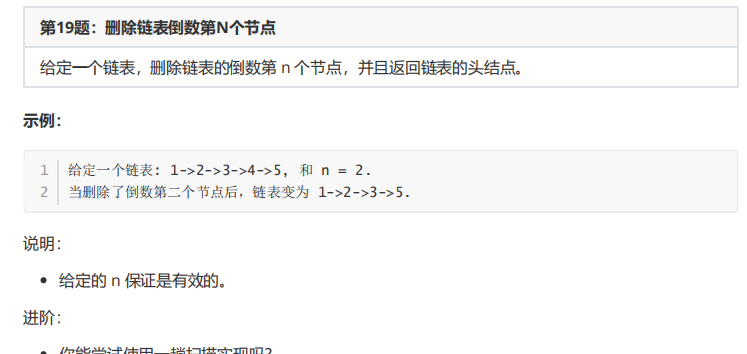
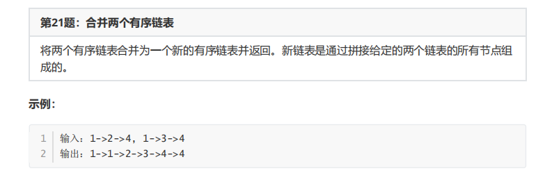

## 删除链表倒数第 N 个节点



```java
// 删除倒数第 N 个节点，
1. 原本链表就有计数
2. 找到最后一个， 往前数 N 个
    双指针： 到结尾
    慢指针： 删除的节点的前一个
    
    
    
    // 删除节点，至少需要两个节点
    // 所以最好的方法就是构造一个前哨节点，方便操作，不然费脑力
    public ListNode removeNthFromEnd(ListNode head, int n) {

        // 对于删除最好提供一个哨兵接节点
        ListNode dummy = new ListNode(0, head);
        
        ListNode preNode = dummy;
        ListNode end = dummy;

        while (n != 0 ) {
            end = end.next;
            n--;
        }

        // 快指针先移动 n 位
        while (end.next != null) {
            end = end.next;
            preNode = preNode.next;
        }
        preNode.next = preNode.next.next;
        return  dummy.next;
    }
}    
```


## 合并链表



```java
是一个典型的链表增删的题目， 所以最方便的方法就是设置哨点
    
    
   public ListNode mergeTwoLists(ListNode l1, ListNode l2) {
        ListNode curNode = new ListNode(-1, null);
        ListNode tempNode = curNode;
        while (l1 != null || l2 != null) {
            if ( l1.val <= l2.val ){
                curNode.next = l1 ;
                l1 = l1.next;
            } else if (l1.val > l2.val) {
                curNode.next = l2;
                l2 = l2.next;
            }
            curNode = curNode.next;
        }

        // 当其中一个空了， cur正好在先空的链表上
        if (l1 == null){
            curNode.next = l2;
        } else if (l2 == null) {
            curNode.next = l1;
        }

        return  tempNode.next;
    } 
```

