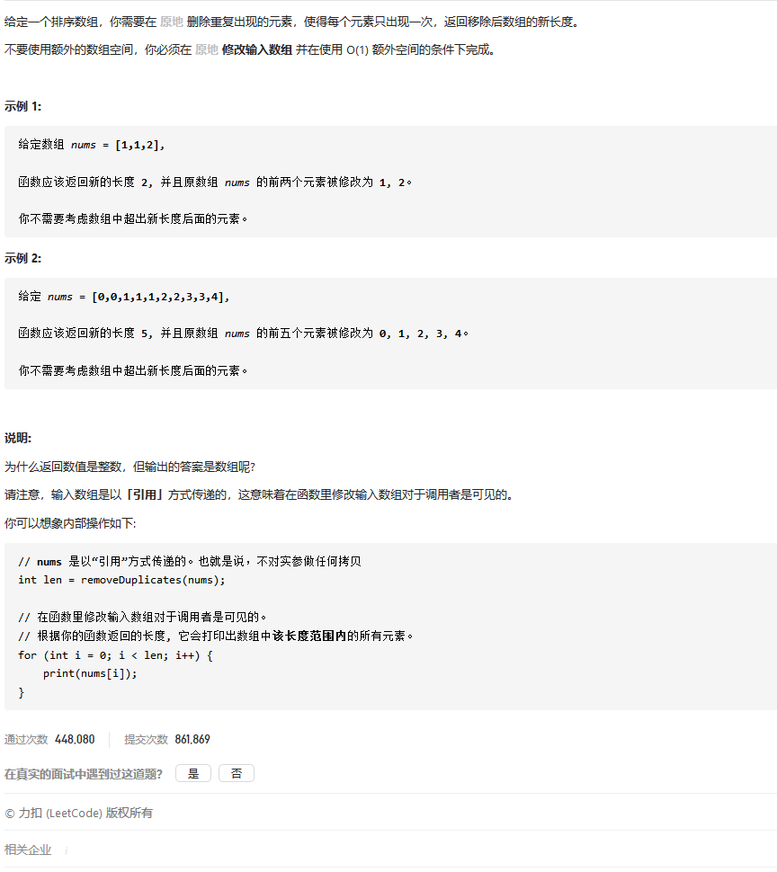

## 题目




## 思路

*   读懂题

    ```go
    func removeDuplicates(nums []int) int { }
    一个有序数组进行去重,注意是有序
    	将数组去重，并将所有非重复的数字放到数组的前面，并返回所有非重复数字的长度
    
        [1,1,2] ---> [1,2]  返回的是2 ，在测试的额时候，他只会遍历数组前两个元素
        相当于原数组变成了 [1,2,2] 只是在册遍历的时候，只会遍历前两个
    关键在于交换
    ```

### 双指针

```go
用快慢指针 
	指针交换条件	：
		慢指针和快指针指向的值不同 , 就将快指针的值给慢指针就行
		当然换之前，慢指针需要向前移动一步

func removeDuplicates(nums []int) int {
    
    if len(nums) == 0 {
        return nil 
    }
    
    if len(nums) == 1 {
        return 1
    }
    
    //  慢指针 prev 快指针 cur
    prev := 0 
    for cur := 1 ; cur < len(nums) ; i++ {
        if nums[cur] != nums[prev] {
            prev++
            // 相同了就是自身复制自身，没必要，可以跳过
            if cur != prev {
                nums[cur] = nums[prev]
            }
        }
    }
    return prev+1
}
```


