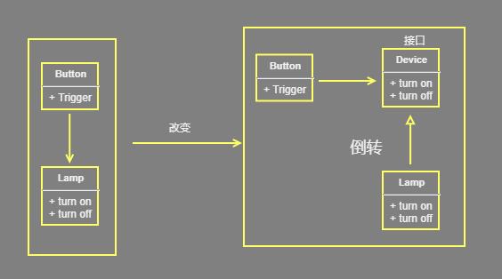

[toc]

## 1.设计原则

* design pattern

* 六个原则的首字母联合起来（两个 L 算做一个）就是 SOLID （solid，稳定的）

    ```go
    Single Responsibility Principle：单一职责原则
    Open Closed Principle：开闭原则
    Liskov Substitution Principle：里氏替换原则
    Law of Demeter：迪米特法则
    Interface Segregation Principle：接口隔离原则
    Dependence Inversion Principle：依赖倒置原则
    
    开闭原则	 是总纲，它告诉我们要对扩展开放，对修改关闭
    里氏替换原则	告诉我们不要破坏继承体系；
    依赖倒置原则	告诉我们要面向接口编程；
    单一职责原则	告诉我们实现类要职责单一
    接口隔离原则	告诉我们在设计接口的时候要精简单一
    迪米特法则告	诉我们要降低耦合度
    合成复用原则	告诉我们要优先使用组合或者聚合关系复用，少用继承关系复用。
    ```

    

* 对普遍出现的问题(反复出现)的各种问题

* 面向对象 =》功能模块（设计模式+数据结构） =》框架（许多设计模式） =》架构（服务器集群）


## 1.开闭原则

### 概念

*   英文
    *   Open Closed Principle，OCP
*   是最简单最基础的原则
*   就是增添需求的时候,不改变源文件,可以用派生类扩展

### 含义

*   应用的需求改变时
    *   软件实体的源代码或者二进制代码 :不修改
    *   只需要根据需求重新派生一个实现类来扩展就可以了
*   软件对象（类、模块、方法等）应该对于扩展是开放的，对修改是关闭的 ,
    *   扩展开放： 对提供方，比如添加类
    *   修改关闭： 使用方，其原先怎么使用不改变
    *   用抽象构建框架，用实现扩展细节（抽象出interface struct）
    *   当软件需要变化的时候，尽量通过扩展软件实体的行为来实现变化，而不是修改已有的代码来实现


### 作用

*   对软件测试的影响
    *   软件测试时只需要对扩展的代码进行测试就可以了，因为原有的测试代码仍然能够正常运行
*   提高戴拿复用性
    *   粒度越小，被复用的可能性就越大
    *   在面向对象的程序设计中，根据原子和抽象编程可以提高代码的可复用性。
*   提高可维护性
    *   抽象约束、封装变化
    *   通过接口或者抽象类为软件实体定义一个相对稳定的抽象层，而将相同的可变因素封装在相同的具体实现类中。


* 在程序需要进行拓展的时候，不能去修改原有的代码，实现一个热插拔的效果。 
* 关键步骤就是抽象化 

## 2.里氏替换原则

### 概念

*   英文
    *   Liskov Substitution Principle  LSP
*    对开闭原则的补充 ， 是对实现抽象化的具体步骤的规范。
*    是针对继承而言的，
*    子类完全继承父类的功能，然后在再扩展更多的功能(在父类原有的功能上)
*    设计程序的时候尽可能使用基类进行对象的定义及引用，具体运行时再决定基类对应的具体子类型

### 介绍

* 对于继承思考
    * 父类中凡是已经实现好的方法，子类继承以后都可以用，能用父类的地方都可以使用子类来替换父类，不产生任何异常和错误，但是子类会有扩展的方法，所以使用子类的地方不一定能用父类替换。
    * 子类对父类已经实现的方法任意修改，就会对整个继承体系造成破坏，这就造成继承的时候，会增加对象间的耦合性
* 所以要遵循里氏替换原则
    *    任何基类可以出现的地方，子类一定可以出现 
    *    LSP 是继承复用的基石，只有当派生类可以替换掉基类，且软件单位的功能不受到影响时，基类才能真正被复用，而派生类也能够在基类的基础上增加新的行为。 

### 使用

*   继承 —— 为了实现代码重用， 为了共享方法

    *   子类要实现父类中声明的所有方法，但是不能重新定义父类中已有的方法 

    *   子类只能通过新添加方法来扩展功能

    *   能使用的父类方法的地方,也可以使用子类来实现

        *   子类继承的方法和父类一样
        *   所有引用基类的地方必须能透明地使用其子类的对象

        ```go
        3. 当子类的方法重载父类的方法时，方法的前置条件（即方法的形参）要比父类方法的输入参数更宽松
        	这个从参数个数上考虑。
        4、当子类的方法实现父类的抽象方法时，方法的后置条件（即方法的返回值）要比父类更加严格，
        	如父类要求返回List，那么子类就应该返回List的实现ArrayList，父类是采用泛型，那么子类则不能采用泛型，而是具体的返回。
        
        
        // 例子
        龙生龙 ， 风生风 ， 老鼠生来会打洞
        现代化的老鼠 ： 在自己本来会打洞的技能上，他还学会新技能：演动画片- 《猫和老鼠》
        ```

*   继承 ——为了多态
    ```go 
    // 多态
    	是子类覆盖并重新定义父类的方法
    	为了符合LSP,可以用以下方法
    
    
    //第一种方法
    我们应该将父类定义为抽象类，并定义抽象方法，让子类重新定义这些方法，
    父类是抽象类时，父类就是不能实例化，所以也不存在可实例化的父类对象在程序里。也就不存在子类替换父类实例（根本不存在父类实例了）时逻辑不一致的可能。  
    
    // 第二种方法
    把父类提升，让父类、子类去继承更加基础的类（这个基础的类就是父类的抽象类），让原先的父类和子类耦合性降低，就让父类不用去重写子类的方法
    
    // 第三种方法
    适当情况下，可以通过聚合、组合、依赖来解决问题
    为防止子类重写父类方法出现耦合性，原来的父类和子类都继承一个更通俗的基类，原有的继承关系去掉，采用依赖、聚合、组合等关系替代 （上面的第二种放大）
    
    // 例子
    燕子是鸟 ， 依靠翅膀可以飞
    悟空可以飞 ， 依靠筋斗云飞
    让悟空去直接继承鸟，显然是不合适的 — — 直接继承的话就改变了飞翔依靠的方式
    所以将鸟抽象为动物，让悟空去继承动物
    ```


## 3.依赖倒转（倒置）

### 概念

*   英文
    *   Dependence Inversion Principle，DIP
*   实现开闭原则，继承时遵循里氏替换原则
*   面向接口编程, 不要面向实现编程， 依赖于抽象而不依赖于具体，来降低类间的耦合性


### 思路

*   高层模块不应该依赖底层模块，二者都应该依赖其抽象
*   抽象不应该依赖细节(实现类)，细节(实现类)应该依赖抽象 ： （interface struct）

*   程序代码中传递参数时或在关联关系中,尽量引用层次高的抽象层类,

    *   使用接口和抽象类进行变量类型声明、参数类型声明、方法返回类型声明，以及数据类型的转换等，而不要用具体类来做这些事情。 

### 设计理念：

* 相对于细节的多变性，抽象的东西要稳定的多
* 以抽象为基础搭建的架构比以细节为基础的架构要稳定的多
    * 底层模块尽量都要有抽象类或接口，或者两者都有，程序稳定性更好
    * 抽象的是 接口、抽象类   ，细节就是 具体的实现类
* 使用接口或抽象类的目的是制定好规范，而不涉及任何具体的操作，把战线细节的任务交给特闷的实现类去完成

### 实现

*   每个类尽量提供接口或抽象类，或者两者都具备。
*   变量的声明类型尽量是接口或者是抽象类。
    *   这样我们的变量引用和实际对象间，就存在一个缓冲层，利于程序扩展和优化
*   任何类都不应该从具体类派生。
*   使用继承时尽量遵循里氏替换原则。

### 例子

*   设计一个 button 用来控制 台灯 的开关，那么对 button 进行扩展就比较困难
*   比如添加一个洗衣机，就需要更改 button 的内部结构
*   所以进行倒置 ： 添加一个 device 的接口，扩展开关洗衣机，只需要让洗衣机实现 device 接口就可以




### 作用

*   降低类间的耦合性。
*   提高系统的稳定性。
*   减少并行开发引起的风险。
*   提高代码的可读性和可维护性

### 传递方式

* 接口传递

    ```go
    type A interface { 
        open() 
    }
    type B interface { 
        play(a A)
    }
    
    type c struct {}
    func (this *c) play(a A) {}  // 实现了接口 B ，但是 play 的参数是接口 A ,这是通过 接口传递的
    ```

    

* 构造方法传递

    ```go
    https://studygolang.com/articles/27152  // 构造函数 
    
    interface IOpenAndClose {
         public void open(); //抽象方法
     }
    
     class OpenAndClose implements IOpenAndClose{
         public ITV tv; //成员
         public OpenAndClose(ITV tv){ //构造器
             this.tv = tv;
         }
         public void open(){
             this.tv.play();
         }
     }
    ```

    

* setter 方式传递

    ```go
    // 方式3 , 通过setter方法传递
    interface IOpenAndClose {
        public void open(); // 抽象方法
    
        public void setTv(ITV tv);
    }
    
    class OpenAndClose implements IOpenAndClose {
        private ITV tv;
    
        public void setTv(ITV tv) {
            this.tv = tv;
        }
    
        public void open() {
            this.tv.play();
        }
    ```


## 4.单一职责原则

### 概念

*   英文
    *   Single Responsibility Principle，SRP
*   规定一个类应该有且仅有一个引起它变化的原因，否则类应该被拆分
*   单一职责原则是最简单但又最难运用的原则，

### 职责扩散

*   就是因为某种原因，职责P被分化为粒度更细的职责P1和P2
    *   刚开始的时候， 职责 p 的确复合单一职责原则，
    *   需求的改变，职责 P 就会分为更细的两种职责
    *   解决 ： 在职责扩散到我们无法控制的程度之前，立刻对代码进行重构。


### 优势

-   降低类的复杂度。
    -   一个类只负责一项职责，其逻辑肯定要比负责多项职责简单得多。
-   提高类的可读性，可维护性
    -   复杂性降低，自然其可读性会提高。
-   提高系统的可维护性。可读性提高，那自然更容易维护了。
-   变更引起的风险降低。
    -   变更是必然的，如果单一职责原则遵守得好，当修改一个功能时，可以显著降低对其他功能的影响。

### 实现

*   如果 A 负责两个不同职责，他们相互影响就应该将其粒度拆解为 A1 和 A2

*   如果类中方法很少，可以再方法级别保持单一原则（ 方法）
*   需要设计人员发现类的不同职责并将其分离，再封装到不同的类或模块中。
*   而发现类的多重职责需要设计人员具有较强的分析设计能力和相关重构经验。

## 5.接口隔离

### 概念

*   英文
    *   Interface Segregation Principle，ISP
*   为了约束接口、降低类对接口的依赖性


* 客户端不应该依赖他不需要的接口 ： 即一个类对另一个类的依赖应该建立在最小的接口上
    *  简单来说就是建立单一的接口， 不要建立臃肿庞大的接口。也就是接口尽量细化，同时接口中的方法尽量少，保持接口纯洁性。 
    *  使用多个隔离的接口，比使用单个接口要好 
    *  降低类之间的耦合度 


### 优势

*   将臃肿庞大的接口分解为多个粒度小的接口，可以预防外来变更的扩散，提高系统的灵活性和可维护性。
*   接口隔离提高了系统的内聚性，减少了对外交互，降低了系统的耦合性。
*   如果接口的粒度大小定义合理，能够保证系统的稳定性；
    *   如果定义过小，则会造成接口数量过多，使设计复杂化；
    *   如果定义太大，灵活性降低，无法提供定制服务，给整体项目带来无法预料的风险。
*   使用多个专门的接口还能够体现对象的层次
    *   因为可以通过接口的继承，实现对总接口的定义。
*   能减少项目工程中的代码冗余。
    *   过大的大接口里面通常放置许多不用的方法，当实现这个接口的时候，被迫设计冗余的代码。
*   来增加灵活性，它的意义就是省去了必须要去实现一些不需要实现的接口
    * 降低里式替换原则中担心的替换、修改父类对子类的影响
    * 也符合迪米特法则，不该知道的就无需知道，否则一旦调用了无需实现的接口方法存在一定的风险。

### 实现

*   接口尽量小，但是要有限度。
    *   一个接口只服务于一个子模块或业务逻辑。
    *   接口分类, 接口拆分
    *   有的接口从逻辑上确实是一件事但是还可以细分这取决于一个度（根据需求推敲出的度）
    *   如果逻辑上实在分不出来，可以从二八原则上来区分，同一个接口中80%时候使用的方法与20%时候使用的方法是可以分开的
*   为依赖接口的类定制服务。
    *   只提供调用者需要的方法，屏蔽不需要的方法。
*   了解环境，拒绝盲从。
    *   每个项目或产品都有选定的环境因素，环境不同，接口拆分的标准就不同深入了解业务逻辑。
*   提高内聚，减少对外交互。
    *   使接口用最少的方法去完成最多的事情。


## 6.迪米特法则

### 介绍

* 英文
*  Law of Demeter, LoD  
    *  Least Knowledge Principle, LKP  最少知道原则
* 含义
    * 只与你的直接朋友交谈，不跟“陌生人”说话
        * 和直接的朋友交流
        * 减少对朋友的了解
    * 如果两个软件实体无须直接通信，那么就不应当发生直接的相互调用，可以通过第三方转发该调用。
    * 其目的是降低类之间的耦合度，提高模块的相对独立性。
* 核心
    * **只是降低类之间（对象间）的耦合度，是为了减少不必要的依赖，并不是要求完全没有依赖关系。** 
    * 要求**一个对象应该对其他对象有最少的了解** 

### 朋友

* 把对象看成一人
* 当等，这些对象同当前对象存在关联、聚合或组合关系，可以直接访问这些对象的方法。
* 只要两个对象之间存在耦合关系，那就说这两个对象是朋友关系

    * 耦合方式 ： 依赖、关联、组合、聚合
    * 直接朋友 ：  前对象本身、当前对象的成员对象、当前对象所创建的对象、当前对象的方法参数
    * 非直接朋友： 出现局部变量的类， 只出现在方法体内部的类 
        * 把局部变量的类作为参数传递进去
    * 即：陌生的类最好不要以局部变量的形式出现在类的内部

### 实现

*   对于类

    *   划分上    ： 应该创建弱耦合的类。类与类之间的耦合越弱，就越有利于实现可复用的目标。
    *   结构设计 ： 尽量降低类成员的访问权限。
    *   设计         ： 优先考虑将一个类设置成不变类。
    *   引用         ： 将引用其他对象的次数降到最低。
    *   属性成员 ： 尽量不要暴露，而应该提供相应的访问器（set 和 get 方法）
    *   谨慎使用序列化功能

*   一个类对自己依赖的类知道的越少越好，

    *    对于被依赖的类不管有多复杂，都尽量将逻辑封装在类的内部，对外部只提供 pubilc 方法，不对外泄漏任何信息

    *    （尽量少的引用别的类的方法，引用的多的，应该在父类中设置一个方法，对这些方法进行聚合成一个方法，然后让调用放去调用这个聚合的方法）

    *  由于每个对象尽量减少对其他对象的了解，因此，很容易使得系统的功能模块功能独立，相互之间不存在（或很少有）依赖关系。 
    *  一个实体应当尽量少地与其他实体之间发生相互作用，使得系统功能模块相对独立。 

### 缺点

* 解耦是有限度的，除非是计算机的最小单元--二进制的0和1，否则都是存在耦合的。
* 完全独立的类，是没有存在的价值的，没有意义的。 
* 过度使用迪米特法则会使系统产生大量的中介类，从而增加系统的复杂性，使模块之间的通信效率降低

### 优点

*   限制软件实体之间通信的宽度和深度
*   就是类间解耦，弱耦合
    *   提高了模块的相对独立性。
    *   弱耦合了之后，类的复用才可以提高，类变更的风险才可以减低
*   由于亲合度降低，从而提高了类的可复用率和系统的扩展性。

## 7.合成复用原则

### 概念

*   英文
    *   Composite Reuse Principle，CRP
    *   Composition/Aggregate Reuse Principle，CARP  组合/聚合复用原则
*   尽量先使用组合或者聚合等关联关系来实现，其次才考虑使用继承关系来实现。
    *   使用继承关系，则必须严格遵循里氏替换原则

### 继承复用

*   优点

    *   简单和易实现

*   缺点

    *   继承复用破坏了类的封装性。
        *   因为继承会将父类的实现细节暴露给子类，父类对子类是透明的，所以这种复用又称为“白箱”复用。
    *   子类与父类的耦合度高。
        *   父类的实现的任何改变都会导致子类的实现发生变化，这不利于类的扩展与维护。
    *   它限制了复用的灵活性。
        *   从父类继承而来的实现是静态的，在编译时已经定义，所以在运行时不可能发生变化。

    

### 组合/聚合复用

*   含义

    *   将已有的对象纳入新对象中，作为新对象的成员对象来实现的，
    *   新对象可以调用已有对象的功能，从而达到复用。

    


## 8.核心思想

* 找出应用中可能变化的地方，把他们独立出来，不要和那些不需要变化的代码混在一起
* 针对接口编程
* 为了交互对象之间的松耦合设计而努力


## 参考

```go
https://www.jianshu.com/p/c3ce6762257c
```

