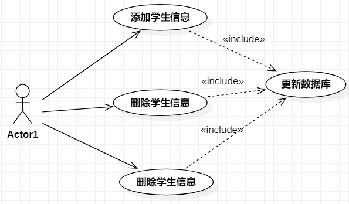

## 用例图

* usecase diagram
* 用户模型图
* 从软件需求分析到最终实现的第一步，从客户的角度来描述系统功能

## 组件

* 参与者
    * 与系统打交道的人或者其他系统即使用该系统的人或者事务
    * 在 uml 中参与者用人型图标表示
* 用例
    * 代表系统中的某项完整功能
    * 在 UML 中使用一个椭圆来表示
* 关系
    * 用例之间的关系
    * 泛化 、 扩展 、 包含

## 关系

* 泛化

    ```c++
    箭头 ，指向端为空芯三角
    ```

    

* 扩展

    ```c++
    extend 扩展
    ```

    

* 包含

    ```c++
    删除、添加都设涉及更新数据库·
    ```

    




