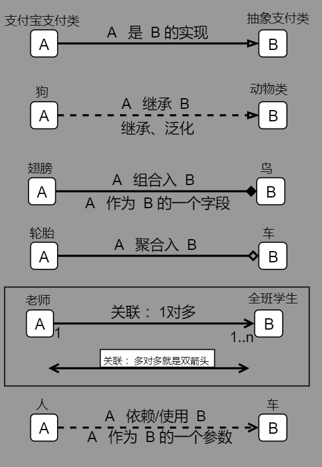

## 类图

* class diagram

* 能用来画图就行，没必要钻研太多

* 注意

    ```css
    跟语言无关
    私有、保护、公共 的关系，只是访问到访问不到而已
    	公共是可以访问的到，各种语言是一样的
    ```

## 类

### 介绍

```css
go 中的 struct 
c++ 中的 struct 、非抽象类(实例类)

字段、方法的权限
	+ pubulic
    - private   
    # protected
注意
	go 中字段都是 public 
	c++ 中 ，就是上面的权限
```

### 格式

* 第一行 ：

     ```css
    /*  类的名称。 */
    如果是抽象类，则用斜体显示
    ```

* 第二行：

    ```css
    /* 类的特性。通常是字段属性 */
    格式
        权限 字段属性名：属性值
        +name:string
    ```
* 第三行： 

    ```c++
// 类的操作。方法、行为
    
    格式
        权限 方法名(参数类型):返回值类型
        +add(int,int):int ;
// 参数类型、返回值类型都可以省略
    // 省略参数类型
    	+pringt():int ;
    // 都省略
    	+pringt();
    ```
    
    

## 接口

### 介绍

```css
介绍
	go 中的 interface
	c++ 中的  class：抽象类（注意是抽象类）

字段、方法的权限
	+ pubulic
    - private   
    # protected
注意
	go 中方法都是 public
```

### 格式

* 第一行 ：

     ```css
    /*  接口的名称 、 抽象类的名称 */
    如果是抽象类或者接口，则用斜体显示
    ```

* 第二行：

    ```css
    /* 字段属性 */
    权限 字段属性名：属性值
    +name:string
    ```

* 第三行： 

    ```go
    // 接口规定的方法方法、行为
    格式
        权限 方法名(参数类型):返回值类型
        +add(int,int):int ;
    // 参数类型、返回值类型都可以省略
    // 省略参数类型
    	+pringt():int ;
    // 都省略
    	+pringt();
    ```


### 表示方法

```c++
矩形表示法
    // 抽象类的可以使用 《class》 ，
    第一行：顶端有《interface》显示，然后是接口名称
	第二行:  接口方法	
        
棒棒糖表示法
    矩形上边画一个类似棒棒糖一样的东西，圆圈旁写上方法名
```

## 六种类关系（struct）

### 1.实现

* realization 

* implementation

    ```go
    实现
    
    1、类与接口的关系
    2、是依赖关系的特例
    2、带三角箭头的虚线，箭头指向接口
    ```

    

### 2.继承 / 泛化

* generalization

    ```go
    继承关系
    
    1、继承的耦合性太强，所以尽量要降低
    2、是依赖关系的特例
    2、三角箭头的实线，箭头指向父类（a 继承 b）
    ```

### 3.依赖/使用

```go
介绍
	dependence
    // 典型的依赖关系就是 传参 ， 
    // function A(B) , 要想实现 A ，必须传入参数 B ，即
	A 依赖 B  ===  A 使用 B


1、一种使用的关系，即一个类的实现需要另一个类的协助(使用了另一个类)，所以要尽量不使用双向的互相依赖.
	// 狗 和 水，狗活着，需要水
2、代码体现 ：
	（被使用者作为）	方法的参数（参数类型）  ：方法传参才能运行


	（被使用者作为）    类中直接使用
	（被使用者作为） 	局部变量（成员属性）  ：这个和组合比较像

	（被使用者作为）	方法的返回值（返回类型）
	（被使用者作为）	静态方法的调用 （方法中使用到）

3、带箭头的虚线，指向被使用者
	// Person  依赖 Car
    interface Person {
        // 被依赖者作为参数被调用进来
        gowark(Car:car)
    }

    struct Car{}
```


### 4. 合成 / 组合

* (Composition) 

    ```go
    组合成
    
    典型应用
    	// 一个对象（类/接口） 作为另一个对象(类/接口) 的成员属性
    	// 强调的是 B 中有一个  A 
        interface A {}
        interface B { A , C ，D}
    特点
    // 部分不可以单独存，共生共灭 
    // 部分离开整体 ，就没有存在的意义了，鸟和翅膀 ， 公司和部门
    1、是整体与部分的关系，但部分不能离开整体而单独存在 ：
    2、组合关系是关联关系的一种，它要求普通的聚合关系中代表整体的对象负责代表部分的对象的生命周期。
    
    
    特点 
    	强拥有关系，体现严格的部分和整体的关系，其周期是一样的
    组合和聚合
    	语法上大致一样，区别在于逻辑
    ```


### 5. 聚合

```go
聚合成 aggregation
	
典型应用
	// 成员变量
	// A B C D 

特点
 // 部分可以单独存在 ， 车子和轮胎，车子没了，轮胎还存在
 // 部分单独存在也也存在意义， 
1、整体和部分的关系，且部分可以离开整体而单独存在 ：
2、关联的一种特例

注意

组合和聚合
	语法上大致一样，区别在于逻辑
关联和聚合
	// 在语法上无法区分，区别是逻辑关系
	// 这有点儿因人而异了，看你怎么想问题了
	强的关联关系；
```

* 一 

### 6. 关联

* association

    ```go
    1、拥有的关系，它使一个类知道另一个类的属性和方法
    2、带普通箭头的实心线，指向被拥有者
    
    3、4、代码体现： 成员变量
    ```

* 有导航性（具体有五种类型）

    * 双向关联
        *  有两个箭头或者没有箭头
        *  老师拥有多个学生，学生也有多个老师 
    * 单向关系
        *  有一个箭头 
        *  一个学生有多个课程，一个课程去不能拥有学生
    * 注意：自身关联

* 多重性

    *  1     	：有且只有一个
    *  m....     :  至少有 m 个
    *  n...m    : 表示 n 到 m 个都可以


### 关系对比

```go
区别
	// 特别是体现在成员变量上
	依赖 、 组合 、 聚合 、 关联 都有一定的相似的地方，没有十分明确的分界线，可能有典型的应用
强弱关系
	实现  =   泛化 > 组合 > 聚合 > 关联 > 依赖
```

## 画图区分

```c++
实现 继承 	 实线三角  虚线三角
---------------------------------
组合 聚合	 实线黑菱  实线空菱
依赖  关联   虚线箭头  实现箭头
    
    三角 箭头 l菱形
```



## 区别

### 组合 + 聚合

```css
1.如果组合对象（外部）对象控制者相关对象合适创建和销毁（组合关系）
```


区分组合和聚合关系： 2.生命周期的长短 总结：组合关系可以说是聚合关系 ，组合关系确不是组合关系 。 在设计业务时可能不需要明确的细分，凡是在代码的实现时需要分清楚。这点很重要。 


