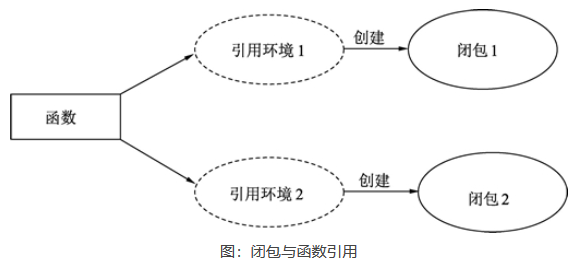

## 相关概念

```js
类： class  接口：interface   
```

## 实现-实例

### 介绍

*   a  实现 b  , 则称 a 是 b 的一个实例

### 结构体

```go
创建一个结构体实例，就是实现了结构体
```


### 接口

*   go 中，接口不能实现其他接口。但是可以使用嵌套

*   一个 struct 实现了 interface 的所有方法 ，就是实现了该接口

*   只有指针类型的 struct 对象可以转换为 interface 对象。

    ```js
    // 任何类型绑定的方法含有接口的所有方法 ，那这个类型就实现了接口
    一个自定义类型实现了一个接口 ，那么这个类型(指针形式)就可以转化为 interface 对象
    ```

    

## 构造方法

### 3.构造函数 - 工厂模式

*    Go语言的类型或结构体<font color=red>没有构造函数的功能</font>
*    使用结构体初始化的过程来模拟实现构造函数 
*    没有提供构造函数相关的特殊机制，用户根据自己的需求，将参数使用函数传递到结构体构造参数中即可完成构造函数的任务。 

### 功能特性

*    每个类可以添加构造函数，多个构造函数使用函数重载实现。
*    构造函数一般与类名同名，且没有返回值。
*    构造函数有一个静态构造函数，一般用这个特性来调用父类的构造函数。
*    在Go里我们一般不会返回多个struct，而是返回一个interface，而具体实现，都满足这个interface

### 模拟构造函数重载

```go
type Cat struct {
    Color string
    Name  string
}
func NewCatByName(name string) *Cat {	  // 用名字构造猫结构的函数，返回 Cat 指针。
    return &Cat{				    	// 取地址实例化猫的结构体
        Name: name,				    	// 始化猫的名字字段，忽略颜色字段。
    }
}
func NewCatByColor(color string) *Cat {
    return &Cat{
        Color: color,
    }
}

// 颜色和名字两个属性的类型都是字符串，由于Go语言中没有函数重载，为了避免函数名字冲突，使用 NewCatByName() 和 NewCatByColor() 两个不同的函数名表示不同的 Cat 构造过程
```

### 模拟父级构造调用

```go
type Cat struct {
    Color string
    Name  string
}

// lackCat 结构，并嵌入了 Cat 结构体，BlackCat 拥有 Cat 的所有成员，实例化后可以自由访问 Cat 的所有成员。
type BlackCat struct {
    Cat  // 嵌入Cat, 类似于派生
}

// “构造基类”
// NewCat() 函数定义了 Cat 的构造过程，使用名字作为参数，填充 Cat 结构体。
func NewCat(name string) *Cat {
    return &Cat{
        Name: name,
    }
}

// “构造子类”
// NewBlackCat() 使用 color 作为参数，构造返回 BlackCat 指针
func NewBlackCat(color string) *BlackCat {
    
    // 实例化 BlackCat 结构，此时 Cat 也同时被实例化。
    cat := &BlackCat{}
    
    // 填充 BlackCat 中嵌入的 Cat 颜色属性，BlackCat 没有任何成员，所有的成员都来自于 Cat
    cat.Color = color
    return cat
}
```


## 重载-不支持

### 函数

*   go 不支持函数重载

### 方法

*   方法
    *    方法是函数，所以同样的，不允许方法重载 
    *    对于一个类型只能有一个给定名称的方法 
*   基于接收器类型
    *   可以重载
    *   有同样名字的方法可以在 2 个或多个不同的接收器类型上存在 

### 结构体

### 接口

## 封装

* encapsulation

```js
go开发过程中没有特别强调封装，go本身对面向对象的特性做了化简的
可见性控制
	首字母大写
    首字母小写
```


### 结构体

#### 1.概念

* 把抽象出来的字段和对字段的操作封装在一起，数据被保护在内，程序的其他只有通过授权的操作（方法），才能对字段进行操作

#### 2.好处

* 隐藏实现细节
* 可以对数据进行验证，保证安全合理

#### 3.实现

* 对结构体中的属性进行封装

* 可以通过方法、包实现封装

* 步骤：

    * 将结构体、字段(属性)的首字母小写（不能导出，其他包不能使用，类型private）

    * 给结构体所在包提供一个工厂模式的函数，首字母大写，类似一个构造函数

    * 提供一个首字母大写的 set 方法 ：设置小写字段的值

    * 提供一个首字母大写的 Get 方法 ：取小写字段的值

        ```GO
        type person struct {
            Name string
            sal float64  	// 其它包不能直接访问..
        }
        
        // 写一个工厂模式的函数，相当于构造函数
        // 注意其中没有小写的字段,大写字段写入工厂模式，不需要set get
        func NewPerson(name string) *person {
            return &person{
                Name : name,
            }
        }
        
        // Set 函数 设置小写字段的值
        func (p *person) SetSal(sal float64) {
            if sal >= 3000 && sal <= 30000 {
                p.sal = sal
            } else {
                fmt.Println("薪水范围不正确..")
            }
        }
        
        // Get 函数 取得小写字段的值
        func (p *person) GetSal() float64 {
            return p.sal
        }
        
        func main(){
            p := NewPerson("小李子")
            p.SetSal(6666)
            p.GetSal()	 	// 6666
            fmt.Println(p) // {"小李子"，6666}
        }
        ```

### 函数-闭包

#### 介绍

*    引用了自由变量的函数，被引用的自由变量和函数一同存在，

*   即使已经离开了自由变量的环境也不会被释放或者删除，在闭包中可以继续使用这个自由变量 

    ```go
    闭包 = 引用变量 + 闭包
    ```

    

#### 函数实例化

*     一个函数类型就像结构体一样，可以被实例化 
*     同一个函数与不同引用环境组合，可以形成不同的实例 
*     函数本身不存储任何信息，只有与引用环境结合后形成的闭包才具有“记忆性” 

#### 使用

*   在闭包内部修改引用的变量

    ```go
    // 闭包对它作用域  上部的变量  可以进行修改，修改引用的变量会对变量进行实际修改
    
    // 准备一个字符串
    str := "hello world"
    // 创建一个匿名函数
    foo := func() {
    
        // 匿名函数中访问str
        // 在匿名函数中并没有定义 str，str 的定义在匿名函数之前，此时，str 就被引用到了匿名函数中形成了闭包。
        str = "hello dude"
    }
    // 调用匿名函数 ,执行闭包，此时 str 发生修改
    foo()
    ```

*   闭包的记忆效应 - 累加器

    ```go
    // 提供一个值，每次调用函数会指定对值进行累加
    
    func Accumulate(value int) func() int {
    	// 返回一个闭包
    	return func() int {
    		// value 进行累加
    		value++
    		return value
    	}
    }
    
    func main() {
    	// 创建一个累加器，初始值为 1
    	// return func()int
    	accumulator := Accumulate(1)
    
        // 每执行accumulator 就执行一次 func()init
    	fmt.Println(accumulator())
    	fmt.Println(accumulator())
    	fmt.Printf("%p\n", &accumulator)
    
    	// 创建累加器 2 ，初始化为 10
    	accumulator2 := Accumulate(10)
    
    	fmt.Println(accumulator2())
    	fmt.Println(accumulator2())
    	fmt.Printf("%p\n", &accumulator2)
    }
    // accumulator  accumulator2 输出的函数地址不同，因此它们是两个不同的闭包实例。
    ```

*   闭包的记忆效应 - 实现生成器

*   闭包有一定的封装性


## 继承-嵌组

### 结构体-内嵌组合

1. #### 介绍

* 解决代码复用问题
* 多个结构体出现相同字段和方法，只在一个 结构体写完，其余的结构体只用继承这些属性即可
* 嵌套一个匿名结构体。
* 子类”实例遵循向上查找原则

#### 2.实现

```go
A 结构体 继承了 B 结构体
 // A 就继承了 B 的字段和方法，可以直接使用
内嵌
组合		静态绑定
```

#### 2. 嵌套

##### 内嵌+组合

```go
// 内嵌
	匿名字段
	匿名函数
// 组合
	有名函数

// Go语言的结构体内嵌特性就是一种组合特性
```

##### 1.匿名字段

```go
// 在一个结构体中对于每一种数据类型只能有一个匿名字段。注意是 每种

type outerS struct {
    b int
    c float32
    int // anonymous field
}
func main(){
    outer := new(outerS)
    outer.b = 6
    outer.c = 7.5
    outer.int = 60
}
```


##### 2.匿名结构体

```go
// 一个结构体嵌套了另一个匿名结构体，那么这个结构体可以直接访问匿名结构体的字段和方法


type Goods struct{
    Name string
    Price int
}

type Book struct{
    Goods  //这就是嵌套匿名结构体 Goods 匿名字段是结构体，这个就是你的数据类型
    Wrinter string
}
 // 在实例化 Book 的同时，也会实例化 Goods
```


##### 3.有名结构体

```go
// 结构体嵌套一个有名结构体，这种模式就是组合，组合关系，
// 则在访问组合的结构体的字段或方法是，必须带上结构体的名字

type Book struct{
    g Goods  //这就是嵌套有名结构体 Goods，访问有名结构体就需要带上有名结构体的名字
    Wrinter string
}

var b Book
b.g.Name = "Jack"

```


##### 4.内嵌结构体特性

*    内嵌的结构体可以直接访问其成员变量

     

     ```go
     // 如果结构体有多层嵌入结构体，结构体实例访问任意一级的嵌入结构体成员时都只用给出字段名，而无须像传统结构体字段一样，通过一层层的结构体字段访问到最终的字段。 
     
     type A struct {
         a int
         Name string
     }
     
     type B struct {
         a int
     }
     type C struct {
         A
         B
         a int
     }
     func main() {
         c := &C{}
         
         // 可以缩写成 c.Name = "lihua"
         c.A.Name = "lihua"	
         
         c.A.a = 1     // 如果使用 c.a 就会出现变异错误 ？？？
         fmt.Println(c)
     }
     
     
     
     //  嵌入结构体的成员，可以通过外部结构体的实例直接访问 
     1.缩写 c.Name
        先看 b对应的类型有没有Name
            有：直接调用 c 类型的Name字段
            没有： 就看 c 中嵌套的匿名结构体(有就调用，没有就报错)
        如果出现成员命名冲突
     		采用就近访问的原则。（如希望访问匿名结构体的字段和方法，可以通过匿名结构名来区分）
     
     // 成员名字冲突
     		必须写明 这个成员是术语哪个结构体的
     
         c.a() //这个就是采用就近原则
         c.A.a)  //这个指定是匿名函数的
     ```

     

*   内嵌结构体的字段名是它的类型名

    *    一个结构体只能嵌入一个同类型的成员，无须担心结构体重名和错误赋值的情况 

    *    内嵌结构体字段仍然可以使用详细的字段进行一层层访问，内嵌结构体的字段名就是它的类型名 

         ```go
         var c Color
         c.BasicColor.R = 1
         c.BasicColor.G = 1
         c.BasicColor.B = 0
         ```

         


##### 3. 内嵌结构体初始化

*    结构体内嵌的类型作为字段名像普通结构体一样进行初始化 

     ```go
     // 车轮
     type Wheel struct {
         Size int
     }
     
     // 车
     type Car struct {
         Wheel
     }
     
     func main(){
         c := Car{
             While : While {
                 Size : 19,
             },
         }
     }
     ```

     

*   初始化内嵌匿名结构体

    ```go
    // 车轮
    type Wheel struct {
        Size int
    }
    // 车
    type Car struct {
        Wheel
        // 引擎
        Engine struct {
            Power int    // 功率
            Type  string // 类型
        }
    }
    
    
    func main() {
        c := Car{
            // 初始化轮子
            Wheel: Wheel{
                Size: 18,
            },
            // 初始化引擎
            Engine: struct {
                Power int
                Type  string
            }{
                Type:  "1.4T",
                Power: 143,
            },
        }
    }
    ```


4. 多重继承

* 为了代码的简洁性，尽量不使用多重继承
* 就是一个函数内嵌多个匿名结构体，
* 多个匿名结构体，如：两个匿名结构体有相同的字段和方法（同时结构体本身没有同名的字段和方法），在访问时，就必须明确指定匿名结构体名字，否则编译错误

```go
type A struct{
    Name string
    age int
}
type B struct{
    Name string
    age int
}

type C struct{
    A
    B
}

func main(){
    var c C
    // 使用c.Name就会出错，因为A B都有Name这个属性，所以就必须指定匿名结构体的名字
    // 这个规则也适用于方法
    //注意多重继承的初始化赋值，可以看看继承与接口的第一个代码
    c.A.Name = "tom"
}

```


#### 5. 优势

* 提高代码的复用性
* 代码的扩展性和维护性提高了

### 接口继承 -嵌套

#### 介绍

*   继承相当于嵌入式接口
*   go 中，接口不能实现其他接口，或者扩展他们
*   可以通过合并两个或者多个接口来创建新的接口

```go
// 一个接口（比如A接口）可以继承多个别的接口（比如B,C接口），此时如果要实现A接口，也同时要实现B,C接口

type B interface{
    test01()
}
type C interface{
    test02()
}
type A interface{
    B  // 继承B接口
    C  // 继承A接口
    test03()
}

// 如果实现A接口，就需要将B、C接口方法实现
type Stu struct{  
}

func (stu stu)test01(){}
func (stu stu)test02(){}
func (stu stu)test03(){}

func main(){
    var stu stu
    var a AIterface = stu  // 注意各个地方，这叫什么呢？
    a.test02()
}
```

#### 特点

* 价值/用途
    * 继承：解决代码复用性和可维护性
    * 价值：设计，提前设计好各种规范，让其自定义类型去实现这些方法
* 灵活性
    * 接口比继承更加灵活，
    * 接口只需要满足：like-a的关系
    * 继承是满足：is-a的关系
* 接口在一定程度上实现代码的解耦

*   补充知识

    ```go
    接口不需要显示实现，只要一个变量，含有接口类型中的所有方法，那么这个变量就实现这个接口。因此：go中没有implement这样的关键字
    ```

## 多态

### 接口

#### 概念

#### 实现

```js
多态是通过接口实现的
可以按照统一的接口来调用不同的实现，此时接口变量就呈现不同的形态
```

* 多态参数

```go
// 多种接口变量就体现出来了多态
type Usb interface{
    Start()
    Stop()
}

type Computer struct{}

func (c Computer)Working(usb Usb){
    // Working方法，接收一个Usb接口类型变量
    //实现Usb接口，就是实现Usb接口声明的所有方法
    // usb变量会根据传入的参数，来判断是phone还是camera，
    // 通过usb接口变量来调用Start和Stop方法
    usb.Start()
    usb.Stop()
}

```

* 多态数组

```go
//声明Usb接口
type Usb interface{
    Start()
    Stop()
}

//手机结构体，然后实现Usb接口方法
type Phone struct{
    Name string
}

func (p Phone)Start(){
    fmt.Print("手机开始工作了")
}

func (p Phone)Stop(){
    fmt.Print("手机停止工作了")
}

//相机结构体，并实现Usb接口的的方法
type Camera struct{
    Name string
}
func (c Camera)Start(){
    fmt.Print("相机开始工作了")
}

func (c Camera)Stop(){
    fmt.Print("相机停止工作了")
}

func main(){
    // 定义一个Usb接口数组，可以存放Phone 和 Camera 的结构体变量
    //此处体现出来多态数组
    var usbArr [3]Usb
    usbArr[0] = Phone{"vivo"}
    usbArr[1] = Phone{"小米"}
    usbArr[1] = Camera{"佳能"}
    fmt.Print(usbArr)
}


```

## 抽象

就是把对象的属性，放在一个结构体中

## 其他类型


### 重构

### 抽象类

### 接口

### 集合

### 泛型

### 委托和事件