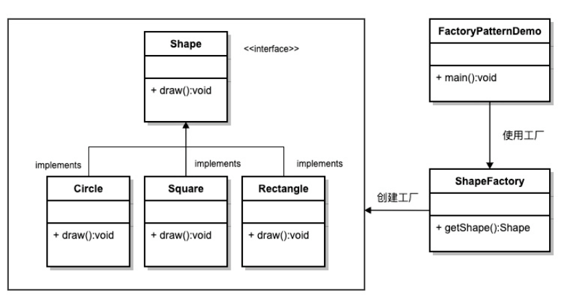

## 结构

```JAVA
interface Shape 
    class Circle
    class Rectangle
class ShapeFactory
class main // 调用
    

```


## Shape.java

```java
public interface Shape {
    public void show();
}

```

### Circle.java

```java
public class Circle implements Shape {
    @Override
    public void show() {
        System.out.println("这是圆形");
    }
}

```

### Rectangle.java

```java
public class Rectangle implements Shape {
    @Override
    public void show() {
        System.out.println("这是正方形");
    }
}

```

## ShapeFactory.java

```java
// 我认为工厂模式只是为了方便管理
// 将对象的创建全部都集中到一个方法里面，进行统筹创建
// 就像中央集权，统筹调配
// 就像我们国家，各种机构集中于国家，有灾有难找政府 ， 政府统一调度安排
// 你需要米，就跟政府要米， 政府就想办法给你搞到米，怎么搞到
public class Factory {
    public Shape createShape(String shapeType) {
        switch (shapeType){
            case "circle" :
                return new Circle();
            case "rectangle" :
                return new Rectangle();
            default:
                return null;
        }
    }
}
```

## main.go

```java
public class Main {
    public static void main(String[] args) {
        Factory factory = new Factory();
        Shape circle = factory.createShape("circle");
        circle.show();
    }
}
```

