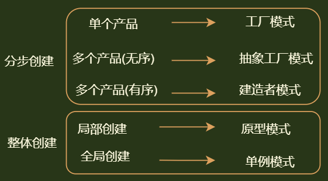

## 介绍

*   关注点
    *   怎样创建对象
*   特点
    *   将对象的创建和使用分离
*   使用
    *   使用者不需要关注对象的创建细节，对象的创建由相关的工厂来完成

## 类创建模式

*   简单工厂方法
*   工厂方法（FactoryMethod）模式
    *   定义一个用于创建产品的接口，由子类决定生产什么产品。

## 对象创建模式

*   单例（Singleton）
    *   某个类只能生成一个实例，该类提供了一个全局访问点供外部获取该实例，其拓展是有限多例模式。
*   原型（Prototype）
    *   将一个对象作为原型，通过对其进行复制而克隆出多个和原型类似的新实例。
*   抽象工厂（AbstractFactory）
    *   提供一个创建产品族的接口，其每个子类可以生产一系列相关的产品。
*   建造者（Builder）
    *   将一个复杂对象分解成多个相对简单的部分，然后根据不同需要分别创建它们，最后构建成该复杂对象


## 理解

```java
// 建造者模式，是将对象创建集中起来处理的一套逻辑方法
工厂方法 ：将对象创建集中起来
抽象工厂 ：将有关系的对象集中起来创建
建造者模式：将有关系的对象，按照一定的顺序集中创建
    
单例模式： 全局只创建一个对象
原型模式： 复制对象
    
```





