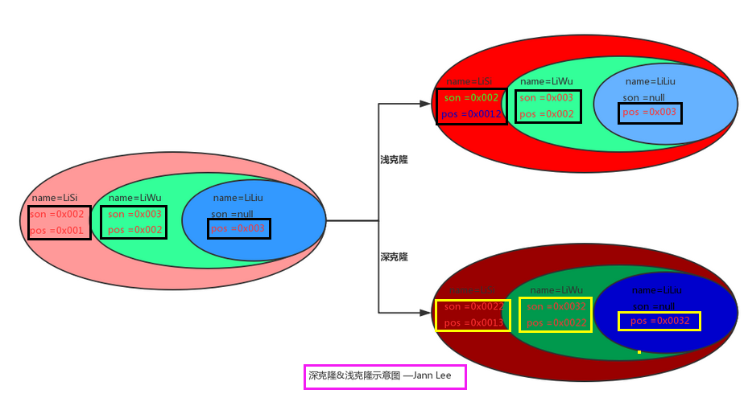

## 概念
* 英文
    * Prototype Pattern
* 是实现了一个原型接口，该接口用于创建当前对象的克隆。
* 就是复制实例
* 注意 ：深拷贝和浅拷贝


## 意图

* 用于创建重复的对象，同时又能保证性能

* 原型   : 被复制的实例

* 用一个已经创建的实例作为原型，通过复制该原型对象来创建一个和原型相同或相似的新对象

    * 复制一个已经存在的实例
    * 创建值相等，只是命名不一样的同类数据。

* 用原型实例指定创建对象的种类，并且通过拷贝这些原型创建新的对象。

    

* 主要解决
  
    * 在运行期建立和删除原型。
## 使用场景

1. 利用已有的一个原型对象，快速地生成和原型对象一样的实例。
2. 多用于创建复杂的或者耗时的实例

```go

1. 当一个系统应该独立于它的产品创建，构成和表示时。 
2. 当要实例化的类是在运行时刻指定时，例如，通过动态装载。 
3. 为了避免创建一个与产品类层次平行的工厂类层次时。 
4. 当一个类的实例只能有几个不同状态组合中的一种时。建立相应数目的原型并克隆它们可能比每次用合适的状态手工实例化该类更方便一些。


 1、资源优化场景。 2、类初始化需要消化非常多的资源，这个资源包括数据、硬件资源等。 3、性能和安全要求的场景。 4、通过 new 产生一个对象需要非常繁琐的数据准备或访问权限，则可以使用原型模式。 5、一个对象多个修改者的场景。 6、一个对象需要提供给其他对象访问，而且各个调用者可能都需要修改其值时，可以考虑使用原型模式拷贝多个对象供调用者使用。 7、在实际项目中，原型模式很少单独出现，一般是和工厂方法模式一起出现，通过 clone 的方法创建一个对象，然后由工厂方法提供给调用者。原型模式已经与 Java 融为浑然一体，大家可以随手拿来使用
```


## 实现

* 注意

    ```java
    两个区别
        深浅克隆都会在堆中新分配一块区域
        区别在于对象属性引用的对象是否需要进行克隆（递归性的）
    ```

* 浅克隆：

    * 值传递，拷贝值
    * 只复制基本类型的数据，只复制了引用类型的地址（值是基本类型的数据，引用类型的地址值）
    * 若原对象中含有引用类型，那么克隆的新对象修改引用类型，会影响到原对象对应的引用类型

* 深克隆：

    * 新地址拷贝旧地址的值
    * 引用的其他对象也会被克隆，不再指向原有对象地址
    * 不管任何类型，都会再重新开辟一段空间进行存放，将原数据的地址值彻底改变了
    * 拷贝创建一个新对象，属性中引用的其他对象也会被克隆，不再指向原有对象地址。



关键代码：
1. 实现克隆操作，
2. 原型模式同样用于隔离类对象的使用者和具体类型（易变类）之间的耦合关系，它同样要求这些"易变类"拥有稳定的接口。 

## 优点

*   性能提高。 
*   逃避构造函数的约束。


## 缺点

* 

    


## 模式

*   抽象原型类

    ```go
    规定了具体原型对象必须实现的接口
    ```

*   具体原型类 / 复制品的原型

    ```go
    实现抽象原型类的 clone() 方法，它是可被复制的对象
    ```

*   原型管理类 /

    ```go
    使用具体原型类中的 clone() 方法来复制新的对象。
    ```


## 参考文件

```go
https://www.runoob.com/design-pattern/prototype-pattern.html
https://blog.csdn.net/N_O_A_maker/article/details/108010094
```

