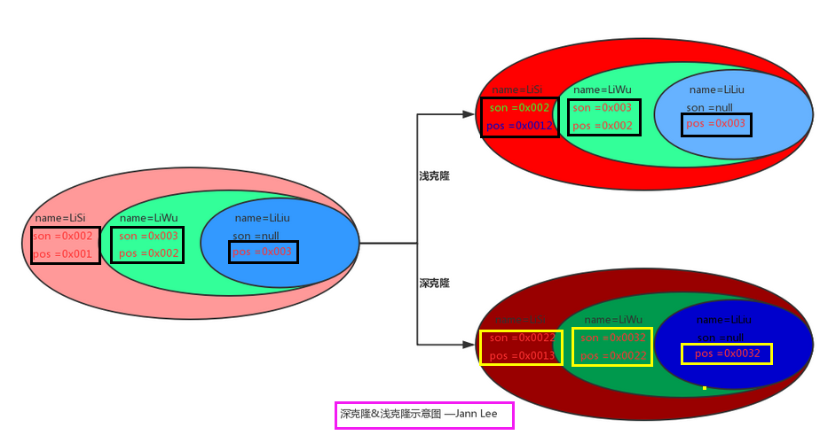

## 概念

```java
名称
    Prototype Pattern
个人理解
    就是复制对象
    复制一个对象 a , 那么对象 a 就是原型
```

## 模式结构

```java


// 角色定义
* 抽象原型类：规定了具体原型对象必须实现的的 clone() 方法。
* 具体原型类：实现抽象原型类的 clone() 方法，它是可被复制的对象。
* 访问类：使用具体原型类中的 clone() 方法来复制新的对象。
```

## 分类

* 注意

    ```java
    两个区别
        深浅克隆都会在堆中新分配一块区域
        区别在于对象属性引用的对象是否需要进行克隆（递归性的）
    ```

#### 浅克隆：

* 值传递，拷贝值
    * 基本类型的数据  (值是基本类型的数据)
    * 引用类型的地址（引用类型的地址值）
* 即
    * 新对象、新对象中的引用对象，指向  原有对象地址。
    * 对新对象的引用类型进行修改， 会影响到原型对象的值

#### 深克隆：

* 开辟新内存
    * 开辟一块新内存（地址），将原型中的值复制过去
    * 原型中的引用类型，也会被开辟新的空间，复制过去
* 即
    * 新对象、新对象中的引用对象，都不再指向  原有对象地址。




## 使用场景

1. 利用已有的一个原型对象，快速地生成和原型对象一样的实例。
2. 多用于创建复杂的或者耗时的实例

```go
1. 当一个系统应该独立于它的产品创建，构成和表示时。 
2. 当要实例化的类是在运行时刻指定时，例如，通过动态装载。 
3. 为了避免创建一个与产品类层次平行的工厂类层次时。 
4. 当一个类的实例只能有几个不同状态组合中的一种时。建立相应数目的原型并克隆它们可能比每次用合适的状态手工实例化该类更方便一些。


 1、资源优化场景。 2、类初始化需要消化非常多的资源，这个资源包括数据、硬件资源等。 3、性能和安全要求的场景。 4、通过 new 产生一个对象需要非常繁琐的数据准备或访问权限，则可以使用原型模式。 5、一个对象多个修改者的场景。 6、一个对象需要提供给其他对象访问，而且各个调用者可能都需要修改其值时，可以考虑使用原型模式拷贝多个对象供调用者使用。 7、在实际项目中，原型模式很少单独出现，一般是和工厂方法模式一起出现，通过 clone 的方法创建一个对象，然后由工厂方法提供给调用者。原型模式已经与 Java 融为浑然一体，大家可以随手拿来使用
```


* 


## 参考文件

```go
https://www.runoob.com/design-pattern/prototype-pattern.html
https://blog.csdn.net/N_O_A_maker/article/details/108010094
```

