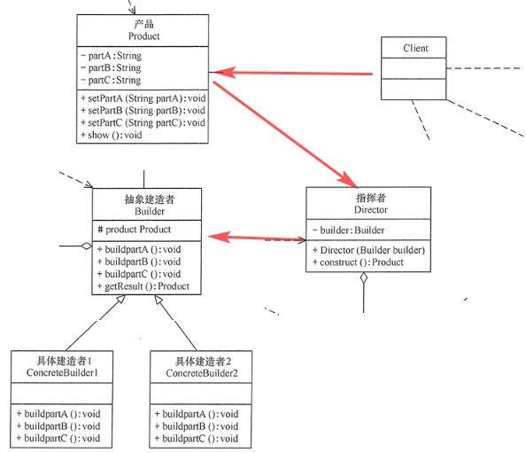

## 理解

```java
建造者
    其实就是创建的对象需要有顺序进行组合，将有顺序组合的步骤拆出去
  
例子
	造电脑， 需要先制造 CPU、 主板、鼠标
    造完零件，这三种零件的组装顺序，单独抽离出来，和建造逻辑进行分离
	抽象建造者 ：集合零件制造 ： CPU 、主板  // 一次零件制造
    指挥者  ： 集合零件的组合顺序 ，进行    // 进行零件组装
    
注意
    // 将零件建造和组合分离开，
    指挥者的中集合的组合顺序也可以写到到抽象建造者当中，
    这时候完全可以脱离指挥者，抽象创建者自己也可以实现有序的组合创建
    指挥者： 个角色是为了进行不同顺序的调用，而做的抽离

比较
    抽象工厂 ： 把商品族的创建集中，并没有强调商品创建顺序
    // 电脑中的零件， 就可以看成是一个商品族
    建造者   ： 把零部件集中创建， 再有顺序进行组合 ，将组合的逻辑抽离出来 ，符合单一职责

这个模式侧重在：分离 ， 
```




## 例子

```java
// 百度很多讲这个组装电脑的例子的，
拿一个常见的例子 ：组装电脑
    电脑构成
 		屏幕 ， 鼠标， 主板
    现在有两种组装方法，具体用哪一种看你调用
        方法一 ： 框架 、鼠标、屏幕
        方法二 ：鼠标 、 框架、屏幕
    增加需求
    	先开始只有华为电脑， 后来联想电脑也要加入进来，
    	你把要组装的电脑给指挥者，指挥者把生产交给实际建造者，由实际建造者进行零部件的生产，
	    	指挥者只支付负责不同顺序的组装调用
    	抽象指挥者，只是一个规范，指明建造者需要实现什么
注意
    指挥者的功能完全可以集中到抽象建造者中，但是你更换不同的顺序组合的时候，就不叫被动了
    // 这就是将对象的创建和行为隔离开 ？？？ 
```

## demo

### Computer.java

```java
package cn.it.buid;

public class Computer {

    private String mainframs;
    private String screen;
    private String mouse;

    public void setMainframs(String mainframs) {
        this.mainframs = mainframs;
    }

    public void setScreen(String screen) {
        this.screen = screen;
    }

    public void setMouse(String mouse) {
        this.mouse = mouse;
    }

    public void show() {
        System.out.println("华为电脑");
    }

}

```

### Abs_1_Builder

```java
package cn.it.buid;

public interface Abs_1_Builder {

    public Computer computer = new Computer();
    // 注意这个接口并没有强调这几个部分是如何结合的
    // 你可以随意写，但是最后一个返回电脑的那个，必须要写到最后
    // 最后一个build 的确实现了 创建一个电脑，但是这个顺序无法确定
    // 这里只是规定了建造电脑的步骤
    public void setScreen();
    public  void setMouse();
    public void setMainframs();
    public Computer build();
}
```

#### HuaComputer.java

```java
package cn.it.buid;

public class HuaComputer implements Abs_1_Builder {

    // private Computer computer = new Computer();
    @Override
    public void setScreen() {
        computer.setScreen("华为屏幕");
        System.out.println("1. 华为屏幕");
    }

    @Override
    public void setMouse() {
        computer.setMouse("华为鼠标");
        System.out.println("2. 华为鼠标");
    }

    @Override
    public void setMainframs() {
        computer.setMainframs("华为框架");
        System.out.println("3. 华为框架");
    }

    // 这里返回的仍旧是没有顺序的组合得到的华为电脑
    @Override
    public Computer build() {
        return computer;
    }
}

```


### Director.java

```java
package cn.it.buid;

public class Director {
    private Abs_1_Builder buidler;

    public Director(Abs_1_Builder buidler) {
        this.buidler = buidler;
    }
    // 第 0 种组合方法
    public Computer produce() {
        System.out.println("123");
        this.buidler.setMainframs();
        this.buidler.setMouse();;
        this.buidler.setScreen();
        return this.buidler.build();
    }

    // 第 1 种组合方法
    public Computer produce1() {
        this.buidler.setMouse();;
        this.buidler.setMainframs();
        this.buidler.setScreen();
        return this.buidler.build();
    }
}

```

### Main.java

```java
package cn.it.buid;

public class Main {
    public static void main(String[] args) {
        // 创建华为电脑
        Abs_1_Builder huawei = new HuaComputer();
        Director director = new Director(huawei);

        // 一种创建顺序
        Computer huaComputer = director.produce();
        huaComputer.show();

        // 另一种创建顺序
        Computer huaComputer1 = director.produce1();
        huaComputer1.show();
    }
}

两种方式就会跟据不同的电脑，进行不同顺序的创建
```


