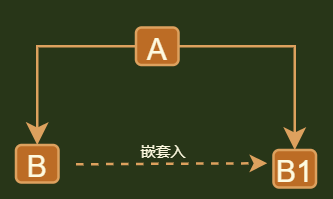

## 介绍



```java
介绍
    你不可以使用一个类（是可以用，但是不能用，就像核弹...）,就将这个类嵌套入另一个类(代理类)
    通过对代理类访问，达到访问到不能访问的类
    
注意
    外观模式： 门面类就是一个单独的类
    // 代理和装饰，使用一种方式实现的，只不过功能不一样
    代理类  ： 代理类 、 被代理类是同一个抽象类型
    装饰模式： 用来扩展方法宽度
    
分类
    静态代理： 
    	// 在编译期生成
    	 代理类 、 被代理类是同一个抽象类型
    动态代理： 
    	// java 运行时动态生成
    	JDK 代理
    		jdk 中提供一个动态代理类 proxy , 
			其提供一个创建代理对象的静态方法（newProxyInstance) 来获取代理对象
    	CGLib 代理
    	
```


## 静态代理

```java
public interface SellTickets {
    void sell();
}

// 火车站
public class Trainstation implements SellTickets{
    @Override
    public void sell() {
        System.out.println("这里是火车站买票");
    }
}


// 代理类
public class ProxyPoint implements SellTickets {
    private  Trainstation ts = new Trainstation();

    public ProxyPoint(Trainstation ts) {
        this.ts = ts;
    }

    @Override
    public void sell() {
        System.out.println("代理点收费");
        this.ts.sell();
    }
}

// 测试
public class Main {
    public static void main(String[] args) {
        ProxyPoint pp = new ProxyPoint(new Trainstation());
        pp.sell(); // 代理点收费 这里是火车站买票
    }
}

```


## 动态代理

### jdk 代理

```java
借
```


### CGLib 代理

