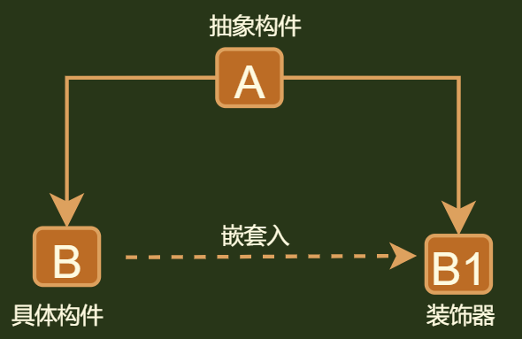

## 介绍



```java
介绍
	// 继承的替代，方法的增强重写, 在原有方法的基础上增强
	通过一个相同抽象类型的对象，组合入原对象，重写方法，增强方法的功能，但是不增加数量
    实际上返回的是一个新的对象，但是两个对象属于相同的抽象类型，所以可以继续使用原对象进行表示
    这样造成使用者感觉一直在使用原先的对象错觉


方法增强： 
    实现方法的增强（不是方法数量的扩充），可实现方法的动态变化（增长、删除）
    增长：迭代增长，是在原有方法基础上的增长，

相同抽象类型
    包装器和被装饰对象，能够进行相互转型（类继承和接口实现）！
    
例子理解
    方法一： 只能爬
    // 进行装饰以后
    方法一： 爬 + 抓
```

## 模式

### 抽象类型

```java
public interface Drink {
    public String showDesc();
    public int cost();
}
```

### 具体构件

```java
public class HotWater implements Drink{
    @Override
    public String showDesc() {
        return "hotwater(0)";
    }

    @Override
    public int cost() {
        return 0;
    }
}
```

### 装饰器类

```java
// milk
public class MIlk implements Drink{
    private Drink drink;

    public MIlk(Drink drink) {
        this.drink = drink;
    }

    @Override
    public String showDesc() {
        return this.drink.showDesc() + "+ milk(20)";
    }

    @Override
    public int cost() {
        return this.drink.cost() + 20;
    }
}

// sugar
public class Sugar implements Drink {
    private Drink drink;

    public Sugar(Drink drink) {
        this.drink = drink;
    }

    @Override
    public String showDesc() {
        return this.drink.showDesc() +" + sugar(10)";
    }

    @Override
    public int cost() {
        return this.drink.cost() + 10;
    }
}

```

### 测试

```java
public class Main {
    public static void main(String[] args) {
        Drink hotWater = new HotWater();
        hotWater = new Sugar(hotWater);
        hotWater = new MIlk(hotWater);
        System.out.println(hotWater.showDesc()); // hotwater(0) + sugar(10)+ milk(20)
        System.out.println(hotWater.cost());  // 30
    }
}

```

