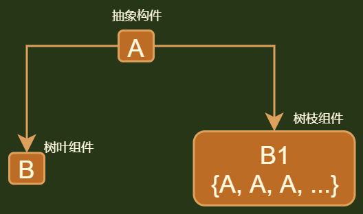

## 介绍



```java
// 模仿树结构
   在子类/实现类中设置一个集合成员， 存储自身相同抽象类型的对象
   
// 注意
   对于集合的操作，
       设置在父类中，方法透明， 所有类的方法操作都是一样的
       设置在使用集合的类中，方法安全，防止被非组件结点访问到
```

## 模式代码

```java
// 在子类、实现类中设置一个集合成员，存储自身相同抽象类型的对象
// 
public interface Tree {
    public void show();
}

// 叶子结点
public class SmallTree implements Tree {
    @Override
    public void show() {
        System.out.println("这是最小树，没有子树了");
    }
}

// 叶子组件
public class Trees implements Tree{
    private ArrayList<Tree> t = new ArrayList<Tree>();
    @Override
    public void show() {
        System.out.println("这是树族，里面包含很多树");
        for (int i=0;i<this.t.size();i++){
            System.out.println("第" + i +"棵树 ");
            // t[i].show(); 有错，但是不知道为啥
            t.get(i).show();
        }
    }
    public void add(Tree e) {
        this.t.add(e);
    }
}

// 测试
public class Main {
    public static void main(String[] args) {
        Tree sm0 = new SmallTree();
        Tree sm1 = new SmallTree();
        Trees trees = new Trees();
        trees.add(sm0);
        trees.add(sm1);
        trees.show();
    }
}
```