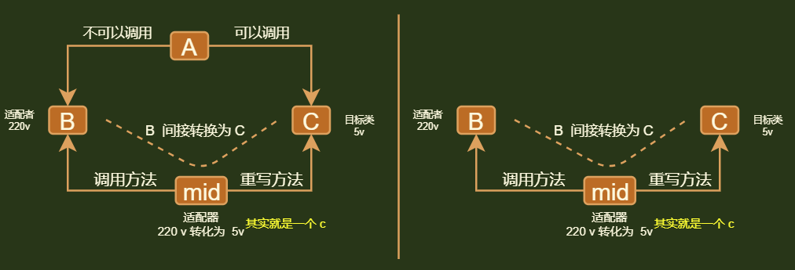
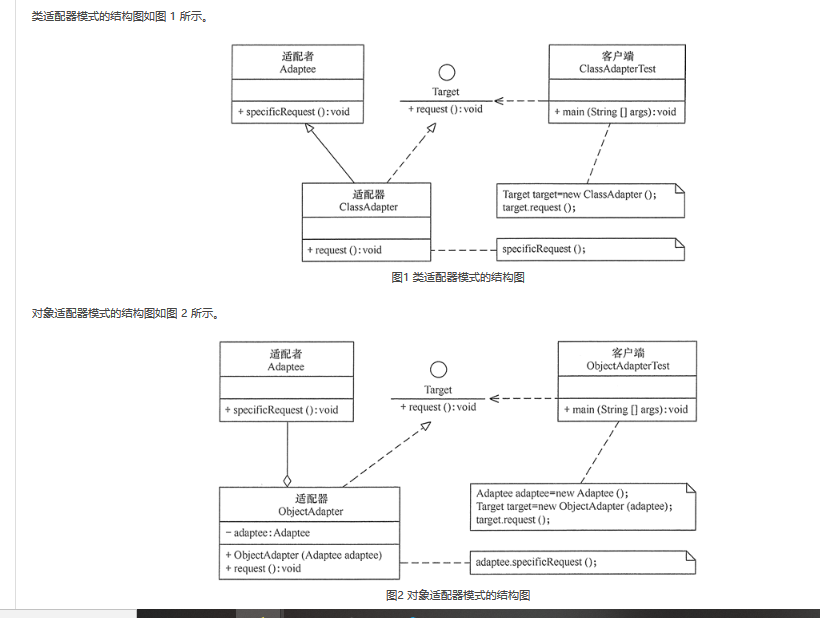

## 概念

* Adapter Pattern 

* 别称

    *  包装器(Wrapper) 

* 模型

    *  类结构型模式       ： 继承实现
    *  对象结构型模式。： 依赖实现（推荐）

    

## 介绍

*   将一个接口转换成客户希望的另一个接口，适配器模式使接口不兼容的那些类可以一起工作 


## 优点

*   可以让任何两个没有关联的类一起运行
    *   将目标类和适配者类解耦，解决了目标类和适配者类接口不一致的问题。
*   增加了类的透明度
    *   客户端通过适配器可以透明地调用目标接口
*   提高了类的复用
    *   复用了现存的类，程序员不需要修改原有代码而重用现有的适配者类。
*   灵活性好。

## 缺点

*   对类适配器来说，更换适配器的实现过程比较复杂。
*   过多地使用适配器，会让系统非常零乱，不易整体进行把握。
    *   比如，明明看到调用的是 A 接口，其实内部被适配成了 B 接口的实现，一个系统如果太多出现这种情况，无异于一场灾难。
    *   因此如果不是很有必要，可以不使用适配器，而是直接对系统进行重构。
*   由于 JAVA 至多继承一个类，所以至多只能适配一个适配者类，而且目标类必须是抽象类。（golang 貌似没）

## 使用

### 使用场景

*   系统需要使用现有的类，而此类的接口不符合系统的需要。 
*   想要建立一个可以重复使用的类，用于与一些彼此之间没有太大关联的一些类，包括一些可能在将来引进的类一起工作，这些源类不一定有一致的接口。 
*   通过接口转换，将一个类插入另一个类系中
    *   比如老虎和飞禽，现在多了一个飞虎，在不增加实体的需求下，增加一个适配器，在里面包容一个虎对象，实现飞的接口

### 小例子

*   美国电器 110V，中国 220V，就要有一个适配器将 110V 转化为 220V
*   在 LINUX 上运行 WINDOWS 程序


### 小技巧

*   用于当别人提供的对象或接口中的方法或者其它属性啥的和我们的重复了，或者看的不顺眼。名字太长了记不住，而将其包装到一个对象中，然后通过你感觉自己舒服的方式或者方法名字去间接的调用它

## 模式结构

* 目标（Target）接口

    *   当前系统业务所期待的接口，它可以是抽象类或接口。
    *   现存的业务 

* 适配者（Adaptee）类

    *   它是被访问和适配的现存组件库中的组件接口。
    *   不匹配的部分

* 适配器（Adapter）类

    * 转换器

    * 把适配者接口转换成目标接口，让客户按目标接口的格式访问适配者。

    * 其作为目标字段属性，实现转换

    * 分类

        * 对象适配器类

            ```go
            // 引入
            // 对象适配器模式可釆用将现有组件库中已经实现的组件引入适配器类中，该类同时实现当前系统的业务接口
            // 调用不适配的对象，进行封装，包装在不得类对象中
            type Adapter struct{
               adaptee Adaptee  // 硬盘去适配电脑
            }
            func (this *Adpter) request(){  //  适配器封装硬盘
                this.Adaptee.SpecificRequest()
            }
            ```

            

        * 类适配器类

            *   耦合度高
            *   要求程序员了解现有组件库中的相关组件的内部结构，所以应用相对较少些。

            ```go
            // 继承
            // 类适配器模式可采用多重继承方式实现
            // 定义一个适配器类来实现当前系统的业务接口，同时又继承现有组件库中已经存在的组件(不适配的部分)。
            
            // 配适器通过继承不适配的部分，已达到配适调用的目的
            type Adapter struct{
                Adaptee  //  硬盘放入适配器
            }
            func (a *Adpter) request(){
               a.SpecificRequest()
            }
            
            使用了go语言中的匿名组合，所以Adapter也就拥有了SpecificRequest实例方法
            又因为Go语言中非侵入式接口特征，这样的话，Adapter其实也适配Adaptee接口
            
            ```

            




## 扩展

*   扩展为双向适配器模式
    *   双向适配器类既可以把适配者接口转换成目标接口，也可以把目标接口转换成适配者接口，