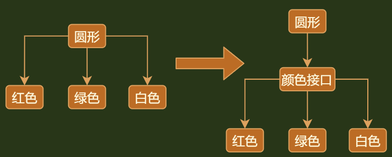

## 介绍

```java
介绍
    // 就是面向接口(抽象类)编程，利用向上转型，解决类复用的问题，达到化简编写代码
    // 一个类调用多个相同类， 改为调用这些类的抽象类/接口， 
    及时对大量重复使用、有共同特点的类，进行接口的抽象，变更为使用接口
    这个桥就是重复类的抽象接口
```

## 模式代码




## 介绍

**意图：**将抽象部分与实现部分分离，使它们都可以独立的变化。

**主要解决：**在有多种可能会变化的情况下，用继承会造成类爆炸问题，扩展起来不灵活。

**何时使用：**实现系统可能有多个角度分类，每一种角度都可能变化。

**如何解决：**把这种多角度分类分离出来，让它们独立变化，减少它们之间耦合。

**关键代码：**抽象类依赖实现类。


## 优点

*   抽象和实现的分离。
*   优秀的扩展能力。
*   实现细节对客户透明。

## 缺点

*   桥接模式的引入会增加系统的理解与设计难度，由于聚合关联关系建立在抽象层，要求开发者针对抽象进行设计与编程

## 应用场景

* 如果一个系统需要在构件的抽象化角色和具体化角色之间增加更多的灵活性，避免在两个层次之间建立静态的继承联系，通过桥接模式可以使它们在抽象层建立一个关联关系。 

* 对于那些不希望使用继承或因为多层次继承导致系统类的个数急剧增加的系统，桥接模式尤为适用。 

* 一个类存在两个独立变化的维度，且这两个维度都需要进行扩展。

    ```go
    1. 墙上的开关，可以看到的开关是抽象的，不用管里面具体怎么实现的。
    2. 对于两个独立变化的维度，使用桥接模式再适合不过了
    3. 我们需要某个特定类型的单个共享值。
    4. 我们需要将某些类型的对象创建限制为整个程序中的唯一
    
    ```

    

