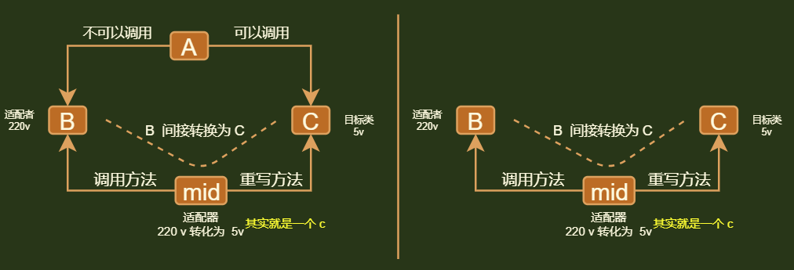

## 介绍



```java
情景
    // 其实是：提供一种两个类之间相互转换的方式
    A 可以使用 C ，但是不可以使用 B
    将 B 转化为 C : 伪转化，并不是真正的转化，是方法中调用方法

调用方法
    // 根据调用 B 方法的不同分类
    类适配器
    	适配器通过继承的方式调用 B 的方法
    对象适配器
        适配器通过组合把 B 嵌套为一个成员属性
    接口适配器
    	适配器通过组合把 B 的抽象接口嵌套为一个成员属性
    
```

## 模式

### 注意

```java
非重要的代码，我就不写了，只写能体现精髓的地方
```


### 介绍

```java 
以下三种方式中
    B 适配者类（adaptee），就是你使用不了的类
    C 目标类（target）， 就是你可以使用的类
    A 调用 C 类的，
    
    mid 适配器（adapter）， 根据模式不同而采用不同的设计
```


### 类适配器(继承)

```java
介绍
    // Java 中是单继承，所以一个用继承，一个用接口实现
    适配器(mid) vs 适配者(B)  使用继承实现方法调用
    适配器(mid) vs 目标类(C)  只能采用实现接口，来重写目标类方法
代码
    // 适配者类 220 V
    public class AC220V {
		public void show220v(){
            System.out.println(" ac220V 充电中 ");
        }
    }
	// 目标类 110V ， 前面分析了，所以 目标类使用接口
	public interface DC5V {
    	public void show5V();
    }
	
	// 适配器类
	public class Adapter extends AC220V implements DC5V {
        @Override
        public void show5v(){
            super.show220v()
        }
    }
	
	// 测试
	public class Main {
        public static void main(String[] args) {
            DC5V dc = new Adapter();
            dc.show5V();  // " ac220V 充电中 "
        }
    }
```


### 对象适配器(类组合)

```java
介绍
    适配器(mid) vs 适配者(B)  
    	将适配者（B）作为适配器（mid）的属性成员，来实现方法调用
    适配器(mid) vs 目标类(C)  
    	继承、实现均可实现方法重写，c 可以是类、接口

 代码
    // 适配者类 220 V ， 和前面的一样
	// 目标类 110V ，可以使用类继承，接口实现，来重写方法，这里使用 接口实现， 和前面一样
	// 适配器类
	public class Adapter  implements DC5V {
        private AC220V ac220v;
        public Adapter(Ac220V ac){
            this.ac220v = ac;
        }
        @Override
        public void show5v(){
            this.ac220v.show220v()
        }
    }

	// 测试
	public class Main {
        public static void main(String[] args) {
            DC5V dc = new Adapter(new AC220V());
            dc.show5V();  // " ac220V 充电中 "
        }
    }
```


### 接口适配器(接口组合)

```java
介绍
    适配器(mid) vs 适配者(B)  
    	将适配者（B）的抽象接口作为适配器（mid）的属性成员，来实现（对于B的）方法调用
        通过多态，可以转换多有实现该接口的类，// 220v 110v 0v 都可以转化为 5v  （手动狗头）
    
    适配器(mid) vs 目标类(C)  
    	继承、实现均可实现方法重写，c 可以是类、接口
代码
    // 适配者接口
    public interface AC {
    	void showAC();
	}
    // 适配者类 220 V
    public class AC220V {
		public void showAC(){
            System.out.println(" ac220V 充电中 ");
        }
    }
	// 目标类 110V ， 前面分析了，所以 目标类使用接口
	public interface DC5V {
    	public void show5V();
    }
	
	// 适配器类
	public class Adapter extends AC220V implements DC5V {
        private AC ac;	// 组合的是接口
        public Adapter(Ac ac){
            this.ac = ac;
        }
        @Override
        public void show5v(){
            this.ac.showAC()
        }
    }
	
	// 测试
	public class Main {
        public static void main(String[] args) {
            DC5V dc = new Adapter(new AC220V());
            dc.show5V();  // " ac220V 充电中 "
            // 你也可以在设置一个 AC110V 的类，传进去就可以进行 110V 转为 5V
        }
    }
```


