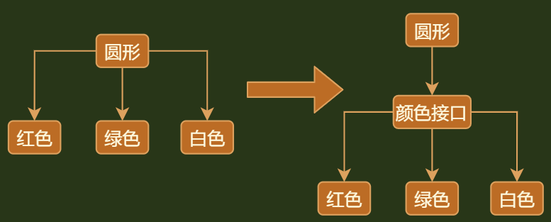

## 介绍

```java
介绍
    // 就是面向接口(抽象类)编程，利用向上转型，解决类复用的问题，达到化简编写代码
    // 一个类调用多个相同类， 改为调用这些类的抽象类/接口， 
    及时对大量重复使用、有共同特点的类，进行接口的抽象，变更为使用接口
    这个桥就是重复类的抽象接口
```

## 模式代码




```java
// Color
public interface Color {
    void useColor();
}

// green
public class Green implements Color {
    @Override
    public void useColor() {
        System.out.println("green");
    }
}

// red
public class Red implements Color {
    @Override
    public void useColor() {
        System.out.println("red ");
    }
}

// white
public class White implements Color{
    @Override
    public void useColor() {
        System.out.println("白色");
    }
}


// Circle
public class Circle {
    private  Color c;

    public Circle(Color c) {
        this.c = c;
    }

    public void showColor(){
        System.out.print("圆形颜色为 ");
       this.c.useColor();
    }
}

// 测试
public class Main {
    public static void main(String[] args) {
        Circle circle = new Circle(new Green());
        circle.showColor(); // 圆形颜色为 green
    }
}

```

