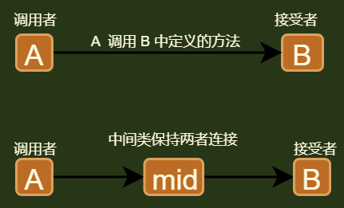

## 介绍



```java
// 代理模式 
// 适配器模式, 适配器实现的是目的接口， 这个是中间类实现的自己的接口
一个类调用另一个类的方法，
    中间使用一个接口，使两者解耦，只要方法不变，可以随意变换两边的类（实例）
```

## 模式代码

```java
// 抽象命令
public interface Command {
    void execute();
}

// 实际命令
public class CommandA implements Command {
    private Receiver receiver;

    public void setReceiver(Receiver re) {
        this.receiver = re;
    }

    @Override
    public void execute() {
        receiver.show();
    }
}

// 调用者
public class Invoker {
    private Command command;

    public void setCommand(Command com) {
        this.command = com;
    }

    public void show() {
        this.command.execute();
    }
}

// 接受者
public class Receiver {
    public void  show(){
        System.out.println("这里是接受者");
    }
}

// 测试
public class Main {
    public static void main(String[] args) {
        Receiver rec = new Receiver();
		
        // 命令设置
        CommandA commandA = new CommandA();
        commandA.setReceiver(rec);
		
        // 调用者调用命令
        Invoker invoker = new Invoker();
        invoker.setCommand(commandA);

        invoker.show();
    }
}
```


## 宏命令