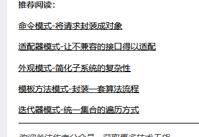

```go
// 需要总结的
https://www.jianshu.com/p/dc94f2099277

继承
	在编码过程中就要指定具体的父类，其关系在编译期就确定
	继承强调的是is-a的关系
组合
	一般在运行时确定。
	组合强调的是has-a的关系。


继承是说“我父亲在家里给我帮了很大的忙”。   
组合是说“我请了个老头在我家里干活”。


  组合是在一类类中引用另一个类。生成另一个类的实例。   
  而继承只是继承了父类的变量和方法。   
  区别：   
  使用组合可以用到另一个类中私有的变量和方法，而继承就不可以用到父类的私有的变量和方法了 


继承：他是is-a的关系，指一个类继承另外一个类的功能

　　例如：public class A extends B { }

聚合：他是has-a　，可以相互分离　
　　例如：public class A{ List<B> b} A可以有b


组合：他是contans-a（强聚合） 缺一不可

嵌套 ： go 中就是使用小写的不可见字段的组合


 处于聚合关系的两个类生命周期不同步，则是聚合关系；处于组合关系的两个类的生命周期同步；

聚合关系,当A创建的时候，B不一定创建；当A消亡时，B不一定消亡。

组合关系，当创建一个A对象时，也会创建一个B对象；当A对象消亡时，作为A的属性的B对象也会消亡。
```

