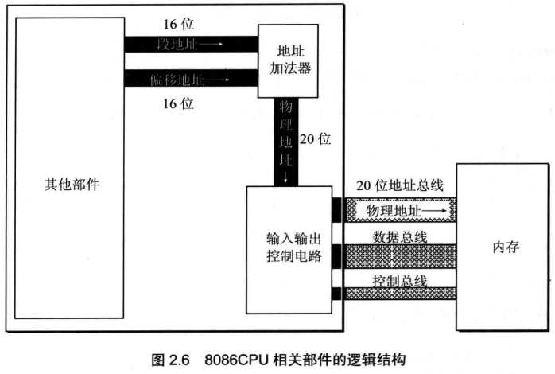

## 介绍

*   20 位地址总线
    *   可以传送 20 位地址，有 1 M 寻址能力
*   16 位结构
    *   在内部一次性处理、传输、暂时存储的地址为 16 位， 寻址能力只有 64 KB

## 物理地址表示

*   用两个 16 位地址合成一个 20 位的物理地址

    ```go
    物理地址 = 段地址 X 16  + 偏移地址
    ```

    

### 逻辑结构 / 原理



*   CPU 中相关部件提供两个 16  位的地址，一个称为段地址，一个为偏移地址
*   段地址和偏移地址通过内部总线送到一个称为地址加法器的部件
*   地址加法器将两个 16 位地址合成一个 20 位的物理地址
*   地址加法器通过总线将 20 位物理地址送入输入输出控制电路
*   输入输出控制电路将 20 位物理地址送上地址总线
*   20 位物理地址被地址总线传送到存储器

```go
// 实例
8086CPU 访问地址为 123C8H 的内存单元
1. 相关部件提供 段地址 1230  偏移地址 00C8
2. 两个地址送入加法器
3. 计算 段地址 X 16  + 偏移地址 = 1230 X 16 + 00C8 = 123C8

// 本质
CPU 在访问内存时，用一个基础地址（段地址 X16） 和一个相对于基础地址的偏移地址相加，给出内存单元的物理地址
```


