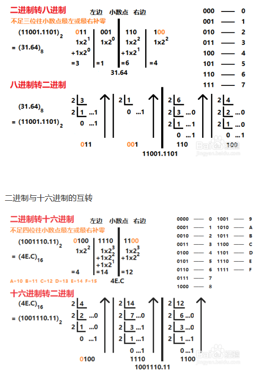

## 数制

### R 进制数 N 

$(N)_R$

​	= $\underbrace{a_{n-1}a_{n-2} ... a_1a_0}_{整数部分}\underbrace{a_{-1}a_{-2} ... a_m}_{小数部分}$ 

​	= $\underbrace{a_{n-1} \times R^ {n-1} + a_{n-2} \times R^ {n-2} +   ... + a_{1} \times R^ {1} + a_{0} \times R^ {0}}_{整数部分} + \underbrace{a_{-1} \times R^ {-1} + a_{-2} \times R^ {-2} + ...+  a_{-m} \times R^ {-m}}_{小数部分}$ 

​	= $\displaystyle \sum^{n-1}_{i = -m}{{a_i \times R^i}}$    $a_i ∈ [0 ,R-1]$

```go
// 注意 i 为负数的小数部分

十进制		R=10 dec  ai : 0 ~ 9
二进制 	R=2  Bin  ai : 0 ~ 1
八进制 	R=8  Oct  ai : 0 ~ 7
十六进制    R=10 Hex  ai : 0 ~ 9 A ~ F
```

### 进制转换

*    R 进制转 10 进制

     *   整数部分 X R （正 对应次方） 
     *   小数部分 X R （负 对应次方）

     ​	$(17)_8 = 1 \times 8^1 + 7 \times 8^{0} = 15$ 

     ​	$(0.42)_8 = 4 \times 8^{-1} + 2 \times 8^{-2} = 0.5 + 0.03125 = (0.53125)_{10} $

     ​	$(17.42)_8 = (15.053125)_{10}$

*   10 进制转 R 进制

    *   整数部分除以 R 取余 （从下往上排列）
    *   小数部分乘以 R 取余 （从上往下排列）
        *   小数部分不一定能换算尽，所以算到一定的精度就行了

    

     

*   二  转 八 、十六进制

    ```go
    // 八 、 十六 进制就是为了更加方便记录二进制
    小数点为分界点
    	整数 ： 从小数点往左 （每三位转为一个八进制数） （每四位转为一个十六进制数） X R 取整
    	小数 ： 从小数点往右 （每三位转为一个八进制数） （每四位转为一个十六进制数） / R 取余
    	不够 三 / 四 位的补 0 
    ```

    

*   其余进制转化

    ```go
    通过 10 进制为跳板 
    ```

    


## 参考

```go
https://jingyan.baidu.com/article/f96699bb7b8710c94f3c1b13.html
```

