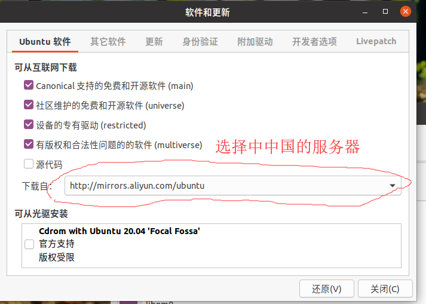

# ubuntu初始设置

# 1.语言环境设置

* 系统设置（system setting） ——> 语言支持（language suppoert） ——>  安装 / 删除语言 （install / remove laguage）：添加中文

  ```go
  这个在中文的语言设置，直接搜索
  ```

# 2.软件安装

## 1.设置服务器镜像源

* 设置步骤

  ```go
  系统设置 —— > 软件和更新 --> 设置自 。。。： 其他站点 —— 找到中国下面的镜像源 —— > 记得点击【选择最佳服务器】：稍微等待一阵子
  ```



## 2.启动栏添加 终端 图标

## 3.更新软件

* 通常安装完以后，先更新系统中可更新的软件包

  ```go
  sudo apt update
  
  sudo apt upgrade
  ```

* 注意：如果增加或者更换了软件源，通常要使用 update 更新本地缓存

# 3.apt安装

* apt : advance packaging tool

* 实现软件 安装 / 更新 / 卸载

```go 
// 安装软件
sudo apt install 软件名

// 卸载软件
sudo apt remove 软件名

// 更新可用软件包列表
sudo apt update

// 更新已安装的包
sudo apt upgrade

```

# 其他安装

## 1.已经下载安装包

* deb 文件

  ```go
  1、转到安装包所在目录
         cd 目录名/...
  2、用dpkg命令运行安装包
  
         sudo dpkg -i 安装包名称.deb
  ------------------------------------------------------------------------------------------
  dpkg常用命令:
  
        sudo dpkg -I 文件名.deb     //查看iptux.deb软件包的详细信息，包括软件名称、版本以及大小等（其中-I等价于--info）
        sudo dpkg -c 文件名.deb    //查看iptux.deb软件包中包含的文件结构（其中-c等价于--contents）
        sudo dpkg -i 文件名.deb     //安装iptux.deb软件包（其中-i等价于--install）
        sudo dpkg -l 文件名             //查看iptux软件包的信息（软件名称可通过dpkg -I命令查看，其中-l等价于--list）
        sudo dpkg -L 文件名            //查看iptux软件包安装的所有文件（软件名称可通过dpkg -I命令查看，其中-L等价于--listfiles）
        sudo dpkg -s 文件名            //查看iptux软件包的详细信息（软件名称可通过dpkg -I命令查看，其中-s等价于--status）
        sudo dpkg -r 文件名             //卸载iptux软件包（软件名称可通过dpkg -I命令查看，其中-r等价于--remove）
  
  ```

  