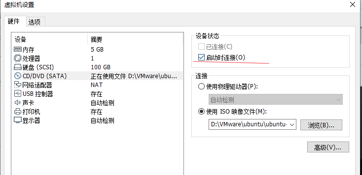

# ubuntu下载

# 1下载

```go
https://ubuntu.com/download/desktop
```

* 有空可以看看首页的、

  ```go
  Ubuntu 20.04 LTS release notes // 这个有空看看
  
  // 配置要求
  Recommended system requirements:
  
  2 GHz dual core processor or better
  4 GB system memory
  25 GB of free hard drive space
  Either a DVD drive or a USB port for the installer media
  Internet access is helpful
  ```

# 2.安装

```go
系统的 iso 文件尽量不要和虚拟机设置的 磁盘文件 放在同一个人间加内
```

# 3.文件机制

* Linux的文件系统是一种树状的结构，一个软件会把包含的众多文件，放置在不同的目录当中，所以不同的使用目的，每个目录扩张的速度会不一样 

  * 当计算机当作服务器使用时，

  		由于变动的文件一般是位于/var当中，/var应规划足够的空间；
  		
  * 当计算机当作日常桌用应用时，
  	/home会增加使用量，所以/home要放大空间；
  	
  * 若计算机中会安装大量的软件，
  	那你可能需要增加/usr的空间。 

  * 不把这些空间独立分割出去，一起使用/的空间，会有最好的空间使用效率，但这样容易造成系统不稳定，或其它的问题的情形发生。

* 前面提到Linux文件系统的根目录，是一定要挂载的。没有特定指定分区挂载的目录，都会与根目录放在同一个分区中。

# 4.注意

* 必须和根目录放在一起

  ```go
  ///bin,/sbin, /lib, /etc, /dev 这五个目录。绝对不可与 / 所在的分区分开，
  
  1.因为这五个目录，有系统必要的工具与资料存放。
  2.当根目录在开机过程中被挂载进来时，需要这些工具与资料来维持正常的运作。
  3.若是把这五个目录放在其它分区当中，系统就不能正常引导。 
  4.以上的目录，绝对不要额外挂载到其它分区上。
  ```

* 不需要跟根目录分开

  ```go
  // /cdrom,/mnt, /media, /proc, /run, /sys,/srv等
  
  1.这些目录可以放到其它的分区，但不需要，因为这些目录的存在，只是运作过程中，维持运作所需，大多不会占用空间。放到其它分区，也无益于系统的性能
  
  2./mnt,/media, /cdrom 只是提供一个挂载点，让实体存储媒体可以挂载而已
    /sys,/proc其实是内存上的数据，上面所有的数据完全不会占用硬盘的空间
  ```

*  最好跟分目录分开

  ```go
  // 最好：是对整个作业系统的稳定而言，并非「必要」。只要”/”存在，Linux系统即可运作。
  
  // /home /var /usr三者必须思考哪些空间必须额外分割出来（参考后面各分区的作用）。当然就系统稳定来说，最好都分割出来。
  ```

  

* FHS的推荐当中提到，根目录所在的分区越小，越有助于系统的稳定，避免其它的干扰；发生错误时，也会比较容易进行维护修正；而且可以提高系统的性能。 


* 启动器安装到efi系统分区下，切记。要不然会出现GRUB错误，而不能进入系统。

  

* 缺少少efi系统分区或启动器为放置在 efi系统分区下，这是使用U盘安装ubuntu导致grub主因 

   


# 5.分区

* 不需要全部设为主分区，只需要第一个设为主分区；各个分区大小根据情况自己定义】

## swap

* 主分区

* ext4日志文件系统  

* 2倍内存的  固态

  ```go
  1、交换空间，类似Windows下的虚拟内存。
  2、空间大小，一般是等于电脑内存；如果容量足够，可以等于物理内存的2倍。比如我的是16GB内存，就可以给固态硬盘32GB的空间，太小也不好，太大也没用。32GB=32768MB。
  ```

## /boot

* 逻辑分区

* ext4日志文件系统

* 4GB，固态

  ```go
  1、引导分区。
  2、空间大小，给固态硬盘容量为4096MB。
  ```

## efi 系统分区

* 逻辑分区

* 无 文件系统类型

* 4GB 固态

  ```go
  1、作用和boot引导分区一样
  2、boot引导默认grub引导，而efi是UEFI引导。
  3、不要按照那些老教程去选boot引导分区，否则就无法使用UEFI启动系统。
  ```

## /

* 逻辑分区 ，根目录

* ext4日志文件系统

* 固态硬盘剩余的

  ```go
  1、安装系统和软件
  2、就是把除挂载home之外的全部杂项囊括了，空间也不要太小
  3、建议在根目录下面只有目录，不要直接有文件
  ```

## /home

* 逻辑分区

* ext4日志文件系统

* 机器硬盘 500G

  ```go
  1、个人文件夹，用户存储数据
  2、Windows下的User，以后自己的图片、视频、下载内容基本都在这里面
  3、home 这个一定要自己分区因为这个是保存的个人数据,万一系统出问题了 这一块里面的数据还能找回来
  4、分割出/home有个最大的好处，当你重新安装系统时，你不需要特别去备份你的个人文件，只要在安装时，选择不要格式化这个分区，重新挂载为/home就不会丢失你的数据。 
5、在你的计算机上，安装两个或更多的Linux系统，你可以共享/home这个分区。简单地说，你的个人文件可以在切换到其它Linux系统时，仍正常使用
  ```
  
  

## 附加分区

### /usr/local/

```go
承载大型软件的
```


# 6.各个文件夹的作用


# 踩坑

1. ``` please remove the installation medium then press enter ```

   * 解决方法：把这个启动时连接去掉 、去掉、

   *  去掉

     

     