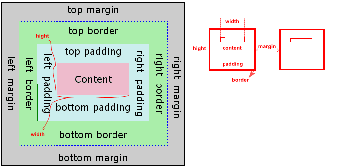
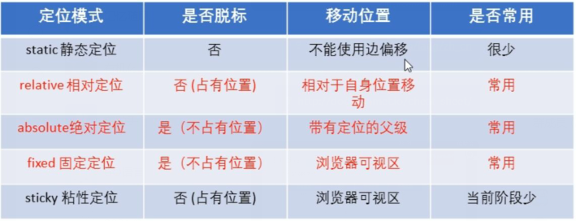

## 字体 font

```css
字体相关样式
    color    字体颜色，前景色
    font-size 字体大小
        em 相当于当前元素的一个 font-size
        rem 相当于根元素的一个 font-size
    font-family 字体族（字体样式）
        可以使用多种字，优先使用第一个字体，最后一个设置成兜底的字体

        font-family:serif ,'中华彩云', 'Courier New';
            可选值，大的字体分类，指定字体类别，浏览器会自动使用该类下的字体
                serif         衬线字体
                sans-serif   非衬线字体
                monospace     等宽字体

    // 这里是建议使用的字体，不涉及版权问题 ，使用 font-family
    @font-face    {  将服务器的字体直接提供给用户使用 ，但是有
        font-family:;  使用的字体名称
        src:url() format("truetype");      服务器中字体的路径 ,formate 很少用
    }
        加载速度问题，版权问题  兼容问题


line-height 行间距 ：上边距 + 文字高度 + 下边距
```

## 背景

```js
background-img 描述元素的背景图像，方便控制位置
background-repeat   平铺，默认情况下，背景图片是平铺的
	背景图片会盖上背景颜色
    
background-position:x y;  x y 的值可以是精确值、方位词联合使用
background:color   //设置透明色，只是让背景色半透明，盒子里面的内容不受影响
	color => rgba() rgb()
```


## 盒子模型



```html
box model  
    盒模型 ， 盒子模型 ， 框模型
css 将页面中的所有元素都设置成了一个矩形的盒子
将元素设置为矩形的盒子后，对有页面的布局就变成不同的盒子摆放位置
盒子组成
    内容区 content  ：weight height
    内边距 padding		影响盒子大小
    边框    border
    外边距  margin

盒子大小    
    可见框 = 内容区 + 内边距 + 边框


内容区
    元素中所有的子元素和文本内容都在内容区中排列
    width  height 设置内容区，这个内容区大小，没有这个 padding 不会撑开盒子对应的 width height
	注意一个顺序是的顺序，要包括全部

盒子中
	边框大小 ：线条粗细
	外边距大小 ：另一个对象的边框大小
	内边距大小 ：内容和边框的大小
```

### 边框 border

```html
边框 boder
设置边框 ： 
    边框宽度 border-width   10px ；省略按照各个浏览器默认的来
    border-width
        四个值：上 右 下 左
        三个值：上 左右 下
        两个值：上下 左右
        一个值： 上下左右
    border-xxx-width    xxx 为 top right bottom left
        单个一个边的长度
边框颜色 border-color    
    每个边的规则和边框一样
    border-color:
        四个值、三个值、两个值、一个值
        可以省略不写，则自动使用 color 默认值

边框样式 border-style
    solid 实线  dotted 点状虚线  dashed 虚线  double 双线
    border-style:
        四个值，三个值，两个值，一个值
        默认没有线

border 简写属性属性，通过该属性可以同时设置边框所有的相关样式，并且没有顺序要求
    border:solid 10px red  (三个没有顺序)
    border-top/left/right/bottom : 10px solid red
```

### 内边距 padding

```go
内容区和边框之间的距离
    一共四个方向的内边距
    padding-top  padding-right  padding-bottom padding-left
特点
    内边距的设置会影响盒子的大小
    背景颜色会延伸到内边距上
简写
    padding:
    四个值，三个值，两个值，一个值 , 跟 border一样

```

### 外边距 margin

#### margin

```go
margin
    外边距 不会 影响盒子课件框的大小，但是影响盒子的位置 音响盒子具体占多大


    方向：margin-top/right/bottom/left
        top ：距离顶部的距离 ， 向下为正，向上为负
        right :距离右边的距离，向左为正，向右为负
        bottom： 距离底部的距离 ， 向上为正，向下为负
        left: 距离左边的距离 ， 向右为正，向左为负
	(总的来说，向下为正、向右为正)

	  

        bottom : 正直，挤兑其下边的元素

        right ： 默认情况下设置，不产生任何变化
            具体看 盒子水平方向布局

        元素在页面中是按照自左向右的顺序排列的

margin:
    四个值，三个值，两个值，一个值
```

#### 垂直外边距合并

```css
发生
	只有垂直方向发生折叠（合并）
分类
	相邻块元素垂直合并外部间距的 合并
	嵌套块元素垂直外边距的  塌陷

相邻块元素（兄弟元素）- 合并
    /*
    *兄弟元素之间，
    * 一个设置了 margin-bottom  
    * 一个设置了 margin-top
    */
    两个值
        两个正值 ： 取两者中的最大值
        两个负值 ： 取两者中的绝对值的最大值
        一正一负 ： 取两者之和
    例子
        上元素   ： margin-bottom  假如 ：40px
        下元素   ： margin-top		假如 ：10px
        两者间距  ： 取两者之间的最大值	值为 ：40px
    解决   
        尽量只给一个盒子添加 margin 值
        兄弟之间外边距的重叠，对于开发是有利的，所有我们不需要处理

嵌套块元素（父子元素）- 塌陷
	问题
		/*如果父元素没有上内边距及边框，则父元素的上外边距会与子元素的上外边距发生合并*/	
		/*合并后的外边距为两者中的较大者，即使父元素的上外边距为0，也会发生合并 ，相当于父元素塌下来了*/
		父元素和子元素都设置了 margin-top , 则只保存较大的 margin-top ，且变为父元素的margin-top
    	 
	出现
		/*父子元素的margin重叠了，就会造成父父子之间，父随子动，子元素会传递给父元素（上外边距）*/
		1. 父元素和子元素的上边距之间没有 border
		2. 父元素和子元素的上边距之间没有 padding
		2. 父元素上边距和儿子元素上边距之间有 空内容
		3. 父元素或资源度没有浮动

	bug
   		 会影响页面布局，所以需要处理
 	解决
		/*使父子的margin相互隔离开*/
		1. 父元素 ：设置上边框border、内边框padding、设置不浮动

```


#### 高度塌陷和BFC

```css
高度塌陷
    在浮动布局中，父元素的高度默认是被子元素撑开的，当子元素浮动以后，其会完全脱离 文档流，子元素从文档中脱离，将会无法撑起父元素的高度，导致父元素高度丢失
    父元素高度丢失以后，其下的元素会自动上移，导致页面的布局混乱
 

BFC block formatting context 块级元素格式化
    BFC 是CSS中一个隐含的属性，可以为一个元素开启BFC
    元素开启 BFC 的特点
        1. 不会被浮动元素所覆盖
        2. 和父元素的外边距不会重叠
        3. 可以包含浮动子元素
        4. 

    开启
        1. 设置元素浮动，父子都设置浮动（不推荐）
        2. 元素设置为行内块元素（不推荐）
        3. 将元素的 overflow 设置为一个非 visiable 的值,使其包含浮动元素
            overflow:hidden;auto  ;
        4. clear
        5. 伪元素
```

### 行内元素的盒模型

```css
    不支持  设置宽度和高度，只是不能修改这两个而已
        width 和 hight 
    支持   设置 padding , 但是垂直方向 ， 不会影响页面的布局
    支持   设置 border , 但是垂直方向，不会影响页面的布局
    支持   设置 mergin , 但是垂直方向，不会影响页面的布局

```


### 边距清除

```js
通常情况下，浏览器都会给元素设置一些默认的样式，
    默认状态的存在会影响到页面布局，通常情况之下，需要清除掉浏览器的默认样式（PC端）

去掉    body
body{
    mergin:0;
}

段落间距
p{
   margin:0;
    margin-left:20px;
    list-style:none;
}

/*合并,严谨来说应该一个一个来，通配符级别最低(仅高于继承)*/
*{
    margin:0;
    padding:0;
}

// 重置样式表
    reset.css  直接去除默认样式
    normalize.css 对默认样式进行统一
    
/*注意*/
行内元素
	只设置左、右内外边距，不设置上、下内外边距
    内边距，在ie6等低版本浏览器也会有问题。我们尽量不要给行内元素指定上下的内外边距就好了。
块级元素、行内块元素
	都可以设置
    

```


## 继承-标准流

### 层叠

```css
/*相同选择器设置相同的样式，此时一个样式会覆盖层叠另个一冲突的样式,相当于设置多余了*/
层叠性原则
	1. 样式冲突。 遵循就近原则，哪个样式离结构近，就执行哪个样式,从上往下执行，下层覆盖上层
	2. 样式不冲突，不会层叠

```

### 概述

```css
/* 这个相当于没有设置 ,子承父业*/
<p>
    我是 p
    <span>
        我是  p  的span
    </span>
</p>

你对 p 设置样式， span 也会使用同样的样式，这就是继承
    继承发生在 祖先和后代之间
    集成设计的开发，利用继承我们可以将一些同样的样式统一设置，设置一次就行

能继承的东西
	文字、颜色等 ：text- font- line-  color
不能继承
    背景、布局相关的不会被继承


行高的继承
	
```


## 浮动

```CSS
1. 浮动原因
2. 浮动排列特性
3. 浮动清除

```

### 概述

```css
设置原因
	有很多布局结果 ， 标准流没法万恒，可以用浮动完成布局，可以改变元素标签默认的排列方式

应用
	让多个块级元素一行排列显示，通过浮动可以制作一些水平方向的布局
	让页面中的元素可以水平排列
介绍
	是一个元素向其父元素的左侧或右侧移动
	创建浮动框，将其移动到一边，直到边缘(左/右)触碰到另一个浮动框或者包含块的边缘
语法
    style{float:;}
            none;默认不浮动
            left； 左移动
            right；右移动

    元素设置浮动以后，水平浮动的等式就不需要强制成立
    元素设置浮动以后，会完全从文档流中脱离，不再占用文档流为位置
        所以元素下边的还在文档流中的元素会自动向上移动
```


### 浮动排列特性

```css
通俗理解
	浮动使页面变成两个图层，浮动将指定元素移动到最前面的图层，
	移动后浮动元素原先的位置被其下面的 元素填充
特性
	1.浮动元素会完全脱离文档流，移动到指定位置，不再占据文档流的位置，原盒子位置被后面的元素占据
	2. 多个浮动元素 ：会按照属性值一行内显示并且顶端对齐
		浮动元素是相互贴在一起的(不会有缝隙)，
		如果父级元素装不下这些浮动的盒子，多出的盒子会另起一行对齐
    3. 浮动元素具有行内元素的特性 ，即块、行内块不用转换就可以直接给高度、宽度
    4. 设置过浮动的元素只会影响后面的标准流 ，不会影响前面的标准流
		如果浮动元素的上边是一个没有浮动的块元素，则浮动元素无法上移

搭配使用
	标准流的父元素
	    先用标准流的父元素排列上下位置，内部子元素采取浮动排列左右位置，复合网页布局第一准则
	     设置浮动以后，子元素向父元素的左侧或者右侧移动，不会从父元素中移出


	   
脱离文档流的特点
    元素设置浮动以后，将会从文档流中脱离，从文档流中脱离后，元素的一些特点也会改变
        块元素 ： 
            不再独占页面的一行
            脱离文档流以后，块元素的高度和宽度默认都是被内容撑开
        行内元素：
            脱离文档流以后，就会变成块元素
        脱离文档库，收其他文档流影响，


注意
    浮动不会覆盖住文字，文字会自动焕然在浮动元素的周围
    可以利用浮动来设置文字环绕图片的效果


```


### 清除浮动 

```css
原因
	父级盒子很多情况下，不方便给高度，但是子盒子浮动有不占有位置，无法撑开父级元素，最后父级盒子的高度为 0 时 ，就会影响下面的标准流盒子

本质
	清除浮动元素脱离文档流造成的影响
策略
	闭合浮动，只让浮动在父盒子内部影响，不影响父盒子外面的盒子

语法
	选择器 { clear:both;}
   
    作用：清楚浮动元素对当前元素所产生的的影响
    可选值
        left : 清楚左侧浮动元素对当前元素的影响
        right :清除右侧浮动元素对当前元素的影响
        both : 清除两侧影响最大的那一侧
    原理
        设置清除浮动以后，浏览器会自动给元素添加一个上外边距，以使其位置不会受其他元素的影响
		闭合清除
方法
    1. 额外标签法(隔墙法)
    2. 父元素添加 overflow 属性
    3. 父级元素添加 after 伪元素
    4. 父级标签添加 双伪元素

具体
1. 额外标签法
    在最后一个浮动元素后面额外添加一个标签 或其他标签(块元素) ，进行浮动清除
    缺点 ：添加无意义的标签
        .clear {clear:both;}
        /*网页中*/
        浮动孩子 n（最后一个浮动孩子）
        <div class="clear"></div>
2. 父元素添加 overflow 属性
	浮动元素的父元素的 style 添加属性 ovserflow:hidden;
3. 父级元素添加 after 伪元素
	.clearfix::after{
            content:'';
            dispaly:block;;  解决塌陷和重叠问题
            height:0;
            clear:both;
            Visibility:hidden;
        }
        .clearfix {
            /*IE6 7 专有*/
            *zoom:1;
        }    
		/*网页中设计*/
		<div class="box clearfix"></div>

4. 父级标签添加 双伪元素
       .clearfix:before ,  /*这是一行，别把逗号丢了*/ 
       .clearfix.after {
                content:'';
                display:table;
            }
        .clearfix:after {
            clear:both;
        }
        .clearfix {
            /*IE6 7 专有*/
            *zoom:1;
        }    
		/*网页中设计*/
		<div class="box clearfix"></div>
```

### 优先级

```css
// 权重
样式冲突
    通过不同的选择器，选中相同的元素，为相同的样式设置不同的值，此时发生样式冲突
    发生冲突有优先级（权重）决定

选择器相同
	执行行层叠性
选择器不同
	选择器优先级权重

优先级
    分组选择器单独计算 ,复合选择器单独使用
    
    无穷大  	    1000        100            10            1          0        没有优先级
   !important  >>  内联样式 > id 选择器 > 类和伪类选择器 > 元素选择器 > 统配选择器 > 继承的样式 
	(sic)
	权重叠加 ：
		不能夸数量级，id 选择器再多，也超不过内联样式
		选择器越具体，优先级越高
		优先级相同的，优先使用靠下的选择器

特殊
	a 链接 ： 浏览器默认指了一个样式，蓝色的 有下划线
```

## 定位

### 概述

```css
使用
	1. 让元素可以自由在一个盒子内移动，并且能压住其他盒子
	2. 滚动窗口，盒子是固定在某个位置的


定位 position
	含义
    	一种高级的布局手段
    	通过定位可以将元素摆放到页面的任意位置
	组成
		定位模式 + 边偏移
		定位模式 ：一个元素在文档中的定位方式
		边偏移   ：决定该元素的最终位置
	语法
       模式
			position 属性来设置定位
       可选值
            static    静态定位	默认值，元素是静止的，没有开启定位，标准流
            relative  相对定位
            absolute  绝对定位
            fixed     固定定位
            sticky    粘滞定位  兼容性不好
	边偏移
		top right  bottom left
		top		顶部偏移量		相对于其父元素  上边线  的距离
		right	右部偏移量		 相对于其父元素  右边线  的距离
		bottom	底部偏移量		 相对于其父元素  下边线  的距离
		left	左部偏移量		 相对于其父元素  左边线  的距离
```

### 相对定位

```css
语法
	选择器 {position:relative}
注意
	1. 元素在移动的时候是相对于它原先(上一次移动)的位置 移动的
	2. 原来在标准流中的位置继续占有，后面的盒子依然以标准流的方式对待它(不脱标，继续保留原先的位置)
		相对定位没有脱标，典型应用是给决定定位当爹用的

    偏移量 offset
        元素开启定位以后，可以通过偏移量设置元素位置

            垂直方向的位置由 top 和 bottom 两各属性控制，通常我们只用其中一个
            top 越大越向下移动 
            bottom 越大，越向上移动


            水平方向的位置由 right 和 left 两各属性控制，通常我们只用其中一个
            left 越大越靠右
            right 越大越靠左

    特点
        1. 不设置偏移量，不发任何变化
        2.  相抵定位是参照元素在文档流中的定位决定的
        3. 相对定位会提升元素的层级
        5. 相对定位不会给变元素的性质：块和行内的性质不变

```

### 绝对定位

```css
语法
	选择器 {position:absolute}
注意
	是相对祖先元素来说的（拼爹）
特点
	1. 如果没有祖先元素或者祖先元素没有定位（标准流或者没设置浮动），则浏览器为准定位（document）
	2. 如果祖先元素有定位(相对、绝对、固定)，则以最近一级的有定位的祖先元素为参考点移动
	3. 绝对定位脱离标准流，不再占有优先的位置(脱标)


    特点：
        1. 如果不设置偏移量，元素位置不发生变化，其他的会变
        2. 开启后，元素会从文档流中脱离
        3. 会改变元素的性质 ， 行内变快，块的高度被内容撑开
        4. 是元素的层级会提升一个
        5. 绝对定位元素是相对于包含块进行定位的
    包含块
        正常情况
            包含块就是离当前块的最近的开启了定位的祖先元素
            所有的祖先元素都没有开启定位，则相对于根元素进行定位
                <html> 根元素，初始包含块

绝对定位元素的位置
    开启绝对定位以后，

    水平布局等式的 七个元素要加上 left 和 right 变成 9 个，发生过度约束时的规则还一样
        1. 9 个值中没有 auto ，则自动调整 right , 使等式成立
        2. 可以设置为 auto 的值
            margin width left right
        3. left 和 right 的值，默认是 auto ,等式不成立，会自动调整这两个值

    垂直方向布局
        top + margin-top/bottom + padding-top/bottom + border-top/bottom + height = 包含块的高度

    包含块中间
        position:absolute;
        margin:auto;

```

### 固定定位

```css
语法
	选择器 {position:fixed}
使用
	元素固定于浏览器可视区域，在网页滚动的时候位置不会改变
特点
	1. 永远参照浏览器的视口，进行定位
	2. 跟父亲没有任何关系
	3. 不会随着网页的滚动而滚动


    浏览器视口
        就是浏览器的可视窗口，视口是规定不懂的

```

### 粘滞定位

```css
语法
	选择器 {position:sticky}
特点
	1. 以浏览器的可视窗口为参照点移动元素（固定定位特点）
	2. 粘性定位占有原先的位置（相对定位特点）
	3. 必须加 top left right bottom 区中的一个

	和相对定位特点基本一致，但是粘滞定位是到达某个位置的时候，将其固定
	跟页面滚动相结合，兼容性较差

```

### 定位叠放次序

```css
在使用定位布局的时候，会出现盒子重叠的情况，此时，可以使用 z-index 来控制 盒子的前后顺序(z轴)

语法
	选择器 { z-index : 1 ;}
	数值
		1. 可以是负数、0 、正数 ，默认 auto ,值越大元素的层级越高，元素的层级越高，越优先显示
		2. 祖先元素的层级再高，也不会盖住后代元素
		3. 如果属性值相同(元素的层级一样),按照书写顺序，后来居上
		4. 数字后面不能加单位
		5. 只有 定位盒子才有 z-index 属

   
```

### 扩展

```css
/* 定位的特殊特性*/
1. 绝对定位、固定定位和浮动类型类似
	行内元素添加绝对和固定定位，可以直接设置高度和宽度
	块级元素添加绝对或者固定定位，如果不给宽度或者高度，默认大小是内容的大小

2. 脱标的盒子不会触发外边距塌陷
	浮动元素、绝对定位(固定定位)元素的都不会触发外部间距合并问题

3. 绝对定位(固定定位)会完全压住盒子
	浮动的元素会压住他表面的标准流的盒子，但是不会压住下面标准流盒子里面的文字和图片
	绝对定位、固定定位会压住标准流所有的东西
	原因
		浮动最初产生的目的就是实现文字环绕的效果的，所以文字会环绕者浮动元素
	
```


### 使用

```css
/* 子绝父相 为多数*/ 
意思
	子级使用绝对定位，父级则需要使用相对定位，来占有位置
使用
	子级绝对定位，不会占有位置，可以放到父盒子里面的任何一个地方，不会影响其他的兄弟盒子
	父盒子需要加定位限制子盒子在父盒子内显示
	父盒子布局时，需要占有位置，因此父盒子只能是相对定位
```




## 布局

### 传统布局

```css
/*网页布局的本质为：用css来摆放盒子*/
css 提供了 3 种传统布局方式，即 3 中摆放顺序
1. 普通流(标准流/文本流)
	标签按照规定好的默认方式进行排列，是最基础的
	比如：
		块级元素会独占一行，自上向下执行
		行内元素会按照自左向右的顺序没碰到父元素边缘则自动换行，
2. 浮动
3. 定位
/* 实际中需要三个布局方式进行布局 */

布局准则
	多个块级元素 ： 纵向排列找标准流 ， 横向排列找浮动
```

### 移动端布局

```css
/*参看移动端布局*/
单独制作移动端页面
    流式布局（百分比布局）
    flex 弹性布局(推荐)
    less + rem + 媒体查询布局
    混合布局

 响应式布局
    媒体查询
    bootstarp
```


### 盒子水平布局

```css
margin
	margin-left   
	margin-right

元素在其父元素中水平方向的位置由以下几个属性共同决定
    margin-left
    border-left
    padding-left
    width
    padding-right
    border-right
    margin-right
子元素在父元素中，水平布局必须要求以下的等式
    以上七个值的和（默认值为 0 ） ==  其父元素内容区的宽度
    如果以上等式不成立，就称为过度约束，就要自动调整
    调整情况
        1. 如果上面七个值，没有 auto 的情况，则浏览器会自动调整 margin-right
        2. 三个可以设置为 auto 的
            width        // 默认 auto
            margin-left 
            margin-right
            自动调整 auto 的那个值,这个值可正可负
            宽度 + 外边 ，宽度调到最大，设置为auto的外边距设置为0
            外边 + 外边 。 宽度固定，会将外边距设置成相等的额两个值

    令一个元素在其父元素总水平居中
        width:xxpx;
        margin-right:0 auto;

可以让一个盒子实现水平居中，需要满足一下两个条件：
        必须是块级元素。
        盒子必须指定了宽度（width）

```

### 盒子垂直方向布局

```go
一个网页的横向是固定的，纵向大小没有限制
    没有特殊的，就是一个班
    默认父元素的高度被子内容撑开

    overflow 属性设置父元素如何处理溢出的子元素
        visible  默认值，子元素会从父元素中溢出，在父元素苏外部的位置显示
        hidden   溢出内容会被裁减不会显示
        scroll   生成滚动条（双方向的滚东条）
        auto     根据需要生成滚定条
        x        单独处理 x 方向的
        y        单独处理 y 方向的
```

### 显示隐藏

```css
注意超链接
    一定要设置的话，就要把行内元素转为块元素
    display 设置元素显示类型
        ：line  将元素设置为行内元素
        ：block  将元素设置为块元素
        ：inline-block  将元素设置为行内块元素，行内块，可以设置高度和宽度，但是不会单独占一行
            但是他有两个方面的缺点，避免使用行内块
        ：table  将元素设置为一个表格
        ：none   元素不在页面中显示，消失，不占位置，

    visibility    显示元素的显示状态
        block 默认值，元素在页面中正常显示
        hidden 元素在页面中隐藏，不显示，但是依然占据位置

	overflow 	对于溢出内容进行隐藏和可见
		对于有定位的盒子，慎用 overflow：hidden  , 因为他会隐藏多余的部分
```

## 常用布局技巧

```css
1. margin 负值
	用于水平布局，让盒子折叠起来
	当鼠标经过的时候，提高盒子层级(如果没有定位，则加相对定位，保留位置，如果有定位则加z-index)
2. 文字围绕浮动元素
	利用浮动元素不会压住文字的特性
3. 行内块
	在一行内显示的块。都转为行内块，利用text-align:center  进行居中
4. 三角形换用
	/*就是说边框不存在了，就会用切线进行封图*/
	如何切换出直角三角形 ，
	上边框宽度调大，左边框和下边框宽度设置为 0
```

## css初始化

```css
不同浏览器对于某些标签的默认值是不同的，为了消除不同浏览器对于 HTML 文本格式，照顾浏览器的兼容性
需要对css进行初始化


```


# css3

## css3 盒子模型

```css
通过box-sizing来指定盒模型，有两个值
	指定为 content-box border-box ，这样计算盒子大小的方式就发生了改变
两种情况
/*以前默认*/
	border-box: concent-box 盒子大小为 width + padding + border 
/*新的*/
	border-box: border-box 盒子大小为 width ，从边框开始算的

新盒子模型语法
	选择器 { box-sizing:border-box; }  开启新的盒子模型
	padding 和 border 不会撑大盒子，前提是padding 和 border 不会超过 width 宽度
	
```


# CSS3

## 圆角边框

```css
border-radius 圆角
	可以设置，进行画源，即：切圆半径为正方形的一半 或者 50%
	还有四个值，有顺序

轮廓
    outline     用来设置元素的轮廓线，用法和 border 一模一样
        轮廓和边框不同的地方，轮廓不会影响到可见框的大小

圆角设置
    border-radius: 10px
        四个值：左上、右上、右下、左下
        三个值：左上、右上/左下、右下
        两个值：左上/右下 、 右上/左下
        百分值：将元素设置成一个圆形
    border-xxx-xxx-radius 
            top-left 、 top-right 、 bottom-left- 、 bottom-right
```


## 阴影

```css
text-shadow 文字阴影
	在文本装饰模式中

阴影
    box-shadow：0px 0px 50px green ;  盒子阴影
        阴影在元素的正下方，要看到需要设置偏移量 ，盒子阴影不占用空间
        第一个值  水平偏移量，设置阴影的水平位置，正值 ， 向右
        第二个值  垂直偏移量， 设置阴影的垂直位置，正值，向下
        第三个值  阴影模糊半径
        第四个值  阴影颜色，阴影一般设置  rgba(0,0,0,.5)
```


## 