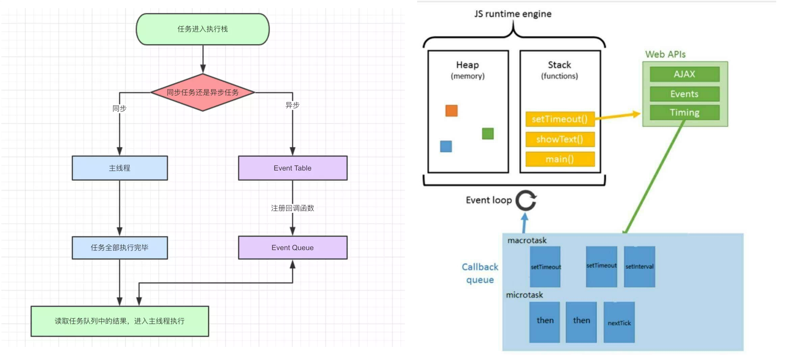

## JavaScript 引擎

*   具有多个线程
*   单个脚本只能在一个线程上运行(主线程) ，其他线程都是后台配合

## 单线程模型

### 介绍

*   JavaScript 单个脚本只能在一个线程上运行(主线程)。
*   即 JavaScript 同时只能执行一个任务，其他任务都必须在后面排队等待

### 模型产生原因

*    JavaScript 从诞生起就是单线程，原因是不想让浏览器变得太复杂

*   多线程需要共享资源、且有可能修改彼此的运行结果，对于一种网页脚本语言来说太复杂了

    ```js
    如果 JavaScript 同时有两个线程，一个线程在网页 DOM 节点上添加内容，另一个线程删除了这个节点，这时浏览器应该以哪个线程为准？是不是还要有锁机制？所以，为了避免复杂性，JavaScript 一开始就是单线程，这已经成了
    ```

### 重要性

*   JavaScript 语言的核心特征 ，将来也不会改变。

### 优势

*   实现起来比较简单，执行环境相对单纯

### 缺点

*   有一个任务耗时很长，后面的任务都必须排队等着，会拖延整个程序的执行

    ```js
    某一段 JavaScript 代码长时间运行（比如死循环），导致整个页面卡在这个地方，其他任务无法执行
    ```


## 事件循环机制

*   JavaScript 语言本身并不慢，慢的是读写外部数据

*   很多时候 CPU 是闲着的，因为 IO 操作（输入输出）很慢（比如 Ajax 操作从网络读取数据），不得不等着结果出来，再往下执行

* 所以 js 内部采取 Event Loop

    *   事件循环 ：
        *   事件循环是一个程序结构，用于等待和发送消息和事件
        *   主线程不断重复获取任务、执行任务、再获取任务、再执行的机制
    *   CPU 完全可以不管 IO 操作，挂起处于等待中的任务，先运行排在后面的任务。等到 IO 操作返回了结果，再回过头，把挂起的任务继续执行下去
    *   就是异步任务

*   发展

    *   HTML5 提出 Web Worker 标准

        ```JS
        // 这个新标准并没有改变 JavaScript 单线程的本质。
        允许 JavaScript 脚本创建多个线程，但是子线程完全受主线程控制，且不得操作 DOM。
        ```

## 同/异步任务


### 介绍

```js
html5 
	提出 web worker 标准， 允许 js  执行多个线程
同步任务（synchronous）
	// 说的一个任务有结果，才执行下一个任务
	// 程序执行任务与任务的排列顺序是一致的
	那些没有被引擎挂起、在主线程上排队执行的任务。只有前一个任务执行完毕，才能执行后一个任务
    同步任务都在 主线程上执行，形成一个执行栈
异步任务（asynchronous）
	// 一个任务执行在等待结果的时候 ，其他任务被调用执行
	是那些被引擎放在一边，不进入主线程、而进入任务队列的任务
    只有引擎认为某个异步任务可以执行了（比如 Ajax 操作从服务器得到了结果），该任务（采用回调函数的形式）才会进入主线程执行。
    异步任务不具有“堵塞”效应, 通过回调函数实现的
    

注意
	js选择了成为单线程的语言，所以它本身不可能是异步的
    但js的宿主环境（比如浏览器，Node）是多线程的，宿主环境通过某种方式（事件驱动，下文会讲）使得js具备了异步的属性。
```

### 例子

```js
例子
	开发者决定 ajax 操作是同步任务，还是异步任务
    同步任务
    	主线程等待 ajax 操作返回结果，再往下执行
    异步任务
    	主线程发出 ajax 请求后，不用等待异步任务结束，就直接往下 执行
        等到 ajax  操作有了结果，主线程会再执行对应的回调函数
```

### js 执行机制

```js
介绍
	1. 先执行栈中的同步任务
    2. 异步任务(回调函数)放入任务队列
    3. 一旦执行栈中的的所有同步任务执行完毕，系统就会按次序读取任务队列中的异步任务，
       于是被读取的的异步任务结束等待状态，进行执行栈，开始执行
```



### 异步任务操作

#### 回调函数

*   介绍

    ```js
    // 就是两个事件 f1 f2 .f1 异步之后 ，执行 f2 , 就是构成同步任务
    function f1(callback) {
        callback()
    }
    function f2() {}
    // f2必须等到f1执行完成才能执行
    f1(f2)
    
    ```

*   运行

    ```js
    一旦异步任务重新进入主线程，就会执行对应的回调函数。
    如果一个异步任务没有回调函数，就不会进入任务队列，即不会重新进入主线程，
    	因为没有用回调函数指定下一步的操作。
    ```

*   优缺点

    ```js
    优点
    	简单、容易理解和实现
    缺点
    	利于代码的阅读和维护，各个部分之间高度耦合（coupling），
        使得程序结构混乱、流程难以追踪（尤其是多个回调函数嵌套的情况）
        每个任务只能指定一个回调函数。
    ```

#### 事件监听

*   介绍

    ```js
    // 采用事件驱动模式。
    // 异步任务的执行不取决于代码的顺序，而取决于某个事件是否发生
    
    例子
    	function f1() {
            setTimeout(function () {
             // f1.trigger('done')表示，执行完成后，立即触发done事件
             f1.trigger('done');
            }, 1000);
         }
    	// 当f1发生done事件，就执行f2 （ jQuery写法 ）
        f1.on('done', f2);
    ```

*   优缺点

    ```js
    优点
    	容易理解
        可以绑定多个事件(指定多个回调函数)，而且可以“去耦合”（decoupling)
        有利于实现模块化
    缺点
    	整个程序都要变成事件驱动型
        运行流程会变得很不清晰
        阅读代码的时候，很难看出主流程
    ```

#### 发布订阅模式

*   介绍

    ```js
    ”发布/订阅模式”（publish-subscribe pattern） 
    	-- “观察者模式”（observer pattern）
    事件完全可以理解成“信号”
    存在一个“信号中心”
    	某个任务执行完成，就向信号中心“发布”（publish）一个信号
        其他任务可以向信号中心“订阅”（subscribe）这个信号，从而知道什么时候自己可以开始执行
    ```

*   实现

    ```js
    // 首先 f2向信号中心jQuery订阅done信号
    	jQuery.subscribe('done', f2);
    // 然后 执行
    function f1() {
      setTimeout(function () {
        // f1执行完成后，向信号中心jQuery发布done信号
        jQuery.publish('done');
      }, 1000);
    }
    // 最后  f2完成执行后，可以取消订阅（unsubscribe）
    jQuery.unsubscribe('done', f2);
    ```

*   优缺点

    ```js
    这种方法的性质与“事件监听”类似，但是明显优于后者。因为可以通过查看“消息中心”，了解存在多少信号、每个信号有多少订阅者，从而监控程序的运行
    ```

#### Promise

#### generator(SE6)

#### async/wait(SE7)

### 异步操作流程控制

#### 介绍

```js
// 当有多个异步操作任务，就需要确定操作顺序 ，以及保证这种顺序
// 异步任务
    function async(arg, callback) {
      console.log('参数为 ' + arg +' , 1秒后返回结果');
      setTimeout(function () { 
          callback(arg * 2); 
      }, 1000);
    }

	function final(value) {
      console.log('完成: ', value);
    }
// 有六个这样的异步任务，需要全部完成后，才能执行最后的final函数 , 该如何安排
```

#### 普通方法

```js
async(1, function (value) {
  async(2, function (value) {
    async(3, function (value) {
      async(4, function (value) {
        async(5, function (value) {
          async(6, final);
        });
      });
    });
  });
});

// 参数为 1 , 1秒后返回结果
// 参数为 2 , 1秒后返回结果
// 参数为 3 , 1秒后返回结果
// 参数为 4 , 1秒后返回结果
// 参数为 5 , 1秒后返回结果
// 参数为 6 , 1秒后返回结果
// 完成:  12

// 缺点
	六个回调函数的嵌套，不仅写起来麻烦，容易出错，而且难以维护。
```

#### 串行执行

```js
串行执行
	编写一个流程控制函数，让它来控制异步任务，一个任务完成以后，再执行另一个
例子

	// items 数组保存每一个异步任务的参数
	let items = [1, 2, 3, 4, 5, 6];
	// results数组保存每一个异步任务的运行结果
	let results = [];
	
		// 函数series就是串行函数，它会依次执行异步任务，所有任务都完成后，才会执行final函数
	function series(item) {
        if (item) {
            // 递归执行
            async(item, function(result){
                result.push(result);
                return series(items.shift());
            });
        } else {
            return final(results[results.length-1])
        }
    }
```

#### 并行执行

```js
并行执行
	所有异步任务同时执行，等到全部完成以后，才执行final函数
优点
	并行执行的效率较高
缺点
	如果并行的任务较多，很容易耗尽系统资源，拖慢运行速度
例子
	let items = [1, 2, 3, 4, 5, 6];
	let results = [];
	// forEach方法会同时发起六个异步任务，
	// 等到它们全部完成以后，才会执行final函数。
	items.forEach(function(item) {
        async(item, function(result){
            results.push(result);
            if (results.length === items.length) {
                final(results[results.length-1]);
            }
        })
    })
 
```

#### 串并结合

```js
介绍
	设置一个门槛，每次最多只能并行执行n个异步任务，这样就避免了过分占用系统资源
    
例子
	var items = [ 1, 2, 3, 4, 5, 6 ];
    var results = [];
	// 变量running记录当前正在运行的任务数
    var running = 0;
	// 多只能同时运行两个异步任务
	// 通过调节limit变量，达到效率和资源的最佳平衡。
    var limit = 2;
	
	function launcher() {
        // running记录当前正在运行的任务数，只要低于门槛值，就再启动一个新的任务，
        // 如果等于0，就表示所有任务都执行完了，这时就执行final函数。
        while (running<limit && items.length>0) {
            let item = items.shift();
            async(item, function(result){
                results.push(result);
                runnig--;
                if (items.length>0) {
                    launcher();
                } else if (running == 0) {
                    final(results);
                }
            });
            running++;
        }
    }
```


## 任务队列

### 介绍

*   JavaScript 运行时，除了一个正在运行的主线程，引擎还提供任务队列（task queue）， 队列里面里面是各种需要当前程序处理的异步任务
*   根据异步任务的类型，分成不同的任务队列

### 运行机制

```js
先执行同步任务
	主线程会先去执行所有的同步任务。等到同步任务全部执行完，就会去看任务队列里面的异步任务
调用合适的异步任务
	如果满足条件，那么异步任务就重新进入主线程开始执行，这时它就变成同步任务了
循环执行异步任务
	一个异步任务执行完就执行下一个异步任务
结束
	任务队列清空，程序就结束执行。
    
// 注意
    1. js 如何判断异步任务有结果了，可以进入主线程？
    	// 事件循环机制
    	引擎在不停地检查，一遍又一遍，只要同步任务执行完了，
        引擎就会去检查那些挂起来的异步任务，是不是可以进入主线程了
```


## 参考

```js
https://wangdoc.com/javascript/async/general.html
```

