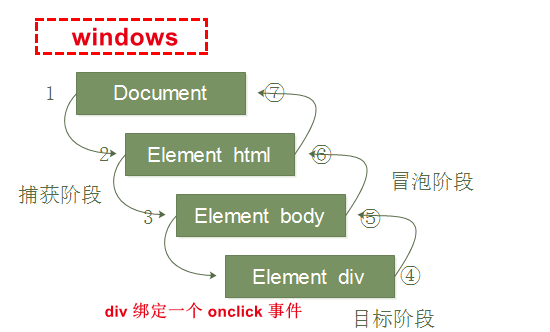

## 参考手册

```js
HTML DOM 参考手册   https://www.w3school.com.cn/jsref/index.asp
```


## HTML DOM

*   概述
    *   HTML 的标准对象模型
    *   HTML 的标准变成标准
    *   W3C 标准
*   使用
    *   定义了所有 HTML 元素的*对象*和*属性*，以及访问它们的方法
    *   HTML DOM 是关于如何获取、修改、添加或删除 HTML 元素的标准
    *   为了使 js 能够操作 html , js 就有了一套自己的 dom 编程接口


## Document

*   每个载入浏览器的 HTML 文档都会成为 Document 对象。
*   通过 document 对象，可以访问 html 中的所有元素
*   Document 对象是 Window 对象的一部分，可通过 window.document 属性对其进行访问(只此一个)

## Element

* Element 对象表示 HTML 元素 ,所有 HTML 元素是元素节点

* Element 对象可以拥有类型为元素节点、文本节点、注释节点的子节点

* NodeList 对象表示节点列表

* 素也可以拥有属性。属性是属性节点 , 即下面的 Attribute  

    ```js
    1. 对于返回的高度，要注意返回的是否有 px 
    2. 是否是计算来的，是否是只读的，计算的高度都有什么
    
    
    // 垂直滚动条滚动到底
    scrollHeight - scrollTop == clientHeight
    	
    // 水平滚动条滚动到底
    scollWidth - scrollLeft == clientWidth
    ```


## 节点

### 概述

*   html dom 中所有的事物（所有的内容）都是结点，
*   DOM 是被视为节点树的 HTML

### 节点属性

```go
				  Node		   NodeName			NodeType 	nodevaluue
整个文档是一个   	  文档节点		#document			9			null
每个HTML元素    	元素节点	   标签名				1		    null
HTML 元素内的文本    文本结点		  #text				 3			属性值
每个HTML属性		属性结点	   属性名				2		   文本内容
注释				 注释结点						  8


4-7 很少用
```

### 结点树

*   将 HTML 视为树结构，这种结构被称为 结点树


### 结点关系

*   结点树之间的结点彼此拥有层级关系

*   关系

    ```js
    父	parent		
    子	child		一个节点有任意个数的子
    同胞 sibling		相同父节点
    
    // 从上到下，统一层级的标签从左往右写
    	  html
    head        body
    
    
    
    html 
    	root  		根结点 ，没有父节点
        child
            firstchild   head
            lastchild    body
        
    head
    	parentNode	html
        nextSibling  body   上下关系，下一个
        
    body  
    	parentNode		html
        previousSibling  head  上下关系，上一个
        
    ```

    

## 方法

### script 标签注意

```js
1. script 标签中
	// 操作 dom 时， script 标签需要写到 body 的下边
	// 因为 浏览器解析 html 的时候，是一行一行解析的，只有先加载了 dom 元素，才能进行操作	
    注意浏览器加载顺序,script 标签在页面上端，代码执行的时候，页面没有加载，会出错
    	// 先加载页面，后执行函数
    	1. 写在要绑定的标签下面
        2. 使用 window 的 onload 属性，页面加载完再执行
               widow.onload = function(){
                   var mybtn = document.getElementById("myBtn");
                    mybtn.onclick=function(){
                    alert("点了 mybtn");
                    };
                }；
          3. script 标签的 defer
```

### 声明使用

```js
// 参看事件使用
方式一
	单个函数语句可以直接写到元素对应的属性中
方式二
	// 先声明后定义
	声明： 声明在元素对应属性的属性值中 
    定义：  方法体定义在 script 标签中
方式三
	// 声明并定义
	声明并定义在 script 标签中
    1. 获取标签（获取事件源）
    // 2 3 步，使用匿名函数，合并到一起了
    2. 定义方法（注册事件）
    3. 函数赋值给标签对应的属性
```


### 返回值

* DOM 方法获取的都是元素对象的集合，以伪数组的形式存储
* 即使没有获取到元素， 返回的就是空的伪数组


## 属性

### 介绍

*   方法是我们可以在节点（HTML 元素）上执行的动作

### 编程接口

*   所有的 HTML 元素被定义为对象，
*   编程接口是对象方法、对象蜀绣属性
    *   方法 ：能够执行的动作，（添加。修改元素等）
    *   属性：能够获取或设置的值（结点的名称或内容)

## 事件

### 介绍

```js
事件：
	// 这些是规定好的
	可以被 JavaScript 侦测到的行为

理解： 
	触发(用户点击)  --- js 产生的响应（该响应就是事件）
触发者：
	// 触发，然后 js 就要执行一些代码
	浏览器行为： 自动跳转页面
    用户行为  ： 用户点击跳转页面
触发位置
	页中的每个元素都可以产生
触发方法

作用
	JavaScript 与 HTML 之间的交换是通过事件实现的
```

### 添加

#### 传统注册

```js
介绍
	给元素添加事件，称为注册事件、绑定事件
	以 on 开头的事件， 注册事件唯一，后面注册的函数会覆盖前面的
    btn.onclick = function(){};
语法例子
    // 单引号 或者  双引号,常通过事件属性来调用
    <some-html-element some-event="some JavaScript">
	<button>the time is </button>
事件源
	// 哪个元素的事件被触发
	事件被触发，哪个事件被触发， button
事件类型
	如何触发， onclick （这是提前规定好的），鼠标经过，还是键盘按下
事件处理程序
	通过一个函数赋值的型方式完成
    
    =======================================================
    方法一
    	// 单行函数语句，可以直接写进去，但是不提倡
    	<h1 onclick="alert(你点了h1)"></h1>  

	方式二：
    // 为对应事件绑定处理函数,当事件被触发时，会调用相应的函数
    =======================================================
    <button onclick="displayDate()">the time is </button>
	<script>
     	function displayDate(){ ... }
     </script>
    =======================================================
    方式三：
	// 事件源.事件类型 = 事件处理程序                               
	<button id="myBtn">the time is </button>                             
	<script>
            var mybtn = document.getElementById('myBtn');
    		mybtn.onclick=function(){
                alert('点了 mybtn');
            };
        }
    </script>  
	=====================================================                               
```

*   事件例子

    *   当用户点击鼠标时
    *   当网页已加载时
    *   当图片已加载时
    *   当鼠标移动到元素上时
    *   当输入字段被改变时
    *   当 HTML 表单被提交时
    *   当用户触发按键时


#### 监听注册

```js
addEventListener()
	语法
    	element.addEventListener(even,function,useCapture)
			even : 事件的类型, click 等， 是不带 on 的
             function : 事件触发后调用的函数
             useCapture : 布尔值，描述事件是冒泡(false 默认)还是捕获（true ）
特点
	同一个元素可以添加多个监听器，监听器之间不会相互覆盖，会依次执行


	可以向任何 DOM  对象添加事件监听，不仅仅是 HTML 元素

 // 注意
 	IE9 之前不支持，使用方法 attachEvent() ， 不建议使用
    eventTarget.attach
语法例子
    <button> 1234 </button>
    var btns = document.querySelector("button")
    btns[1].addEventListener('click',function(){
        alert('111')
    })
	btns[1].addEventListener('click',function(){
        alert('22')
    })
// 当用户点击按钮时触发监听事件
    

```

#### attachEvent

```js
 // 注意, IE9 以前才会有
 	IE9 之前不支持 addEventListener ，使用方法 attachEvent() ， 但是不建议使用
    eventTarget.attachEvent(eventNameWithOn, callback)
语法例子
    <button> 1234 </button>
    var btns = document.querySelector("button")
    btns[0].attachEvent('onclick', function(){
        alert("222")
    })
```

#### 兼容性封装 

```js
// 先照顾大多数正常的浏览器，在处理特殊浏览器
function addEventListener(element, eventName, fn){
    if (element.addEventListener){
        element.addEventListener(eventName,fn);  // 第三个参数 false
    } else if (element.attachEvent) {
        element.attachEvent('on'+eventName, fn);
    } else {
        // element.onclick = fn
        element['on'+eventName] = fn;
    }
}
```

### 删除

```js

var btns = document.querySelector("button")
// 传统方法
btns[0].onclick = function(){
    alert('触发')
    // 进行取消
    btns[0].onclick = null;
}
// 监听方式
    btns[1].addEventListener('click', fn)
	function fn(){  
        alert('111') 
        btns[1].removeEventListener('click', fn)
    }
// attachEvent
    btns[0].attachEvent('onclick', fn)
	function fn(){  
        alert('111') 
        btns[1].detachEvent('onclick', fn)
    }
```


### 事件传递

#### 介绍

```js
概述
	事件传递定义了事件触发的顺序
// 默认行为（事件）
    元素固有行为， 点击超链接会跳转，这就是默认行为
    
dom 事件流
	事件流：描述的是从页面中接收事件的顺序
    dom 事件流： 事件发生时会在元素节点之间按照特定的顺序传播，这个传播过程就是
捕获（网景）
	window 发生点击事件
    document 接收到 点击事件，但是其没有绑定点击事件，往下一层传播
    html  接收到 点击事件，但是其没有绑定点击事件，往下一层传播
    body ...
    div  接收到 点击事件，绑定了点击事件， 捕获结束
目标阶段
	div 执行点击事件
冒泡（IE）
	// 点击事件向上传播
	body 接收到 点击事件，但是其没有绑定点击事件，往上一层传播
    body 接收到 点击事件，但是其没有绑定点击事件，往上一层传播
    html ...
    document ...
    windows 到此结束
    
综述
    // div p 均绑定一个 onclick 事件，点击 p , 谁先触发？ 谁后触发？
	<div>
    	<p></p>
    </div>
    // 冒泡法
        内部元素的时间先触发，然后触发外部元素，即先 p 再 div
    // 捕获法
        外部元素的事件先触发，然后才触发内部元素的事件 先 div 后 p
实现
	js 只能执行捕获、冒泡其中一个阶段
    onclick attachEvent ： 只能得到冒泡阶段
```



### 事件对象

#### 介绍

```js
介绍
    var mybtn = document.getElementById('button');
    mybtn.onclick = function(event){}
event 就是一个事件对象，写到监听函数的小括号中，当成形参来看待
事件对象
	只有了事件才会存在， 是系统自动创建的， 不需要我们进行传参
    是一个对象，事件触发后，与事件相关的数据信息就会保存在这个对象中，即一系列相关数据的集合， 跟事件相关
    比如：
    	鼠标点击就包含了鼠标相关的信息， 鼠标坐标
        键盘事件里面包含键盘事件的信息， 比如用户按下了哪个键
    可以自定义命名
    	event ev e
    兼容性
    	ie-678 , 通过 window.event
		e = e || window.event

```

#### 常见方法属性

```js
常见属性和方法
e.target ： 返回的是触发事件的对象（元素）
    var mybtn = document.getElementById('button');
    mybtn.onclick = function(e){
        e.target; // 返回的是触发事件的对象
        this;    // 绑定事件的对象
    }

e.srcElement    // 返回触发对象 ie678
currentTarget  跟 this 属性相似， 但是 ie678 不认识， 只用 this

e.type  事件的类型， 不带 on , click mouseover
```

#### 事件取消

```js
// 阻止默认行为
    btns[1].addEventListener('click', function(){
        e.preventDefault();  // dom 标准写法
    })
    mybtn.onclick = function(e){
       // 普通浏览器
        e.preventDefault();  // dom 标准写法
       // ie678
        e.returnValue
        // 没有兼容性行为， 只限于传统方式
        return false
    }
// 阻止冒泡
    btns[1].addEventListener('click', function(){
       ...
    }， false)
	// 
    btns[1].addEventListener('click', function(e){
        e.stopPropagation();  // dom 标准写法
        e.cancelBubble = true; // ie678
    }， false)
    // 兼容性方案
    if (e && e.stopPropagation){
        e.stopPropagation();
    } else {
        window.event.cancelBubble = true;
    }
```

#### 事件委托

```js
介绍
	事件代理、委派
原理
	不给每个子节点单独设置时间监听器，而是给其父节点设置， 然后利用冒泡原理影响每个子节点
语法案例
	给 ul 注册点击事件， 利用事件对象的 target 找到当前点击的 li
    因为点击 li , 会冒泡到 ul 上， ul 有注册事件，就会触发监听器 
    <ul>
        <li></li>
	    <li></li>
    </ul>
	var ul = document.querySelector('ul')
    ul.addEventListener('click',function(){
        alert('挑出来')
        e.target  // 得到当前点击对象
    })
```


## 导航

```js 
使用结点关系，在节点树上导航

// 返回的是一个数组
var x = document.getElementByIdTagName("p")  //获取所有的 p 元素节点
for (i=0;i<x.length;i++) {		
    document.write(x[i].innerHTML)    // 输出每个结点的值
}

利用其它属性值进行导航
parentNode
firstChild
lastChild


```


