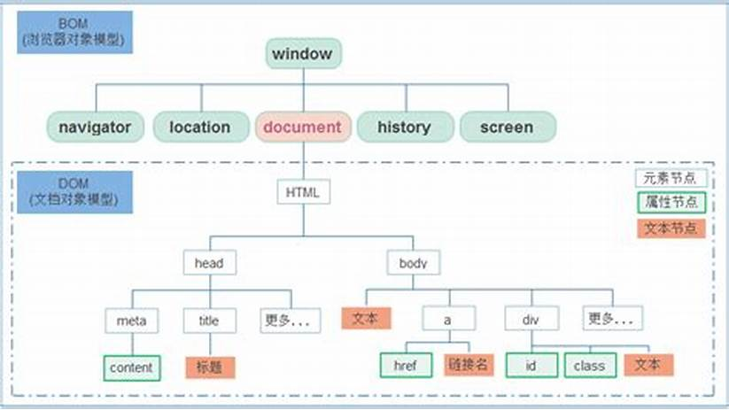

## BOM

## 介绍

*   browseer object model
*   浏览器对象模型, 核心对象是 window
*   可以使用 js 来操作浏览器， 进行浏览器跳转、弹窗等操作
*   在 BOM 中为我们提供了一组对象，用来完成对浏览器的操作

## 特点

* BOM 缺乏标准， 最初是 newscape 浏览器的一部分
* js 的标准化组织是 ecma ,dom 的标准化组织是 w3c
* 兼容性比较差

## 对象



*   window

    *   整个浏览器的窗口 
    *   也是网页中的全局对象, js 中的全局变量、函数会变为 window 对象的 属性和方法， window 可以省略

*   navigator

    *   航海家，导航条
    *   代表的当前浏览器的信息，通过该对象来识别不同的浏览器
    *   历史原因，其中大部分属性已经不能帮助我们识别浏览器

*   location

    *   代表当前浏览器的地址栏信息
    *   通过地址栏信息或者操作浏览器跳转页面

*   history

    *   通过浏览器的历史记录，可以通过该对象来操作浏览器的历史记录
    *   由于隐私原因
        *   不能访问具体的历史记录，只能操作浏览器往前或者往后
        *   只在档次操作的时候有效

*   screen

    *   代表用户的屏幕的信息
    *   通过该对象可以获得用户的显示器的信息

    

*   document

    *   就是  dom

    

    

    

## 联系

*   上面的 BOM 对象都是作为 window 对象的属性存在的 ，可以通过 window 对象来使用，也可以直接使用

    ```js
    console.log(window)
    console.log(navigator)
    console.log(window.navigator)
    ```

    

