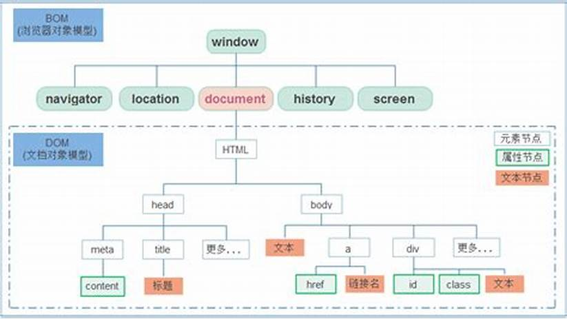

## 介绍

* webAPIs 是 w3c 组织标准
* 是 js 所独有的部分，包括 DOM BOM
* 主要使用页面交互功能

## 概念介绍

```js
API
	application programming interface 应用程序编程接口
    一些预先定义的函数，无需访问源码，可以直接使用
webAPIs    
	// 就是被人已经实现好了，你可以直接拿来用的函数
	浏览器提供的操作一套浏览器功能和页面的API
```

