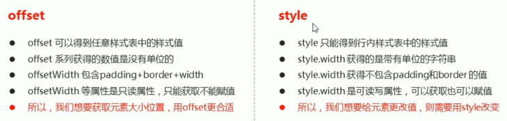

## 元素偏移量 offset 

```js
介绍
	偏移量， 可以动态的动态获取该元素的位置(偏移)、大小
常用属性
// element.xxx
offsetParent	返回该元素带有定位的父级元素，如果父级没有定位则返回 body
offsetTop		返回元素相对带有定位父元素上方的偏移
offsetLeft		返回元素相对带有定位父元素左边框的偏移
offsetWidth		返回包括 padding 边框 内容区的宽度， 返回数值不带单位
offsetHEight	返回包括 padding 边框 内容区的高度， 返回数值不带单位
```



## 元素可视区 client

```js
介绍
	获取元素可视区的相关信息， 可以动态获取该元素边框大小、元素大小等
属性
	clientTop		返回元素上边框的大小
    clientLeft		 元素左边框的大小
    clientWidth		 返回吱声包括：padding 内容区宽度。 不含边框，返回值不带单位
    clientHeight	 返回吱声包括：padding 内容区高度。 不含边框，返回值不带单位
```


## 元素滚动 scroll

```js
介绍
	滚动， 动态获取钙元素的大小、滚动距离
属性
	scollTop 返回被卷去的上侧距离， 返回值不带单位
    scollLeft  返回被卷去的左侧距离， 返回值不带单位
    scollWidth	返回自身实际的宽度， 不含边框， 返回值不带单位
    scollHeght	返回自身实际的高度， 不含边框， 返回值不带单位   
    
```

## 总结

```js
offset 用于获取元素位置
client 获取元素大小
scoll  获取滚动距离
页面滚动的距离通过 window.pageXoffset
```


## 动画 

### 原理

```js
1. 获得盒子当前位置
2. 让盒子的当前位置加上 1 个移动距离
3. 利用定时器不断重复这个操作
4. 加一个结束定时器的条件
5. 注意此元素需要添加定位， 才能使用 element.style.left
```

