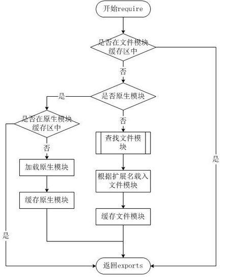

# 模块化

## 前端常见模块化规范

### 类型

```js
commonJS
AMD
CMD
es6Modules
```

# commonJS

### 介绍

*   模块化标准规范，即 require/exports，让javascript可以实现模块化,
*   2014年已经被终止的项目
*   ES6改进了模块化标准为用 import/export (require/exports 被替换)

### 原因

```js
ES5中没有原生支持模块化，我们只能通过script标签引入js文件来实现模块化
	
node 中
	在node中为了对模块管理，引入了CommonJS规范
```

### 导出

```js
// 暴露方法属性
在node中一个js文件就是一个模块
     1. 默认情况下在js文件中编写的代码，都是运行在一个独立的函数中，
     2. 而不是全局作用域，所以模块中的变量和函数，外部的模块无法访问
     
     
// 源文件导出变量和函数
// 在被调用的源文件中应该设置如下(a 调用 b 中的函数或者方法)

     
exports（值引用）
	只能使用 . 的方式来向外部暴露内部变量
    例子：
        exports.属性 = 属性值;
        exports.方法 = 函数;

module.exports（地址引用）
	使用 . 或者直接赋值 
    例子：
        module.exports.属性 = 属性值;
        module.exports.方法 = 函数;
        module.exports = {};  // 直接使用
```

### 导入

```js
使用 require()函数来引入外部模块,引入后会返回一个对象，这个对象就是引入的模块
	例子：
		var 变量 = require("模块的标识"); 
		// 变量就表示引入的模块，是一个字典，掐面，前面导出的属性、方法作为key
		console.log(变量.x)              // 调用模块中的变量、函数

// 模块标识
含义
	模块的标识就是模块的名字或路径
功能
    我们node通过模块的标识来寻找模块的
    
类型
	核心模块
    	由 node 引擎提供的模块 , 直接使用模块的名字对其进行引入
            var fs = require("fs");
    文件模块
    	用户自定义的模块， 标识就是文件路径 ：绝对路径、相对路径(必须以./或 ../开头)
 		 require("./route.js")
```



### 原理

```js
node 在执行模块中的代码的时候，它会添加
最顶部 ： function (exports,require,module,__filename,__dirname){
最底部 ： }
实质   ： 模块中的代码都是包装在一个函数中执行，并在在函数执行的时候，同时传递了5个实参

exports     该对象用来将变量或函数宝楼道外部
require	    函数 ，用来引入外部的模块
module		
	- module  代表当前模板本身
    - exports  其实就是 module 的属性
__filename
	当前模块的路径
__dirname
	当前模块所以在文件夹的路径
```


# es6模块化

## 模块化文件

```js
.mjs 模块化文件
	1. V8推荐了这样的做法
好处
    比较清晰，这可以指出哪些文件是模块，哪些是常规的 JavaScript。
    这能保证你的模块可以被运行时环境和构建工具识别，比如  Node.js 和 Babel。

.js
	目前仍旧使用 .js 后缀的文件，方便移植
    
```


## 模块文件注意

*   模块自动使用严格模式
*   加载一个模块脚本时不需要使用 `defer` 属性 (see [`` attributes](https://developer.mozilla.org/en-US/docs/Web/HTML/Element/script#Attributes)) 模块会自动延迟加载
*   模块功能导入到单独的脚本文件的范围 — 他们无法在全局获得。因此，你只能在导入这些功能的脚本文件中使用他们，你也无法通过Javascript console 中获取到他们

## expert

### 介绍

*   用于从模块中导出实时绑定的函数、对象或原始值，以便其他程序可以通过 [`import`](https://developer.mozilla.org/zh-CN/docs/Web/JavaScript/Reference/Statements/import) 语句使用它们

### 注意

*   无论您是否声明，导出的模块都处于[`严格模式`](https://developer.mozilla.org/zh-CN/docs/Web/JavaScript/Reference/Strict_mode)。
*    export语句不能用在嵌入式脚本中

### 导出方式

```js
// 方式
    1. 命名导出 (每个模块包含任意数量)  --- 多接口导出
		导出文件中是什么名字 ，导入文件中也要使用什么名字
    2. 默认导出 (每个模块只能导出(使用)一个)  --- 默认导出
		模块中的功能我们不希望命名，可以让导入者自己命名
//注意
	在每一个模块中定义多个命名导出，但是只允许有一个默认导出
    多接口导出中也有只导出一个接口
   
```

### 语法

*   描述

    ```js
     nameN 要导出的标识符（以便其他脚本通过 import 语句进行导入）
     
    ```

*   默认导出

    ```js
    // 导出单个特性作为默认值
    
    export default expression;
    export default function (…) { … } // also class, function*
    export default function name1(…) { … } // also class, function*
    
    // 导出事先定义的特性作为默认值
    export { name1 as default, … };
    
    ```

*   模块集合导出

    ```js
    // 创建单个模块，集中多个模块的多个导出
    // 为了使模块导入变得可用，在一个父模块中“导入/导出”这些不同模块也是可行的
    
    export * from …; // does not set the default export
    export * as name1 from …; // Draft ECMAScript® 2O21
    export { name1, name2, …, nameN } from …;
    export { import1 as name1, import2 as name2, …, nameN } from …;
    
    -------------------------------------------------------------
    export { default as DefaultExport } from 'bar.js'; // 有效
    	import DefaultExport from 'bar.js'; 
    export DefaultExport from 'bar.js'; // 无效的
    
    
    // 例子
    	模块重定向
    ```

*   多接口导出  -- 命名导出

    ```js
    // 导出单个特性（可以导出var，let，const,function,class）
    // 没有大括号，因为每个模块只允许有一个默认导出 （说的是default）
    export let name1, name2, …, nameN; // also var, const
    export let name1 = …, name2 = …, …, nameN; // also var, const
    export function FunctionName(){...}
    export class ClassName {...}
    // 导出列表
    export { name1, name2, …, nameN };
    // 导出事先定义的特性
     export { myfunction }
     
     
     // 注意
    	在导出多个值时，命名导出非常有用。在导入期间，必须使用相应对象的相同名称
    ```

*   重命名导出

    ```js
    // 重命名导出
    export { 
    	variable1 as name1, 
        variable2 as name2, 
        …, 
        nameN 
    };
    ```

    

*   解构导出

    ```js
    // 解构导出并重命名
    export const { name1, name2: bar } = o;
    ```

### 例子

*   模块重定向

    ```js
    // 层次结构	
        childModule1.js: 导出 myFunction 和 myVariable
        childModule2.js: 导出 myClass
        parentModule.js: 作为聚合器（不做其他事情）
        顶层模块：调用 parentModule.js 的导出项
    // childModule1.js 中
        let myFunction = ...; // assign something useful to myFunction
        let myVariable = ...; // assign something useful to myVariable
        export {myFunction, myVariable};
    // childModule2.js 中
        let myClass = ...; // assign something useful to myClass
        export myClass;
    // parentModule.js 中
    // 仅仅聚合 childModule1 和 childModule2 中的导出, 以重新导出他们
        export { myFunction, myVariable } from 'childModule1.js';
        export { myClass } from 'childModule2.js'
    
    // 顶层模块中
    // 我们可以从单个模块调用所有导出，因为 parentModule 事先已经将他们“收集”/“打包”到一起
    	import { myFunction, myVariable, myClass } from 'parentModule.js'
    
    ```

### 注意

```js

    在你的 HTML 中需要包含 type="module" 的 <script> 元素这样的脚本，以便它被识别为模块并正确处理
    不能通过 file:// URL 运行 JS 模块 — 这将导致 CORS 错误。你需要通过 HTTP 服务器运行。

```

## import

### 应用

*   应用到 html

    ```js
    <script type="module" src="main.mjs"></script>
    import ...
    ```

### 介绍

*   静态的 import 语句用于导入另一个模块导出的绑定
    *   初始化加载依赖项的最优选择
    *   容易从代码静态分析工具和 [tree shaking](https://developer.mozilla.org/zh-CN/docs/Glossary/Tree_shaking) 中受益。
    *   标准用法的import导入的模块是静态的，会使所有被导入的模块，在加载时就被编译（无法做到按需编译，降低首页加载速度）
*   动态的 inport() 类似函数
    *   照一定的条件或者按需加载模块的时候

### 注意

*   import 的模块都是运行在严格模式下的
*   浏览器中， import 语句只能在声明了 type="moudule" 的 script标签总使用 ，动态的 import() 不需要 依赖 moudule 的 script 标签
*   script 标签中使用 bomodule 属性，可以确保向后兼容

### 语法

*   描述

    ```js
    defaultExport 
    	导入模块的默认导出接口的引用名
    module-name  
    	包含目标模块的.js文件的相对或绝对路径名 ,
    	只允许单引号和双引号的字符串
    name   
    	起别名
        “导入模块对象”的名称，它将用一种名称空间来引用导入模块的接口
    export, exportN  
    	被导入模块的导出接口的名称。
        就是导入模块中，接口的 nameN
    alias, aliasN    
    	将引用指定的导入的名称
    
    ```

    

*   导入默认值

    ```js
    import defaultExport from "module-name";
    import defaultExport, { export [ , [...] ] } from "module-name";
    import defaultExport, * as name from "module-name";
    
    
    
    1. 可以使用任何名称导入默认导出
        let k;
         export default k = 12; 
        // 由于 k 是默认导出，所以可以自由使用 import m 替代 import k
    	//  等价于 import {default as m} from './test';
        import m from './test'; 
    
    2. 和命名空间导入或命名导入一起使用
    	// default导入必须首先声明。
    	import myDefault, * as myModule from '/modules/my-module.js   // 命名空间导入
    	import myDefault, {foo, bar} from '/modules/my-module.js';  // 命名导入
    	
    ```

    

*   导入整个模块的内容

    ```js
    // 使用 * 
    // 获取module.mjs中所有可用的导出，并使它们可以作为对象模块（name）的成员使用，
    // 从而有效地为其提供自己的命名空间
    	import * as name from '/modules/module.mjs';
    	// 调用 ,访问导出接口意味着使用模块名称（在本例为“name”）作为命名空间
    	name.sum()
    ```

    

*   导入多个接口 - 命名空间导入

    ```js
    // {} 中至少有一个接口，接口可以使用别名，也可以不使用别名
    import { export1 as name1 ,export2 as name2, ... } from "module-name";
    
    // 给定一个名为 foo 的对象或值，它已经从模块my-module导出, foo 插入当前作用域。
    import {foo, bar} from '/modules/my-module.js';
    ```

*   导入带别名( 重命名 )的接口 - 命名导入

    ```js
    // 使用关键字 as  ，取别名即重命名
    import {
        reallyReallyLongModuleExportName as shortName ,
         anotherLongModuleName as short
    }
      from '/modules/my-module.js';
    ```

*   副作用导入

    ```js
    介绍
    	不导入模块中的任何内容(接口) , 运行模块中的全局变量
    代码
    	import '/modules/my-module.js';
    注意
    	原则上来说，模块不能有副作用，但是很多时候，无法控制你所依赖的模块内容
    ```

### 动态 import

*   注意

    ```js
    不要滥用动态导入 , 只有在必要情况下采用
    ```

*   使用场景

    ```js
    1. 当静态导入的模块很明显降低了代码的加载速度且被使用的可能性很低
    2. 当静态导入的模块很明显占用大量系统内存且被使用的可能性比较低
    3. 当被导入的模块 ， 在加载的时候，并不存在，需要异步获取
    4.当导入模块的说明符，需要动态构建，（静态导入只能使用静态说明符）
    5. 当被导入的模块使用副作用，这些作用只有在触发某些条件需要时
    ```

*   语法

    ```js
    // 像调用函数一样来动态导入模块，这样将会返回一个 promise
    import('/modules/my-module.js')
    	.then((module)=>{
        // do something with module
    })
    
    // 支持 await 关键字
    let module = await import('module/my-modules.js')
    ```

    

## 故障

```js
1. 在前面已经提到了，在这里再重申一次： .mjs 后缀的文件需要以 MIME-type 为 javascript/esm 来加载(或者其他的JavaScript 兼容的 MIME-type ，比如 application/javascript), 否则，你会一个严格的 MIME 类型检查错误，像是这样的 "The server responded with a non-JavaScript MIME type".
2. 如果你尝试用本地文件加载HTML 文件 (i.e. with a file:// URL), 由于JavaScript 模块的安全性要求，你会遇到CORS 错误。你需要通过服务器来做你的测试。GitHub pages is ideal as it also serves .mjs files with the correct MIME type.
3. 因为.mjs 是一个相当新的文件后缀, 一些操作系统可能无法识别，或者尝试把它替换成别的。比如，我们发现macOS悄悄地该我们的 .mjs 后缀的文件后面添加上 .js  然后自动隐藏这个后缀。所以我们的文件实际上都是 x.mjs.js. 当我们关闭自动隐藏文件后缀名，让它去接受认可 .mjs。问题解决。

```

