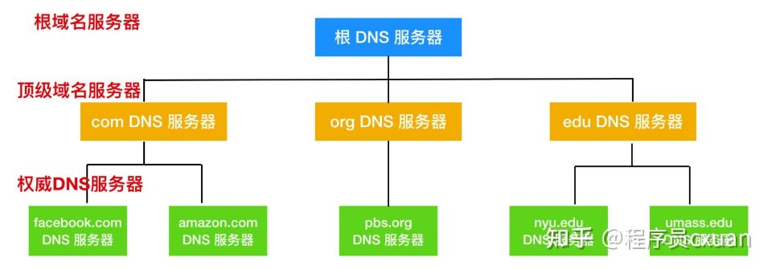
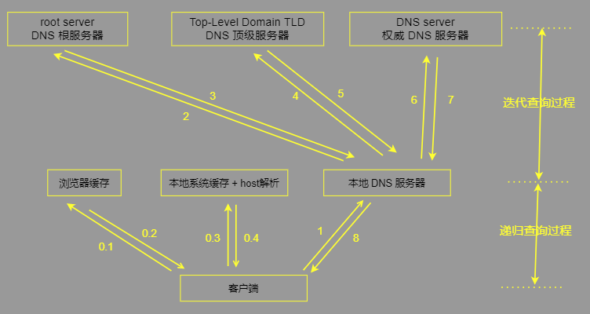

## 介绍

* Domain Name System
* 域名系统
* 介绍
    * 一个分层的 DNS 服务器（ DNS server ）实现的分布式数据库
    * 一种-组织成域层次结构的计算机和网络服务命名系统
    * 是一个使主机能够查询分布式数据库的应用层协议
* 作用
    * 它用于TCP/IP网络，它将主机名或域名转换为实际IP地址的工作


## DNS 服务器

```js
服务器层次
	根 DNS 服务器 ： 
    顶级域(Top-Level Domain TLD) DNS 服务器
    	后缀是 com org edu 的服务器
    权威服务器
    	管理方服务器
请求流程
	// 客户端想知道 www.baidu.com 的IP地址
客户端先从根服务器(之一) 关联，获取顶级域名 com 的TLD服务器的IP地址
客户端和 TLD 服务器进行联系，返回全权威服务器 (baidu.com) 的 IP 地址
最后 客户端 和 baidu.com 权威服务器之一联系，他为 www.baidu.com 返回其 IP 地址
```



## DNS 查询解析

### DNS 解析器

```js
介绍
	进行 DNS 查询的主机和软件都叫 DNS 解析器
	用户所使用工作站、个人电脑都是属于解析器
注意
	一个解析器至少注册一个以上域名服务器的 IP 地址
    DNS 解析器是查找的第一站，启动查询序列 ，将 URL 转化为必要的 IP 地址
```


### DNS缓存

#### 介绍

```js
DNS 缓存
    DNS caching (DNS缓存，DNS 解析器缓存)
作用
	由操作系统维护的临时数据库库，负责保存最近网站和其他 Internet 域的访问记录
缓存流程
	浏览器向外部发出请求之前，计算机会拦截每个请求并在 DNS 缓存数据库中查询域名
    (该数据库包含有最近的域名，以及 DNS 首次发出请求时 DNS 为他们计算的地址)
缓存方式
	// 可以缓存到不同的位置上，生存事件由 TTL(DNS字段) 决定
	浏览器缓存
    	如今的 Web 浏览器设计默认将 DNS 记录缓存一段时间
        越靠近 Web 浏览器进行 DNS 缓存，为检查缓存并向 IP 地址发出请求的次数就越少
        发出对 DNS 记录的请求时，浏览器缓存是针对所请求的记录而检查的第一个位置。
    操作系统内核缓存
    	作系统级 DNS 解析器是 DNS 查询离开你的计算机前的第二站，也是本地查询的最后一个步骤
```

### 简单原理

```js
// 浏览器输入 www.baidu.com/index.html 
同一台用户主机上运行着 DNS 应用的客户端
浏览器从上述 URL 中抽出主机名 www.baidu.com , 并将这台主机名传给 DNS 应用的客户端
DNS 客户向 DNS 服务器发送一个包含主机名的请求
DNS 客户端最终会收到一份回答报文，其中包含目标主机的 IP 地址
一旦浏览器接收到目标主机的 IP 地址后，它就能向位于该 IP 地址的 80 端口的 HTTP 服务器发起一个 TCP 连接
```

### 具体过程



* 浏览器缓存检查

    ```js
    浏览器会首先搜索浏览器自身的 DNS 缓存，缓存时间比较短，大概只有1分钟，且只能容纳1000条缓存
    看自身的缓存中是否有对应的条目，而且没有过期，
    	如果有且没有过期则解析到此结束
        没有就去下一个地方
    ```

* **操作系统缓存检查 + hosts 解析**

    ```js
    如果浏览器的缓存里没有找到对应的条目，操作系统也会有一个域名解析的过程，
    那么浏览器先搜索操作系统的 DNS 缓存中是否有这个域名对应的解析结果，
    	如果找到且没有过期则停止搜索，解析到此结束。
         没有就去下一个地方
    ```

* **本地区域名服务器(Local DNS Server)解析**

    ```js
    介绍
    	如果在 hosts 文件中也没有找到对应的条目，浏览器会发起一个 DNS 的系统调用，
        会向本地配置的首选 DNS 服务器发起域名解析请求
        通过的是 UDP 协议向 DNS 的 53 端口发起请求，这个请求是递归的请求，
        也就是运营商的DNS服务器必须得提供给我们该域名的IP地址
    ```

    

未整理

```js
首先来看看最先发生的事情——DNS 域名解析，简单的说就是把域名翻译成 IP 地址。例如：把 www.test.com 这个域名翻译成对应 IP 192.168.1.1，这里只是举个例子。

如果你在浏览器中直接输入的 IP 地址，那么实际上会跳过这个步骤，否则会经理下面几部：

1、浏览器缓存检查

浏览器会首先搜索浏览器自身的 DNS 缓存，缓存时间比较短，大概只有1分钟，且只能容纳1000条缓存，看自身的缓存中是否有对应的条目，而且没有过期，如果有且没有过期则解析到此结束。

2、操作系统缓存检查 + hosts 解析

如果浏览器的缓存里没有找到对应的条目，操作系统也会有一个域名解析的过程，那么浏览器先搜索操作系统的 DNS 缓存中是否有这个域名对应的解析结果，如果找到且没有过期则停止搜索，解析到此结束。

    在 Linux 中可以通过 /etc/hosts 文件来设置，可以将任何域名解析到任何能够访问的 IP 地址。如果在这里指定了一个域名对应的 IP 地址，那么浏览器会首先使用这个 IP 地址。当解析到这个配置文件中的某个域名时，操作系统会在缓存中缓存这个解析结果，缓存的时间同样是受这个域名的失效时间和缓存的空间大小控制的。

3、本地区域名服务器(Local DNS Server)解析

如果在 hosts 文件中也没有找到对应的条目，浏览器会发起一个 DNS 的系统调用，会向本地配置的首选 DNS 服务器发起域名解析请求（通过的是 UDP 协议向 DNS 的 53 端口发起请求，这个请求是递归的请求，也就是运营商的DNS服务器必须得提供给我们该域名的IP地址）。

在我们的网络配置中都会有“DNS 服务器地址”这一项，这个地址就用于解决前面所说的如果两个过程无法解析时要怎么办。操作系统会把这个域名发送给这里设置的 LDNS，也就是本地区的域名服务器。

这个 DNS 通常都提供给你本地互联网接入的一个 DNS 解析服务，例如你是在学校接入互联网，那么你的 DNS 服务器肯定在你的学校；如果你是在一个小区接入互联网的，那这个 DNS 就是提供给你接入互联网的应用提供商，即电信或者联通。大约 80% 的域名解析都到这里就已经完成了，所以 LDNS 主要承担了域名的解析工作。

4、根域名服务器解析(Root Server)

如果 LDNS 没有找到对应的条目，则由运营商的 DNS 代我们的浏览器发起迭代 DNS 解析请求。它首先是会找根域的 DNS 的 IP 地址，找到根域的 DNS 地址，就会向其发起请求。然后根域名服务器返回给本地域名服务器一个所查询域的主域名服务器(gTLD Server)地址。

5、主域名服务器(gTLD Server)

本地域名服务器(LDNS Server)再向上一步返回的 gTLD 服务器发送请求。

接受请求的 gTLD 服务器查找并返回此域名对应的 Name Server 域名服务器的地址，这个 Name Server 通常就是你注册的域名服务器，例如你在某个域名服务提供商申请的域名，那么这个域名解析任务就由这个域名提供商的服务器来完成。

Name Server 域名服务器会查询存储的域名和IP的映射关系表，正常情况下都根据域名得到目标IP记录，连同一个 TTL 值返回给 DNS Server 域名服务器。
```


