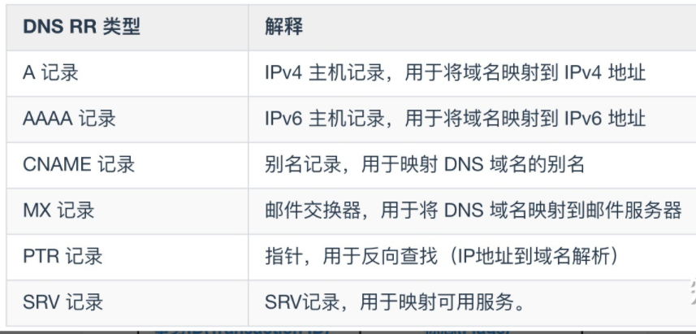
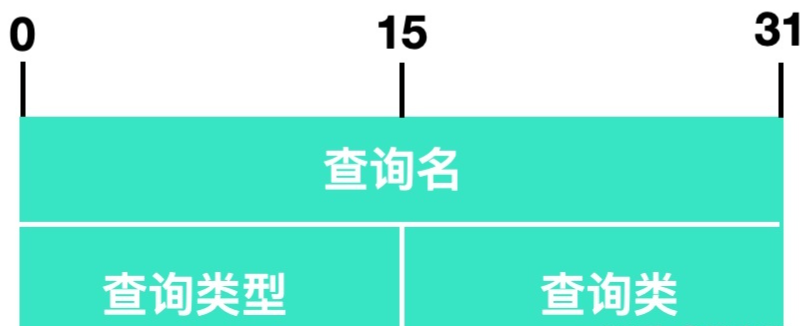
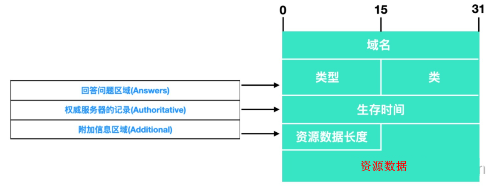

## 报文

## 资源记录

### pr 介绍

```js
介绍
	共同实现 DNS 分布式数据库的所有 DNS 服务器存储了资源记录(Resource Record, RR)
	RR 提供了主机名到 IP 地址的映射
    PR 记录用于回复客户端查询。
包含字段
	(Name, Value, Type, TTL)
```

### pr 类型




## 报文信息

### 介绍

```js
报文信息有两种， 格式都是一样的
	查询报文
    响应报文
```


### 报文格式

### 报文首部

```js
报文段首部
	事务 ID、标志、问题数量、回答资源记录数、权威名称服务器计数、附加资源记录数
     6 个字段 12 个字节
```

#### 事务ID

| 名称   | 大小  | 含义                                                         |
| ------ | ----- | ------------------------------------------------------------ |
| 事务ID | 2字节 | 它是 DNS 的标识，又叫做 `标识符`<br>对于请求报文和响应报文来说，这个字段的值是一样的<br>过标识符可以区分 DNS 应答报文是对哪个请求进行响应的。 |

#### 标志位

| 名字                    |       |                                                              |
| ----------------------- | ----- | ------------------------------------------------------------ |
| 标志位                  | 2字节 | 标志字段有很多                                               |
| 标志字段                |       |                                                              |
| QR(Response)            | 1bit  | 查询报文时 QR = 0<br>响应报文时 QR = 1。                     |
| OpCode                  | 4bit  | 表示操作码<br5>0 表示标准查询<br>1 表示反向查询<br>2 表示服务器状态请求。 |
| AA(Authoritative)       | 1bit  | 代表授权应答，这个 AA 只在响应报文中有效<br>值为 1 时，表示名称服务器是权威服务器<br>值为 0 时，表示不是权威服务器。 |
| TC(Truncated)           |       | 截断标志位<br>值为 1 时，表示响应已超过 512 字节并且已经被截断，只返回前 512 个字节。 |
| RD(Recursion Available) |       | 期望递归字段，该字段在查询中设置，并在响应中返回<br>告诉名称服务器必须处理这个查询，这种方式被称为一个递归查询<br>如果该位为 0，且被请求的名称服务器没有一个授权回答，它将返回一个能解答该查询的其他名称服务器列表 |
| zero                    |       | 用递归字段，这个字段只出现在响应报文中<br>当值为 1 时，表示服务器支持递归查询。 |
| AD                      |       | 表示信息是否是已授权                                         |
| CD                      |       | 表示是否禁用安全检查。                                       |
| rcode(Reply code)       |       | 回码字段，表示响应的差错状态<br>当值为 0 时，表示没有错误<br>当值为 1 时，表示报文格式错误（Format error），服务器不能理解请求的报文；<br>当值为 2 时，表示域名服务器失败（Server failure），因为服务器的原因导致没办法处理这个请求；<br/>当值为 3 时，表示名字错误（Name Error），只有对授权域名解析服务器有意义，指出解析的域名不存在；<br/>当值为 4 时，表示查询类型不支持（Not Implemented），即域名服务器不支持查询类型；<br/>当值为 5 时，表示拒绝（Refused），一般是服务器由于设置的策略拒绝给出应答，如服务器不希望对某些请求者给出应答。 |


### 问题区域

#### 介绍

```js
通常指报文格式中查询问题的区域部分
	用来显示 DNS 查询请求的问题，包括查询类型和查询类
```




#### 字段名称

```js
查询名
	指定要查询的域名，有时候也是 IP 地址，用于反向查询。
查询类型
	DNS 查询请求的资源类型，通常查询类型为 A 类型，表示由域名获取对应的 IP 地址。
查询类
		地址类型，通常为互联网地址，值为 1
```

### 资源记录

#### 介绍

```js
NS 报文的最后三个字段
	回答问题区域、权威名称服务器记录、附加信息区域
    这三个字段均采用一种称为资源记录的格式，如下图所示
    资源记录部分只有在 DNS 响应包中才会出现
```



#### 字段含义

```js
域名
	DNS 请求的域名。
类型
	资源记录的类型，与问题部分中的查询类型值是一样的。
类
	地址类型、与问题中的查询类值一样的。
生存时间
	以秒为单位，表示资源记录的生命周期。
资源数据长度
	资源数据的长度。
资源数据
	表示按查询段要求返回的相关资源记录的数据。
```

## SOA 记录

### 介绍

```js
介绍
	如果是权威 DNS 服务器的响应的话，会显示记录存储有关区域的重要信息，
    这种信息就是 SOA 记录。
    SOA 记录对于区域传输也很重要。
```

### 字段名

```js
DNS 响应字段
	具有 DNS 解析器响应的字段
其他字段
PNAME：
	即 Primary Name Server
	这是区域的主要名称服务器的名称。
RNAME：
	即 Responsible authority's mailbox，
	RNAME 代表管理员的电子邮件地址，@ 用 . 来表示，也就是说 admin.example.com 等同于 admin@example.com。
序列号： 
	即 Serial Number ，
    区域序列号是该区域的唯一标识符。
刷新间隔：
	即 Refresh Interval，
    在请求主服务器提供 SOA 记录以查看其是否已更新之前，辅助服务器应等待的时间（以秒为单位）。
重试间隔：
	服务器应等待无响应的主要名称服务器再次请求更新的时间。
过期限制：
	如果辅助服务器在这段时间内没有收到主服务器的响应，则应停止响应对该区域的查询。上面提
```


