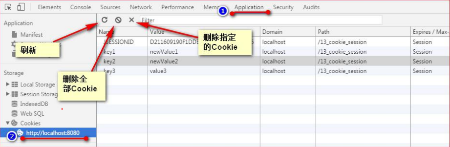

## cookie

### 是什么

*   就是 http 协议的 cookie
*   Cookie实际上是一小段的文本信息（key-value格式）
*   服务器存储在客户端的、体积较小的信息，服务器通知客户端保存键值对的一种技术
*   存储在客户端

### 使用

*   cookie 记录你的用户名、密码、浏览的网页等信息，当你在来这个网站的时候，服务器会先看它上次有无留下的 cookie，有的话就直接读取 cookie 中内容，进行判断，并送出响应的内容

### 使用原因

*   HTTP协议
    *   无状态的， 即服务器无法判断用户身份
    *   没有缓存功能，所以只是在HTTP协议中扩充了缓存字段，让浏览器和服务端按照缓存控制字段处理是否需要缓存
*   本意是用来克服 HTTP 的无状态性，但不是唯一目的

## 种类

* 会话 cookie
    * 别称 ：临时 cookie
* 持久 cookie
    * 其他 cookie 都是 持久 cookie 的变种

## 执行流程

### 首次请求

* 客户端
    * 向服务器发起请求
* 服务器
    * 接收请求，则判断是否需要记录该用户的状态，
    * 创建 Cookie ，包含在 HttpResponse 响应中发送
* 客户端
    * 接收响应，存储 Cookie

### 非首次请求

* 客户端
    * 向服务器发起请求， 请求头中就包含 Cookie 
* 服务器
    * 接收请求，根据 cookie信息 区分不同用户


## 客户端

### 介绍

```java
注意
    浏览器是可以自动接收、存储 cookie 的
    但是我们在客户端还是要进行一些操作，来控制 cookie
```


### 接收 - 存储

### 发送

## 服务端

### 发送  - 创建 

```java
服务器端使用Cache-Control, 
例如Cache-Control: max-age=30，
	就是说服务器端发出报文到客户端智能保留30秒。
    浏览器是怎么处理的呢，浏览器收到缓存条件就把数据缓存起来，
    		如果没有过期就可以直接使用，
             过期就要去服务器验证是否仍然可用。
             

当浏览器再请求该网站时，浏览器把请求的网址连同该Cookie一同提交给服务器。服务器检查该Cookie，以此来辨认用户状态。             
```


### 接收

### 验证

```java
// 根据 cookie信息 区分不同用户
在第一次缓存的时候浏览器收到的服务器报文中，有Last-Modified和ETag两个字段。
浏览器接下来的处理中
	会先下发HEAD请求，
    报文带上if-Modified-Since和if-None-Match两个字段以及上面Last-Modified和ETag两个字段, 
    交给服务器验证，	
	服务器验证后如果返回304 Not Modified，就说明缓存依然有效，浏览器就可以继续使用缓存
```


## cookie 

### 查看

* 谷歌浏览器




