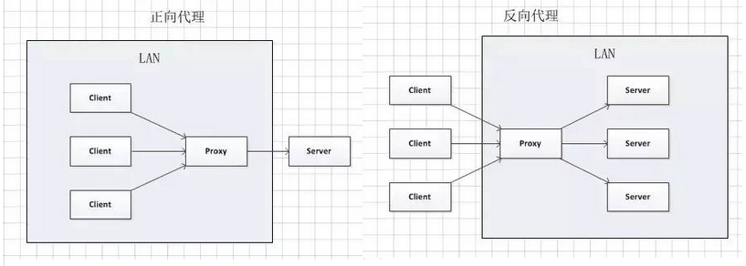

## Nginx代理

### 反向代理

#### 介绍

```js
名称
	Reverse Proxy
运作方式
	代理服务器来接受 Internet  上的连接请求，
    然后将请求转发给内部网络上的服务器，并将从内部网络上服务器得到的结果返回给 Internet  上请求连接的客户端。
    此时代理服务器对外就表现为一个服务器，反向代理服务器对于客户端而言它就像是原始服务器，并且客户端不需要进行任何特别的设置。
作用
	1. 保证内网的安全，可以使用反向代理提供 WAF 功能，阻止 web 攻击。
	2. 负载均衡，通过反向代理服务器来优化网站的负载。
```


### 正向代理

#### 介绍

```js
名称
	Forward Proxy
    被简称为代理
方式
	正向代理的工作原理就像一个跳板。
    用户无法正常访问外部资源，可以通过代理的方式，让用户绕过防火墙，从而连接到目标网络或者服务。
例子
	我访问不了 google.com，但是我能访问一个代理服务器 A，A 能访问 google.com，
	于是我先连上代理服务器 A，告诉它我需要 google.com 的内容，A 就去取回来，然后返回给我。
作用
	是一个位于客户端和原始服务器(origin server)之间的服务器。
    为了从原始服务器取得内容，客户端向代理发送一个请求并指定目标(原始服务器)，、
    然后代理向原始服务器转交请求并将获得的内容返回给客户端。
```


### 区别




