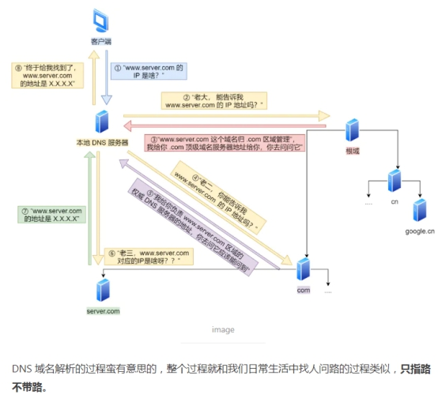
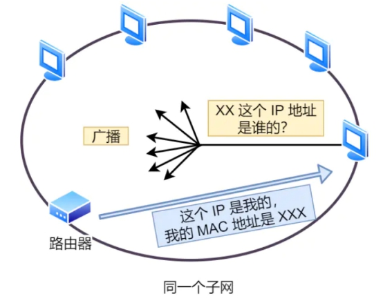
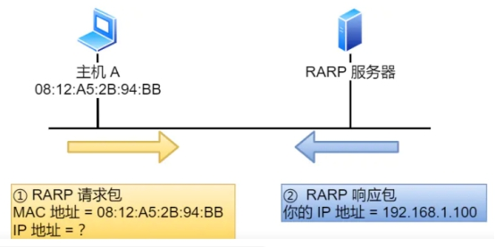

## ***\*ARP 是借\*******\*DNS\****

l 通常使用的方式域名，而不是 IP 地址，因为域名方便人类记忆

l DNS 可以将域名网址自动转换为具体的 IP 地址

### ***\*层级关系\****

DNS 中的域名都是用***\*句点\****来分隔的，比如 [www.server.com](https://www.server.com)句点代表了不同层次之间的***\*界限\****。***\*越靠右\****的位置表示其层级***\*越高\****。

 

### ***\*名的层级关系类似一个树状结构\****

 

根DNS 服务器

l 根域的 DNS 服务器信息保存在互联网中所有的 DNS 服务器中。这样一来，任何 DNS 服务器就都可以找到并访问根域 DNS 服务器了。

顶级域 DNS 服务器（com）

权威 DNS 服务器（server.com）

 

l 域名解析工作流程

浏览器首先看一下自己的缓存里有没有，如果没有就向操作系统的缓存要，还没有就检查本机域名解析文件 hosts，如果还是没有，就会 DNS 服务器进行查询，查询的过程如下：1. 客户端首先会发出一个 DNS 请求，问 [www.server.com](https://links.jianshu.com/go?to=http://www.server.com) 的 IP 是啥，并发给本地 DNS 服务器（也就是客户端的 TCP/IP 设置中填写的 DNS 服务器地址）。2. 本地域名服务器收到客户端的请求后，如果缓存里的表格能找到 [www.server.com](https://links.jianshu.com/go?to=http://www.server.com)，则它直接返回 IP 地址。如果没有，本地 DNS 会去问它的根域名服务器：“老大， 能告诉我 [www.server.com](https://links.jianshu.com/go?to=http://www.server.com) 的 IP 地址吗？” 根域名服务器是最高层次的，它不直接用于域名解析，但能指明一条道路。3. 根 DNS 收到来自本地 DNS 的请求后，发现后置是 .com，说：“[www.server.com](https://links.jianshu.com/go?to=http://www.server.com) 这个域名归 .com 区域管理”，我给你 .com 顶级域名服务器地址给你，你去问问它吧。”4. 本地 DNS 收到顶级域名服务器的地址后，发起请求问“老二， 你能告诉我 [www.server.com](https://links.jianshu.com/go?to=http://www.server.com) 的 IP 地址吗？”5. 顶级域名服务器说：“我给你负责 [www.server.com](https://links.jianshu.com/go?to=http://www.server.com) 区域的权威 DNS 服务器的地址，你去问它应该能问到”。6. 本地 DNS 于是转向问权威 DNS 服务器：“老三，[www.server.com](https://links.jianshu.com/go?to=http://www.server.com)对应的IP是啥呀？” [server.com](https://links.jianshu.com/go?to=http://server.com) 的权威 DNS 服务器，它是域名解析结果的原出处。为啥叫权威呢？就是我的域名我做主。7. 权威 DNS 服务器查询后将对应的 IP 地址 X.X.X.X 告诉本地 DNS。8. 本地 DNS 再将 IP 地址返回客户端，客户端和目标建立连接。 整个过程就和我们日常生活中找人问路的过程类似，***\*只指路不带路\****。

 

## ***\*ARP\****

l 在传输一个 IP 数据报的时候，确定了源 IP 地址和目标 IP 地址后，就会通过主机「路由表」确定 IP 数据包下一跳。然而，网络层的下一层是数据链路层，所以我们还要知道「下一跳」的 MAC 地址。

l 由于主机的路由表中可以找到下一条的 IP 地址，所以可以通过 ***\*ARP 协议\****，求得下一跳的 MAC 地址。

l 为透过目标设备的IP地址，查询目标设备的MAC地址，以保证通信的顺利进行，它是IPv4中网络层必不可少的协议。

### ***\*确定 Mac地址\****

l 已知 IP 地址 求 MA助 ***\*ARP 请求与 ARP 响应\****两种类型的包确定 MAC 地址的。

· 主机会通过***\*广播发送 ARP 请求\****，这个包中包含了想要知道的 MAC 地址的主机 IP 地址。· 当同个链路中的所有设备收到 ARP 请求时，会去拆开 ARP 请求包里的内容，如果 ARP 请求包中的目标 IP 地址与自己的 IP 地址一致，那么这个设备就将自己的 MAC 地址塞入 ***\*ARP 响应包\****返回给主机。 操作系统通常会把第一次通过 ARP 获取的 MAC 地址缓存起来，以便下次直接从缓存中找到对应 IP 地址的 MAC 地址 不过，MAC 地址的缓存是有一定期限的，超过这个期限，缓存的内容将被清除。

 

 

 

## ***\*RARP\****

**l** ***\*已知 MAC 地址求 IP 地址\****

该设备会发送一条「我的 MAC 地址是XXXX，请告诉我，我的IP地址应该是什么」的请求信息。RARP 服务器接到这个消息后返回「MAC地址为 XXXX 的设备，IP地址为 XXXX」的信息给这个设备。最后，设备就根据从 RARP 服务器所收到的应答信息设置自己的 IP 地址。

 

 

 