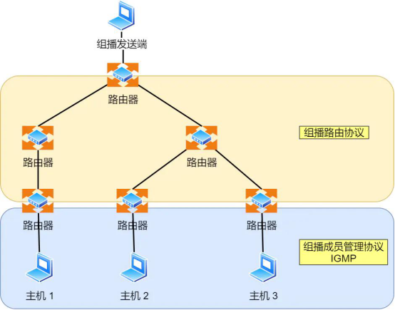
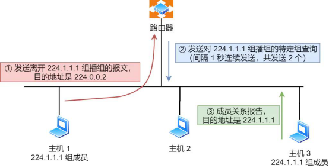
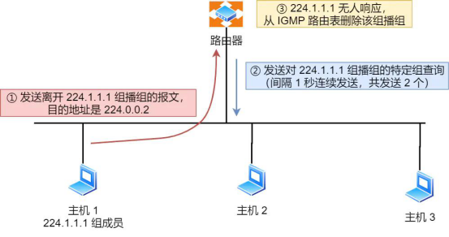

## ***\*IGMP\****

l ICMP 跟 IGMP 是一点关系都没有的，就好像周杰与周杰伦的区别

l 组播地址，也就是 D 类地址，既然是组播，那就说明是只有一组的主机能收到数据包，不在一组的主机不能收到数组包，怎么管理是否是在一组呢？那么，就需要 IGMP 协议了。

 

 

 

**l** ***\*是因特网组管理协议，工作在主机（组播成员）和最后一跳路由之间\****，如上图中的蓝色部分。

· IGMP 报文向路由器申请加入和退出组播组，默认情况下路由器是不会转发组播包到连接中的主机，除非主机通过 IGMP 加入到组播组，主机申请加入到组播组时，路由器就会记录 IGMP 路由器表，路由器后续就会转发该组播地址的数据包了。· IGMP 报文采用 IP 封装，IP 头部的协议号为 2，而且 TTL 字段值通常 为 1，因为 IGMP 是工作在主机与连接的路由器之间。

 

### ***\*版本\****

l IGMPv1、IGMPv2、IGMPv3

### ***\*工作机制\****

l 以 IGMPv2 作为例子，说说***\*常规查询与响应和离开组播组\****这两个工作机制

l 常规查询与响应工作机制

· 路由器会周期性发送目的地址为 224.0.0.1（表示同一网段内所有主机和路由器） ***\*IGMP 常规查询报文；\****· 主机1 和 主机 3 收到这个查询，随后会启动「报告延迟计时器」，计时器的时间是随机的，通常是 0~10 秒，计时器超时后主机就会发送 ***\*IGMP 成员关系报告报文\****（源 IP 地址为自己主机的 IP 地址，目的 IP 地址为组播地址）。如果在定时器超时之前，收到同一个组内的其他主机发送的成员关系报告报文，则自己不再发送，这样可以减少网络中多余的 IGMP 报文数量；· 路由器收到主机的成员关系报告报文后，就会在 IGMP 路由表中加入该组播组，后续网络中一旦该组播地址的数据到达路由器，它会把数据包转发出去

*l* **离开组播组工作机制**

n 情况一

网段中仍有该组播组：· 主机 1 要离开组 224.1.1.1，发送 IGMPv2 离组报文，报文的目的地址是 224.0.0.2（表示发向网段内的所有路由器）；· 路由器收到该报文后，以 1 秒为间隔连续发送 IGMP 特定组查询报文（共计发送 2 个），以便确认该网络是否还有 224.1.1.1 组的其他成员；· 主机 3 仍然是组 224.1.1.1 的成员，因此它立即响应这个特定组查询。路由器知道该网络中仍然存在该组播组的成员，于是继续向该网络转发 224.1.1.1 的组播数据包；

 

 

l 情况二

网段中没有该组播组： · 主机 1 要离开组播组 224.1.1.1，发送 IGMP 离组报文；· 路由器收到该报文后，以 1 秒为间隔连续发送 IGMP 特定组查询报文（共计发送 2 个）。此时在该网段内，组 224.1.1.1 已经没有其他成员了，因此没有主机响应这个查询；· 一定时间后，路由器认为该网段中已经没有 224.1.1.1 组播组成员了，将不会再向这个网段转发该组播地址的数据包；

 

 

 

 

 