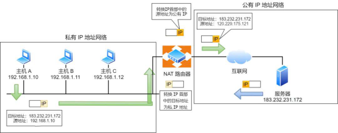
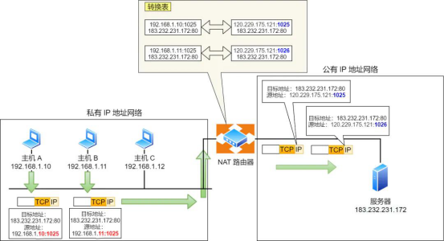
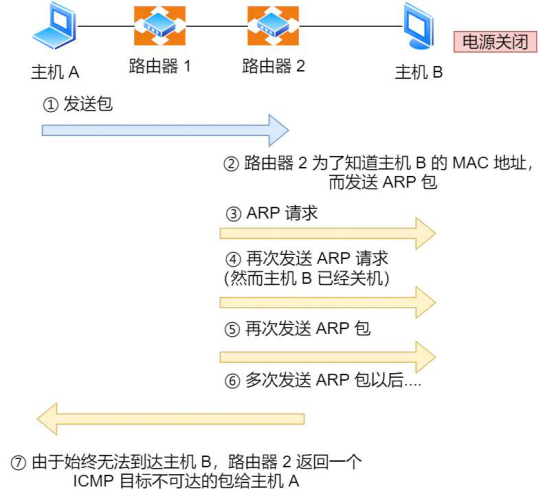
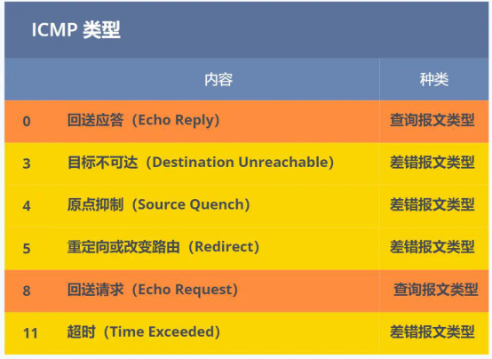

## ***\*NAT\****

l 提出了一个种***\*网络地址转换 NAT\**** 的方法，再次缓解了 IPv4 地址耗尽的问题

l 简单的来说 NAT 就是在同个公司、家庭、教室内的主机对外部通信时，把私有 IP 地址转换成公有 IP 地址。

**l** ***\*NAT技术就是实现局域网与互联网通信的一项协议\****

 

 

l 普通的 NAT 转换没有什么意义

### ***\*NAPT\****

l 由于绝大多数的网络应用都是使用传输层协议 TCP 或 UDP 来传输数据的因此，可以把 IP 地址 + 端口号一起进行转换,这样，就用一个全球 IP 地址就可以了，这种转换技术就叫***\*网络地址与端口转换 NAPT。\****

图中有两个客户端 192.168.1.10 和 192.168.1.11 同时与服务器 183.232.231.172 进行通信，并且这两个客户端的本地端口都是 1025。此时，***\*两个私有 IP 地址都转换 IP 地址为公有地址 120.229.175.121，但是以不同的端口号作为区分。\****于是，生成一个 NAPT 路由器的转换表，就可以正确地转换地址跟端口的组合，令客户端 A、B 能同时与服务器之间进行通信。这种转换表在 NAT 路由器上自动生成。例如，在 TCP 的情况下，建立 TCP 连接首次握手时的 SYN 包一经发出，就会生成这个表。而后又随着收到关闭连接时发出 FIN 包的确认应答从表中被删除。

 

 

###  ***\*NAT/NAPT 缺点\****

l 由于 NAT/NAPT 都依赖于自己的转换表，因此会有以下的问题

外部无法主动与 NAT 内部服务器建立连接，因为 NAPT 转换表没有转换记录。转换表的生产与转换操作都会产生性能开销。通信过程中，如果 NAT 路由器重启了，所有的 TCP 连接都将被重置。

### ***\*解决方法\****

*l* **改用 IPv6**

IPv6 可用范围非常大，以至于每台设备都可以配置一个公有 IP 地址，就不搞那么多花里胡哨的地址转换了，但是 IPv6 普及速度还需要一些时间。

*l* **NAT 穿透技术**

它能够让网络应用程序主动发现自己位于 NAT 设备之后，并且会主动获得 NAT 设备的公有 IP，并为自己建立端口映射条目，注意这些都是 NAT设备后的应用程序自动完成的。 在 NAT 穿越技术中，NAT 设备后的应用程序处于主动地位，它已经明确地知道 NAT 设备要修改它外发的数据包，于是它主动配合 NAT 设备的操作，主动地建立好映射，这样就不像以前由 NAT 设备来建立映射了 说人话，就是客户端主动从 NAT 设备获取公有 IP 地址，然后自己建立端口映射条目，然后用这个条目对外通信，就不需要 NAT 设备来进行转换了

 

### ***\*使用\****

这种方法需要在专用网连接到因特网的路由器上安装NAT软件。装有NAT软件的路由器叫做***\*NAT路由器\****，***\*它至少有一个有效的外部全球IP地址\****。这样，所有使用本地地址的主机在和外界通信时，都要在NAT路由器上将其本地地址转换成全球IP地址，才能和因特网连接。另外，这种通过使用少量的公有IP 地址代表较多的私有IP 地址的方式，***\*将有助于减缓可用的IP地址空间的枯竭\****。

 

### ***\*分类\****

· ***\*静态NAT(Static NAT)：\**** 静态NAT设置起来最为简单和最容易实现的一种，内部网络中的每个主机都被永久映射成外部网络中的某个合法的地址。当一个内部主机必须被作为一个固定的外部地址访问时，通过静态NAT实现。

· ***\*动态地址NAT(Pooled NAT)：\**** 动态NAT则是在外部网络中定 义了一系列的合法地址（地址池），采用动态分配的方法映射到内部网络。动态NAT转换的工作过程是这样的，当有一个内部主机需要访问外网时，从公用IP地址池中取出一个可用的地址分配给该主机使用。当通信完成后，所获取的公用IP地址也被释放回地址池中。外部公用IP在被分配给一个内部主机通信使用时，该地址不能不能再次被分配给其他内部主机使用。

· ***\*网络地址端口转换NAPT（Port－Level NAT）：\**** NAPT是把内部地址映射到外部网络的一个IP地址的不同端口上。NAPT（Network Address Port Translation），即网络端口地址转换，可将多个内部地址映射为一个合法公网地址，但以不同的协议端口号与不同的内部地址相对应，也就是<内部地址+内部端口>与<外部地址+外部端口>之间的转换。

https://www.cnblogs.com/vincently/p/4620167.html

 

 

 

 

 

如上图例子，主机 A 向主机 B 发送了数据包，由于某种原因，途中的路由器 2 未能发现主机 B 的存在，这时，路由器 2 就会向主机 A 发送一个 ICMP 目标不可达数据包，说明发往主机 B 的包未能成功。 ICMP 的这种通知消息会使用 IP 进行发送 。因此，从路由器 2 返回的 ICMP 包会按照往常的路由控制先经过路由器 1 再转发给主机 A 。收到该 ICMP 包的主机 A 则分解 ICMP 的首部和数据域以后得知具体发生问题的原因。

 

### ***\*类型\****

l 一类是用于诊断的查询消息，也就是「***\*查询报文类型\****」

l 另一类是通知出错原因的错误消息，也就是「***\*差错报文类型\****」

 

 

 