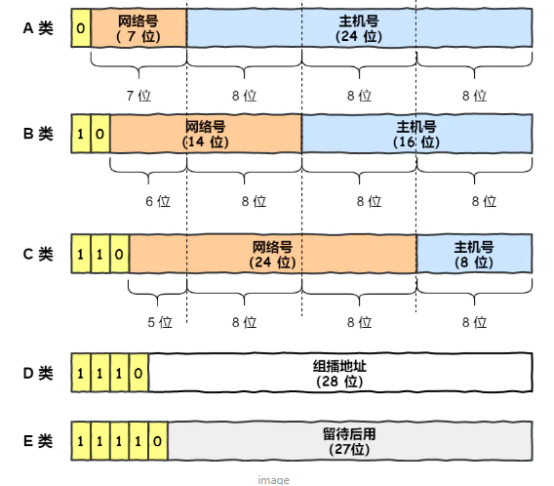
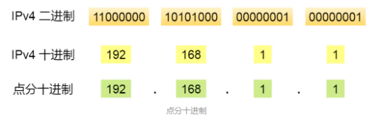

## 介绍

*   英语：
    *   IP Address  ： Internet Protocol Address）
*   全称：
    *   IP地址 ： 网际协议地址、互联网协议地址
*   模型中的位置
    *   在 TCP/IP 参考模型中处于第三层，也就是网络层

## 作用

*   IP地址是用来标记主机的地址，没有 IP 地址就无法识别主机。（标志主机）
*   因为唯一标记主机，所以可以用来在网络中查找主机。（寻址）
*   实现主机与主机之间的通信，也叫点对点（end to end）通信。
*   在复杂的网络环境中将数据包发送给最终目的主机

## ipv4

### 配置

*   IP 地址是根据网卡来配置的，不是根据主机台数配置的
*   也就是有两个以上的网卡，也就有两个 IP 地址

### IP 分类

* 介绍

    ```java
    ipv4 是一个32位二进制数，通常被分为 4 个字节， 表示成 a.b.c.d 的形式(0-255的十进制数)
    最多有 42 亿个
    ```

    

*   分类概述

    ```go
    // 0 之前都是 1
    A 第 1 位 是 0
    B 第 2 位 是 0
    C 第 3 位 是 0
    D 第 4 位 是 0
    E 第 5 位 是 0
    ```

    

    

    

    *   类型用途

        *   ABC 类型
            *   主机号全为 1  ：指定某个网络下的所有主机，用于广播
            *   主机号全为 0  ： 指定某个网络
        *   DE 类型
            *   没有主机号，不可用于主机 IP
            *   D  ： IP 多播
            *   E  ：预留使用

        

### 标记方法

*   点分十进制标记 。计算机使用二进制方式

*   使用是将 32 位 IP 地址以每 8 位为组，共分为 4 组，每组以「.」隔开，再将每组转换成十进制。

    

    

```go
E 类  
	最小 ：1111 0000 0000 0000 0000 0000 0000 0000
 点十进制 ：240.      0.        0.        0
	最大 : 1111 1111 1111 1111 1111 1111 1111 1111
 点十进制 ：255.      255.      255.       255

IP地址的最大个数就是 2 的32 次方
```


## IPV 6

### 概述

*   IPv4 和 IPv6 不能相互兼容，所以不但要我们电脑、手机之类的设备支持，还需要网络运营商对现有的设备进行升级

### 优点

*    IPv6 可自动配置，即使没有 DHCP 服务器也可以实现自动分配IP地址，真是***便捷到即插即用**啊。
*   IPv6 包头包首部长度采用固定的值 40 字节，去掉了包头校验和，简化了首部结构，减轻了路由器负荷，大大*\*提高了传输的性能\***。
*   IPv6 有应对伪造 IP 地址的网络安全功能以及防止线路窃听的功能，大大***提升了安全性**

### 标识方法

*   IPv6 地址长度是 128 位，是以每 16 位作为一组，每组用冒号 「:」 隔开

*   十六进制表示 ， 计算机中使用二进制表示

    ```go
    IPV 6 
    二进制 和 十六分制
    	1111111011011100    1011101010011000	111011001010100		0000000000000000
    	FEDC:			   BA98:			   7654:		      0000:
    
    	0000000000000000	0000000000000000	0000000000000000	11001000010000
    	0000:				0000:			   0000:			  3210
    
    十六分制	FEDC：BA98：7954:0000:0000:0000:0000:3210
    // 连续出现的 0 可以省略，用两个冒号隔开 ，但是一个 IP 地址中只允许出现一次
    		   FEDC：BA98：7954::3210
    ```


## IP 相关协议

```go
DNS 域名解析
ARP 与 RARP 协议
DHCP 动态获取 IP 地址
NAT 网络地址转换
ICMP 互联网控制报文协议
IGMP 因特网组管理协
```

## 常用命令

```java
// 查看本机 IP 地址
ipconnfig
// 检查网络是否连通
ping 空格 ip地址  // ping 192.168.1.1
```


