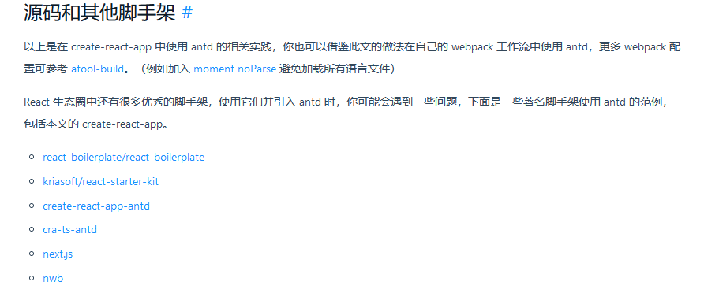

## 1. 最流行的开源React UI组件库

### 1). material-ui(国外)

	官网: http://www.material-ui.com/#/
	github: https://github.com/callemall/material-ui

### 2). ant-design(国内蚂蚁金服)

	官网: https://ant.design/
	github: https://github.com/ant-design/ant-design/

## 2. ant-design使用入门

### 1). 使用create-react-app搭建react开发环境

	npm install create-react-app -g
	create-react-app antd-demo
	cd antd-demo
	npm start

### 2). 搭建antd的基本开发环境

	1. 下载
		npm install antd@2.7.4 --save
	2. src/App.js
	    import React, { Component } from 'react';
	    import { Button } from 'antd';
	    import './App.css';  // 这样引入的是所有的样式
	    
	    class App extends Component {
	      render() {
	        return (
	          <div className="app">
	            <Button type="primary">Button</Button>
	          </div>
	        );
	      }
	    }
		export default App;
	3. src/App.css
	    @import '~antd/dist/antd.css';
	    
	    .app {
	      text-align: center;
	    }

### //============

### 3). 实现按需加载(组件js/组件css)

```js
// 详细的版本配置， 使用 3.x 版本
1.安装依赖: 
	yarn add react-app-rewired customize-cra babel-plugin-import less less-loader
2.修改package.json
    "scripts":{
        "start": "react-app-rewired start"
        "build": "react-app-rewired build",
        "test": "react-app-rewired test"，
        "eject": "react-scripts reject"
    },
3.根目录下创建config- overrides .js
//配置具体的修改规则
    const { override, fixBabelImports , addLessLoader} = require(' customize-cra');
    module.exports = override(
        fixBabelImports(' import', {
            libraryName: " antd',
            ibraryDirectory: 'es' ,
            style: true ，
        }),
    addLessLoader({
        lessOptions:{
            javascriptEnabled: true,
            modifyVars: { '@primary-color': 'green' },
            }
        }),
    );
4.备注:不用在组件里亲自引入样式了，即: import ' antd/dist/antd.css'应该删掉

```

## react 脚手架合并



## 补充

```java
// 直接去  module 库中去找 antd
import { button } from 'antd'
    
<Html5TwoTone />    
```

