## // ============== 基础

## 整体布局

### 栅格布局

```java
栅格布局
	单一分栏布局
    分栏间隔 
    任意扩展布局
    偏移指定栏数
    
对齐方式
响应式布局
基于断点的隐藏类
    
```


### 布局容器

```java
布局容器
    <el-header>：顶栏容器。
	<el-aside>：侧边栏容器。
	<el-main>：主要区域容器。
	<el-footer>：底栏容器
```

### 分页


```java
// 当数据量过多时，使用分页分解数据。
基础用法
设置最大页码按钮数
 带有背景色的分页
小型分页
附加功能
    只有一页隐藏分页
```


## 页面导航

### 导航菜单


```java
// 为网站提供导航功能的菜单。
顶栏
侧栏
折叠    
```


### 标签页

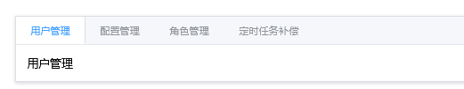

```java
基础用法
选项卡样式
 卡片化
位置
自定义标签页
动态增减标签页
自定义增加标签页触发器
    
```


### 面包屑


```java
基础
图标分隔符
```


### 页头

```java
// 如果页面的路径比较简单，推荐使用页头组件而非面包屑组件。
```


### 下拉菜单  -- 下拉框

```java
// 将动作或菜单折叠到下拉菜单中。
基础用法
触发对象   
触发方式
菜单隐藏方式
指令事件
不同尺寸
    
```

### 回到顶部

```java
基础
自定义显示内容
    
```


## 操作导航


### 进度条


```java
// 用于展示操作进度，告知用户当前状态和预期。
类型
    线形进度条
    环形进度条
    仪表盘形进度条    
百分比内显
自定义颜色

    
```


### 步骤条

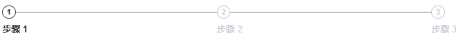

```java
// 引导用户按照流程完成任务的分步导航条，可根据实际应用场景设定步骤，步骤不得少于 2 步
基础
含状态步骤条    
有描述的步骤条
居中的步骤条
带图标的步骤条
竖式步骤条
简洁风格的步骤条    
    
```

### 时间线

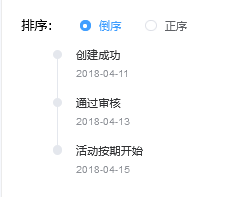

```java
基础
⾃定义节点样式
⾃定义时间戳
    
```


## 图片

### 图标

```java

```


### 头像


### 图片

```java
// 图片容器，在保留原生img的特性下，支持懒加载，自定义占位、加载失败等
基础
占位内容
加载失败
懒加载    
 大图预览    
```


### 走马灯 -- 轮播图

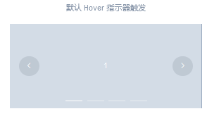

```java
基础
指示器
切换箭头
卡片化
方向
    
```


## 信息提示框

### 警告

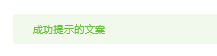

```java
// 用于页面中展示重要的提示信息。
默认
主题
自定义关闭按钮
带有 icon
文字居中
带有辅助性文字介绍
带有 icon 和辅助性文字介绍    
```


### 加载展示

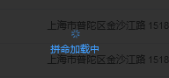

```java
区域加载
自定义
整页加载
	服务    
```

### 消息弹窗

#### 消息提示 --上端浮动

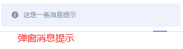

```java
// 常用于主动操作后的反馈提示。与 Notification 的区别是后者更多用于系统级通知的被动提醒。
默认
不同状态： 不同状态给与不同提示
可关闭
文字居中
使用 html
    
```

#### 弹框提示 -- 中间弹框


```java
// 模拟系统的消息提示框而实现的一套模态对话框组件，用于消息提示、确认消息和提交内容。
默认
确认消息
提交内容
自定义
html
// 区分取消和关闭    
居中布局    
```


#### 通知 --  侧边显示

```java
// 悬浮出现在页面角落，显示全局的通知提醒消息。
基础
带有倾向性：
    带有 icon，常用来显示「成功、警告、消息、错误」类的系统消息
自定义弹出位置
    可以让 Notification 从屏幕四角中的任意一角弹出
 带有偏移
使用 HTML 片段
隐藏关闭按钮    
```

#### 对话框 -- 复杂的中间弹框

```java
// 在保留当前页面状态的情况下，告知用户并承载相关操作。
基本用法
自定义内容
嵌套的 Dialog
居中布局    
```

#### 气泡确认框 -- 附近位置


```java
基础
自定义    
```

#### 抽屉


```java
// , Dialog 组件并不满足我们的需求, 比如你的表单很长, 亦或是你需要临时展示一些文档,
// Drawer 拥有和 Dialog 几乎相同的 API, 在 UI 上带来不一样的体验.

基础
不添加 Title    
自定义内容
多层嵌套    
    
```


### 文字弹浮

#### 文字浮现 --Tooltip

```java
// 常用于展示鼠标 hover 时的提示信息。
基础用法
主题
更多 Content    
```

#### 文字弹窗 -- Popover

```java
// Popover 的属性与 Tooltip 很类似
基础
嵌套信息
嵌套操作
    
```


### 提醒标记

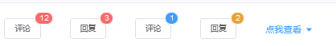

```java
// 图标旁的数字或状态标记
基础用法
最大值
自定义内容
小红点
    
```


## //==============表单

## 选择框

### 单选框

```java
基础
禁用
单选框组
按钮样式
带有边框    
```


### 多选框

```java
基础
禁用
多选框组
数量选择
    状态 ： 一般用于实现全选的效果
    数量限制： 堆选择的个数
按钮样式
带有边框    
```


### 输入框

```java
基础

样式    
	带 icon
    复合型输入框： 带前缀或者后缀
    自适应文本高度的文本域
功能
    禁用
    可清空
    密码框
文本调节
   带建议输入 
   长度限制
    
文本域


尺寸

自定义输入框模板

服务端搜索数据    
```

### select 下拉框

```java
基础
禁用
    部分禁用
    全部禁用
清空选择
多选
分组
可搜索
创建条目    
服务端搜索    
自定义模板    
```


### 级联选择器

```java
默认
禁用
    禁用选项
清空选择
显示
    仅显示最后一级
多选
选择任意一项
动态加载
可搜索
自定义节点内容
级联面板    
```


### 穿梭框

```java
默认
搜索： 数据进行搜索和过滤
自定义
    
```

### 计数器

```java
基础
禁用
步数
	精度    
    严格步数
样式
    尺寸
	按钮位置    	
```


## 日期时间

### 时间选择器

```java
固定时间点
任意时间点 
固定时间范围
任意时间范围    
```


### 日期选择器

```java
选择
    日
    其他单位
范围
    日
    月份
日期范围
默认显示日期    
```


### 事件时间选择器

```java
日期和时间点
日期和时间范围
默认的起始与结束时刻    
```


### 日历

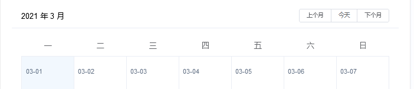

```java
基础
 自定义范围    
```


## // ============= data

## 列表

### 表格


```java
// 用于展示多条结构类似的数据，可对数据进行排序、筛选、对比或其他自定义操作。
样式
    默认
    斑马纹
    边框
    状态
固定
    表头    
    列
    表头和列
高度
    流体高度

多级表头
操作
    单选
    多选
    排序
    筛选
    展开
    	行
    合并
    	表尾合计行
    	合并行或列
    树形数据与懒加载
自定义
    列模板
    表头
    索引
```

### 卡片

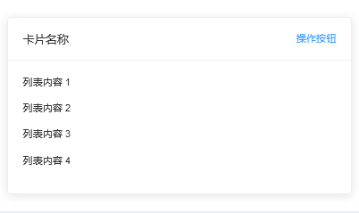

```java
基础
简单卡片
图片
卡片阴影
    
```

### 折叠面板

```java
// 通过折叠面板收纳内容区域
基础
手风琴效果
自定义面板标题
    
```

### 无限滚动

```java
```


### 树形控件

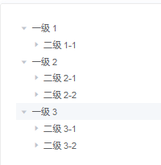

```java
基础用法
    
选择    
	可选择
	懒加载自定义叶子节点
	默认展开和默认选中
	禁用状态
	树节点的选择
自定义节点内容
节点过滤
手风琴模式
可拖拽节点    
```


## //===============其他


## 样式

### 色彩

```java
主色
辅助色
中性色    
```


### 字体

```java
正文
标题    
```


### 边框

```java
边框
圆角
投影    
```

### 分割线

```java
// 对不同章节的文本段落进行分割

```


## 功能表单

### 开关

```java
基础
文字描述
扩展 value
禁用    
```


### 滑块

```java
基础 ： 在拖动滑块时，显示当前值
离散值： 有步长滑动
带输入框
范围选择
竖向表示
展示标记
    
```


### 上传

```java
上传方式
    点击
    拖拽
    手动

用户头像上传
照片墙
文件缩略图
图片列表缩略图
上传文件列表控制    
```


### 评分(评价)

```java
基础用法: 五星评价
辅助文字： 显示出分数
其它 icon    
只读 ：允许出现半星    
```


### 颜色选择器

```java
 基础用法: 色值
 选择透明度      
 预定义颜色    
  不同尺寸	     
```


## 按钮

```java
基础按钮
    默认
    朴素
    圆角
禁用
文字按钮
图标按钮
按钮组
加载中图标    
```

## 标签

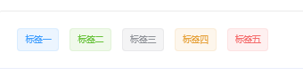

```java
 基础用法
 可移除标签     
 动态编辑标签
 不同尺寸
 不同主题
```

## 文字连接

```java
基础连接
    默认链接 主要链接 成功链接 警告链接 危险链接 信息链接
禁用状态
下划线
    有、 无
图标
    
```


## 表单模板