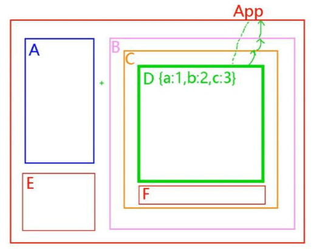

## 文档

```java
1)英文文档: https://redux.js.org/
2)中文文档: http://www.redux.org.cn/
3)Github: https://github.com/reactjs/redux
```

## 介绍

### 概述

```java
1)redux是一个独立专门用于做状态管理的JS库(不是react插件库)
2)它可以用在react, angular, vue等项目中, 但基本与react配合使用
3)作用: 集中式管理react应用中多个组件共享的状态
    
```

### 使用场景

```java
组件 A 需要 组件 D 的数据，进行数据共享 
就是 D 组件将需要公用的数据，交给 redux , 然后组件 A 去跟 redux 要数据    
```



## 使用原则

```java
1)总体原则: 能不用就不用, 如果不用比较吃力才考虑使用
2)	某个组件的状态，需要共享
3)	某个状态需要在任何地方都可以拿到
4)	一个组件需要改变全局状态
5)	一个组件需要改变另一个组件的状态
```


## 工作流程


## 核心概念

### 概述

```java
action: 
	默认是对象(同步action), {type: 'xxx', data: value}, 需要通过对应的actionCreator产生, 
	它的值也可以是函数(异步action), 需要引入redux-thunk才可以
reducer
	根据老的state和指定的action, 返回一个新的state
	不能修改老的state
store
	redux最核心的管理对象
	内部管理着: state和reducer
	提供方法: getState(), dispatch(action), subscribe(listener)
```


### action

```js
介绍
    1)标识要执行行为的对象
    2)包含2个方面的属性
键值对    
    a.type: 标识属性, 值为字符串, 唯一, 必要属性
    b.xxx: 数据属性, 值类型任意, 可选属性
3)例子:
		const action = {
			type: 'INCREMENT',
			data: 2
		}
4)Action Creator(创建Action的工厂函数)
		const increment = (number) => ({type: 'INCREMENT', data: number})
```


### reducers

```js
1)根据老的state和action, 产生新的state的纯函数
2)样例
		export default function counter(state = 0, action) {
		  switch (action.type) {
		    case 'INCREMENT':
		      return state + action.data
		    case 'DECREMENT':
		      return state - action.data
		    default:
		      return state
		  }
		}
3)注意
a.返回一个新的状态
b.不要修改原来的状态
```

### store

```js
1)将state,action与reducer联系在一起的对象
2)如何得到此对象?
		import {createStore} from 'redux'
		import reducer from './reducers'
		const store = createStore(reducer)
3)此对象的功能?
		getState(): 得到state
		dispatch(action): 分发action, 触发reducer调用, 产生新的state
		subscribe(listener): 注册监听, 当产生了新的state时, 自动调用
```

