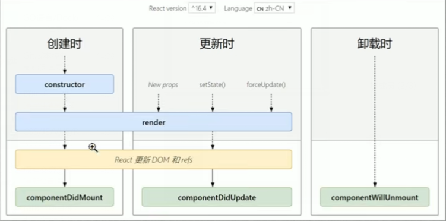
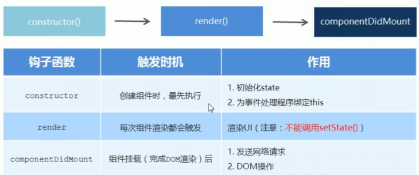
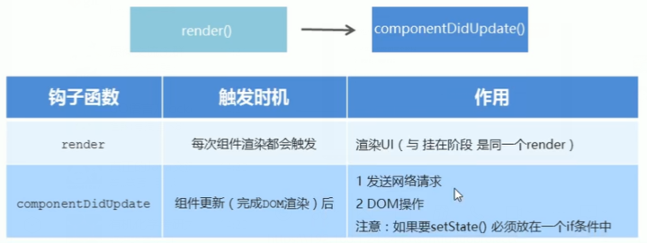

## 

## 介绍

```java
使用组件使得我们的应用更容易，多个组件组合构成页面。
组件是 react 的一等公民，
利用 js 实现组件    
```


## 语法

### == 单组件 ==

### 函数组件

```js
介绍
	使用 js 的函数(箭头函数)创建的组件
    函数名作为标签名，直接渲染到 dom 中
约定
	1. 函数的名称必须是: 大写字母开头
    2. 函数组件必须有返回值： 表示该组件的结构, 最好用 （）括起来
    3. 注意组件类只能包含一个顶层标签，否则也会报错。
返回值
	null ： 表示组件不进行渲染
    
渲染
	用函数名作为组件标签名(单双标签均可)

// 封装一个输出 "Hello World！" 的组件，组件名为 HelloMessage：
// 函数定义了一个组件
function HelloMessage(props) {
    return <h1>Hello World!</h1>;
}


// 用户自定义的组件。函数名作为为标签名
const element = <HelloMessage />;
 
ReactDOM.render(
    element,  // 这个地方可以直接使用  <HelloMessage />
    document.getElementById('example')
);

// 注意
    const tem = () => (<h1>这个是函数是组件22</h1>)
	这样子在 render 中使用的时候， 用的是 <tem />                       

```

### 类组件

```java
介绍
    使用 es6 的类创建组件
约定
    1. 类名称需要用大写字母开头
    2. 类组件
    	需要继承 React.Component ， 可以使用父类的方法和属性
    	需要提供 render 方法
    3. render 需要有返回值
渲染
    类名称作为标签名，直接渲染到 dom 中
class Welcome extends React.Component {
  render() {
    return <h1>Hello World!</h1>;
  }
}

ReactDOM.render(
    <Welcome />,  // 这个地方可以直接使用  <HelloMessage />
    document.getElementById('example')
);
```

### == 复合组件 ==

```java
介绍
    创建多个组件来合成一个组件，即把组件的不同功能点进行分离
例子
	//  ==  不同的组件
    function Name(props) {
        return <h1>网站名称：{props.name}</h1>;
    }
    function Url(props) {
        return <h1>网站地址：{props.url}</h1>;
    }
    function Nickname(props) {
        return <h1>网站小名：{props.nickname}</h1>;
    }
	
	/*
		== 复合组件组合
		App 组件使用了 Name、Url 和 Nickname 组件来输出对应的信息。
	*/  
	
    function App() {
        return (
        <div>
            <Name name="菜鸟教程" />
            <Url url="http://www.runoob.com" />
            <Nickname nickname="Runoob" />
        </div>
        );
    }

    ReactDOM.render(
         <App />,
        document.getElementById('example')
    );

```

## 模块化

### 组件文件

```java
1. 先创建独立组件文件 hello.js
    // 创建组件
    class Welcome extends React.Component {
      render() {
        return <h1>Hello World!</h1>;
      }
    }
	// 导出组件
	exprot default Welcome
        
2. 使用文件导入独立组件
    import Welcome from './Hello'
        
    ReactDOM.render(
        <Welcome />,  
        document.getElementById('example')
    );   
```

### 待整理

```java
<body>
  <div id="example"></div>
  // 将需要 render 的东西单独放到一个 js 文件中
  <script type="text/babel" src="helloworld_react.js"></script>
</body>

// 创建一个 helloworld_react.js 文件

ReactDOM.render(
  <h1>Hello, world!</h1>,
  document.getElementById('example')
);
    
```


## 组件传参

```java
介绍
    需要向组件传递参数，可以使用 this.props 对象

例子    
    function HelloMessage(props) {
        return <h1>Hello {props.name}!</h1>;
    }
	
	/*
		name 属性通过 props.name
		在添加属性时， 
			class 属性需要写成 className ，
			for 属性需要写成 htmlFor ，
			
			这是因为 class 和 for 是 JavaScript 的保留字。
	*/
    const element = <HelloMessage name="Runoob"/>;

    ReactDOM.render(
        element,
        document.getElementById('example')
    );
    
```

## 生命周期

### 状态划分

```java
// 组件的生命周期可分成三个状态
	Mounting：已插入真实 DOM
    Updating：正在被重新渲染
    Unmounting：已移出真实 DOM
```

### 周期方法

```java

// --- component
    ---WillMount 在渲染前调用,在客户端也在服务端。

    ---DidMount : 在第一次渲染后调用，只在客户端。之后组件已经生成了对应的DOM结构，可以通过this.getDOMNode()来进行访问。 如果你想和其他JavaScript框架一起使用，可以在这个方法中调用setTimeout, setInterval或者发送AJAX请求等操作(防止异步操作阻塞UI)。

    ---WillReceiveProps 在组件接收到一个新的 prop (更新后)时被调用。这个方法在初始化render时不会被调用。

    should---Update 返回一个布尔值。在组件接收到新的props或者state时被调用。在初始化时或者使用forceUpdate时不被调用。
    可以在你确认不需要更新组件时使用。

    ---WillUpdate在组件接收到新的props或者state但还没有render时被调用。在初始化时不会被调用。

    ---DidUpdate 在组件完成更新后立即调用。在初始化时不会被调用。

    ---WillUnmount在组件从 DOM 中移除之前立刻被调用。

```


## // ===


## == 生命周期 ==

## 介绍

```java
每当 Clock 组件第一次加载到 DOM 中的时候，我们都想生成定时器，这在 React 中被称为挂载。

同样，每当 Clock 生成的这个 DOM 被移除的时候，我们也会想要清除定时器，这在 React 中被称为卸载。
    
意义
    根据声明周期运行方式，分析错误。完成更复杂的功能
组件的生命周期
    组件从创建到挂载到页面中运行，再到组件不用的时候进行卸载的过程
钩子函数
    组件运行到某个阶段，会调用一个函数
    这些函数，是由开发人员进行编写，由 react 进行调用，
    就像 react 在运行的时候，从外部钩了一个函数， 这个函数就叫钩子函数
    
注意
    只有类组件有声明周期
```

## 各个阶段(常用)



### 创建时 -- 挂载阶段

```java
执行时机：组件创建时（页面加载时）
```



### 更新时

```java
执行时机
    setState()  forcceUpdate()  组件接收到新的 props 
    以上三者之一发生变化，组件就会重新渲染
    
    componnetDidUpdate
    if (两次的 props 是否相同) {
        this.setState()
    }        
```



### 卸载时

```JAVA
执行时机
    组件从页面中消失时触发：写在接单
```


## 例子

```java
class Clock extends React.Component {
  constructor(props) {
    super(props);
    this.state = {date: new Date()};
  }
 
  // 生命周期钩子。    
  componentDidMount() {
    this.timerID = setInterval(
      () => this.tick(),
      1000
    );
  }
 
  // 生命周期钩子	    
  componentWillUnmount() {
    clearInterval(this.timerID);
  }
 
  tick() {
    this.setState({
      date: new Date()
    });
  }
 
  render() {
    return (
      <div>
        <h1>Hello, world!</h1>
        <h2>现在是 {this.state.date.toLocaleTimeString()}.</h2>
      </div>
    );
  }
}
 
ReactDOM.render(
  <Clock />,
  document.getElementById('example')
);

```

## 运行顺序

```java

    当 <Clock /> 被传递给 ReactDOM.render() 时，React 调用 Clock 组件的构造函数。 
        由于 Clock 需要显示当前时间，所以使用包含当前时间的对象来初始化 this.state 。 我们稍后会更新此状态。

    React 然后调用 Clock 组件的 render() 方法。
        这是 React 了解屏幕上应该显示什么内容，然后 React 更新 DOM 以匹配 Clock 的渲染输出。

    当 Clock 的输出插入到 DOM 中时，React 调用 componentDidMount() 生命周期钩子。 
        在其中，Clock 组件要求浏览器设置一个定时器，每秒钟调用一次 tick()。

    浏览器每秒钟调用 tick() 方法。 
        在其中，Clock 组件通过使用包含当前时间的对象调用 setState() 来调度UI更新。 
        通过调用 setState() ，React 知道状态已经改变，并再次调用 render() 方法来确定屏幕上应当显示什么。
        这一次，render() 方法中的 this.state.date 将不同，所以渲染输出将包含更新的时间，并相应地更新 DOM。

    一旦 Clock 组件被从 DOM 中移除，React 会调用 componentWillUnmount() 这个钩子函数，定时器也就会被清除。

```


## 待整理

```java
    
    
    


主要区别：


————————————————
版权声明：本文为CSDN博主「白小宇」的原创文章，遵循CC 4.0 BY-SA版权协议，转载请附上原文出处链接及本声明。
原文链接：https://blog.csdn.net/b954960630/article/details/79822639
```

