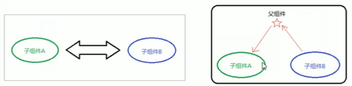

## 组件通讯

### 介绍

```java
默认情况下：
    组件只能使用自己的数据，不同组件之间的数据是不能互通的
组件通讯
    各个封装好的组件之间，需要共享某些数据，就需要打破组件的封闭性，进行组件之间的沟通，
    这个过程就是组件通讯
```

### 数据自顶向下流动

#### 介绍

```java
状态: 
	通常被称为局部或封装
	父组件或子组件都不能知道某个组件是有状态还是无状态，并且它们不应该关心某组件是被定义为一个函数还是一个类    
    除了拥有并设置它的组件外，其它组件不可访问
```

#### 例子

```java
function FormattedDate(props) {
  return <h2>现在是 {props.date.toLocaleTimeString()}.</h2>;
}
 
class Clock extends React.Component {
  constructor(props) {
    super(props);
    this.state = {date: new Date()};
  }
 
  componentDidMount() {
    this.timerID = setInterval(
      () => this.tick(),
      1000
    );
  }
 
  componentWillUnmount() {
    clearInterval(this.timerID);
  }
 
  tick() {
    this.setState({
      date: new Date()
    });
  }
 
  render() {
    return (
      <div>
        <h1>Hello, world!</h1>
        <FormattedDate date={this.state.date} />
      </div>
    );
  }
}
 
ReactDOM.render(
  <Clock />,
  document.getElementById('example')
);


分析
     FormattedDate 组件将在其属性中接收到 date 值，
     并且不知道它是来自 Clock 状态、还是来自 Clock 的属性、亦或手工输入
     // 这通常被称为自顶向下或单向数据流。
介绍
    任何状态始终由某些特定组件所有，并且从该状态导出的任何数据或 UI 只能影响树中下方的组件
    所有组件都是真正隔离的
    想象一个组件树作为属性的瀑布，每个组件的状态就像一个额外的水源，它连接在一个任意点，但也流下来
    可以在有状态组件中使用无状态组件，也可以在无状态组件中使用有状态组件
```


## 组件状态

### 状态

```java
状态
    是一个组件中的数据集合
当『有状态的组件』
    （stateful component）被加载到内存中时，这些数据也同时被保存在内存中。
    当渲染带状态的组件时，状态中数据可能会对该组件及其子组件产生影响    
是一个『无状态组件』
    自己是没有数据，结果就是要么这个无状态组件就是纯粹的渲染 html 内容，不需要对数据进行判断和处理；
    要么这个组件所需要的数据，都是来自于上层结构（父组件传递下来的数据，或者 Redux 的 store 中的数据）
   
// ====
种数据从上下向下的流动，
    所以通常『有状态组件』会包含若干『无状态组件』。
    『有状态组件』就像一个容器，内部盛放着『无状态组件』：
    当『无状态组件』需要数据，都是从上层的『有状态组件』提供。    
```

### 分类

```java
分类
	无状态组件： 
    	就是函数组件
    	函数组件没有自己的数据（属性字段：状态），只负责数据展示(静态)
    有状态组件： 
    	就是类组件
    	类组件有自己的数据(属性字段：状态)，能够自定义一些列的动作
使用
    函数：速度较快，适合用于做表现层，
    类 ：能够处理复杂逻辑和状态，适合做逻辑层和数据层
状态
    即数据
```


## == state ==

## 介绍

```java

	通过与用户的交互，实现不同状态，然后渲染 UI，让用户界面和数据保持一致
	React 里，只需更新组件的 state，然后根据新的 state 重新渲染用户界面（不要操作 DOM）
     
        
state 是个对象，表示一个组件中可以有多个数组        
```

## 语法

```java
// 方式一: 类构造函数中初始化

    class Clock extends React.Component {
      // 添加一个类构造函数来初始化状态 this.state，
      // 类组件应始终使用 props 调用基础构造函数	    
      constructor(props) {
        super(props);
        this.state = {
            date: new Date()
        }
      }
     ...
    }     

// 方式二
    class Clock extends React.Component {
		state = {
            count ： 0
        }
    }   

// 在react16版本前使用的方式
React.createClass({
    getInitialState:function(){
        return {
              name:'lan',
        };
    }
```

## 操作

### 获取

```js
介绍
	state 是状态，就是数据，
    状态是私有的， 只能在组件内容部使用，
    可以通过 this.state 进行获取

// 例子
    class Clock extends React.Component {
		state = {
            count ： 0
        }
		
		render() {
            return(
                // 拿到 state 的数据
            	<h1>{this.state.count}</h1>
            )
        }
    }  
```

### 设置：setState

#### 语法

```java
语法
setState(object nextState[, function callback])
参数
    nextState，将要设置的新状态，该状态会和当前的state合并
    callback，可选参数，回调函数。该函数会在setState设置成功，且组件重新渲染后调用。
作用	
    合并nextState和当前state，并重新渲染组件。
    setState是React事件处理函数中和请求回调函数中触发UI更新的主要方法。
    
注意
    // 数据驱动视图
    不能在组件内部通过this.state修改状态，因为该状态会在调用setState()后被替换
     setState()并不会立即改变this.state，而是创建一个即将处理的state。
     setState()并不一定是同步的，为了提升性能React会批量执行state和DOM渲染。
     setState()总是会触发一次组件重绘，除非在shouldComponentUpdate()中实现了一些条件渲染逻辑。
```

#### 例子

```java
class App  extends React.Component{
	state = {
        count: 0 //,
    }
    render() {
        return(
   		<div>
            <h1>点我！点击次数为: {this.state.clickCount}</h1>
            <button onClick={() => {
                this.setState({
                    count:this.state.count + 1
                })
            }}> +1 </button>
		</div>
        )
    }
}    
ReactDOM.render(
  <App />,
  document.getElementById('example')
);

```

#### 使用注意

##### 1.不要直接修改状态

```java
1、不要直接更新状态，构造函数是唯一能够初始化 this.state 的地方。
    // 错误： this.state.comment = 'Hello';
	this.setState({comment: 'Hello'});

```

##### 2.状态更新可能是异步

```java
2、状态更新可能是异步的
    React 可以将多个 setState() 调用合并成一个调用来提高性能。
	因为 this.props 和 this.state 可能是异步更新的，你不应该依靠它们的值来计算下一个状态
    /*
    此代码可能无法更新计数器：
    his.setState({
 	 counter: this.state.counter + this.props.increment,
	});
    */
    // 方式一
    // 使用第二种形式的 setState() 来接受一个函数而不是一个对象。 
    // 该函数将接收先前的状态作为第一个参数，将此次更新被应用时的props做为第二个参数：
    this.setState((prevState, props) => ({
      counter: prevState.counter + props.increment
    }));
	// 方式二：
    this.setState(function(prevState, props) {
      return {
        counter: prevState.counter + props.increment
      };
    });
```

##### 3.状态更新合并

```java
当你调用 setState() 时，React 将你提供的对象合并到当前状
    
1. 状态可能包含一些独立的变量, 可以调用 setState() 独立地更新它们'
componentDidMount() {
    fetchPosts().then(response => {
      this.setState({
        posts: response.posts
      });
    });
	/*
	这里的合并是浅合并，也就是说 this.setState({comments}) 完整保留了 this.state.posts，
	但完全替换了 this.state.comments。
	*/
    fetchComments().then(response => {
      this.setState({
        comments: response.comments
      });
    });
  }
```


## == props ==

## 介绍

```java
介绍
    组件是封闭的， 要接受外部数据应该通过 props 实现
    接收传递给组件的数据
传递数据
    给组件添加属性
    <Hello name="jack" age={19} />
接收数据
    函数组件：通过参数 props 进行接收， 
	    function Hello(props) { props.xxx }
    类组件  ：通过 this,props 进行接收
        class Hello extends React,Component { this.props.age }
```

## 特点

```java
1. 传递的数据类型没有限制
	<Hello 
    	name="jack" 
    	age={19},
		fn={() => ()}  // 函数
    />, 
2. 对于使用 props 的组件来说，是只读的，
    	要想修改Props，只能通过该组件的父组件修改。
    	子组件只能通过 props 来传递数据
    
3. 使用类组件， 如果写了构造函数， 应该将 props 传递给 super()
    否则无法在构造函数中获取到 props
    class Hello extends React.Component {
        constructor(props) {
            // 推荐将 props 传递给父类构造函数
            super(pros)
			// console.log(props)  可以拿到 props 类
        }
        render() {
            return <div>接收到的数据： {this.props.age}</div>
        }
    }
```


## 数据传递 -- 自上而下

### 函数组件

```js
const Hello = props => {
  // props 是一个对象， {name: jack, ...}	    
  console.log(props)  
  return (
    <div>
      <h1>props: {props.name}</h1>
    </div>
  )
}

ReactDOM.render(
  // 这里的 name 就会包括到 Hello 函数组件的 props 中  
  // 在这里给组件传递数据    
  <Hello name="jack" />,  
  document.getElementById('root')
);

```

### 类组件

```java
class Hello extends React.Component {

   render() {
        // props 是一个对象， {name: jack, ...}	   
      console.log(props)  
      return (
        <div>
          <h1>props: {props.name}</h1>
        </div>
  )
  }	    
}

ReactDOM.render(
  // 这里的 name 就会包括到 Hello 函数组件的 props 中    
  <Hello name="jack" />,  
  document.getElementById('root')
);

```


### 默认 props

```java
介绍
	通过组件类的 defaultProps 属性为 props 设置默认值
例子
    class HelloMessage extends React.Component {
      render() {
        return (
          <h1>Hello, {this.props.name}</h1>
        );
      }
    }
	// defaultProps 属性
	// 设置上面的 this.props.name 的默认值
    HelloMessage.defaultProps = {
      name: 'Runoob'
    };

    const element = <HelloMessage/>;

    ReactDOM.render(
      element,
      document.getElementById('example')
    );
	
```

## 传递方式

### 父传子

```java
1. 父组件提供要传递的 state 数据
2. 给子组件标签添加属性， 值为 state 中的数据   
3. 子组件通过 props 接收父组件中传递的数据    
    
    
// 1. 父组件提供要传递的 state 数据
// 父组件
class WebSite extends React.Component {
  constructor() {
      super();
 
      this.state = {
        name: "菜鸟教程",
        site: "https://www.runoob.com"
      }
    }
  render() {
    return (
      <div>
        // 子组件
        // 2. 给子组件标签添加属性， 值为 state 中的数据
        <Name name={this.state.name} />
        <Link site={this.state.site} />
      </div>
    );
  }
} 


// 3. 子组件通过 props 接收父组件中传递的数据 
// 子组件
class Name extends React.Component {
  render() {
    return (
      /*
          父组件中 state = { name: "菜鸟教程", ...}
          获取父组件中的 state 值
      
      */ 
      
      <h1>{this.props.name}</h1>
    );
  }
}

```


### 子传父(改)

```java
思路
    利用回调函数， 父组件提供回调， 子组件调用，将要传递的数据作为回调函数的参数
步骤
    1. 父组件提供一个回调函数(创建事件句柄, 用于接收数据)
    2.  该函数作为属性的值，传递给子组件
    3. 子组件通过 props 调用回调函数
    4. 将子组件的数据作为参数传递给回调函数

介绍
	你需要在父组件通过 (handleChange) ，
    并作为 prop (updateStateProp) 传递到你的子组件上
    
例子
// 父组件
// 父组件
class HelloMessage extends React.Component {
    state = {
        parentMsg:''
    }
    
    // 这个回调函数不是父组件调用的，而是子组件进行调用的
    getChildMsg = (msg) => {
        console.log("接收子组件的数据：", msg)
        // 将子组件传递过来的数据更到父组件的 state
		this.setState({
            parent: msg
        })            
    }
    
    render() {
        return (
        	<div>
            // 2.  该函数作为属性的值，传递给子组件
            // 子组件就可以通过 props 进行调用
            子组件：<child getMsg={this.getChildMdg} />
            </div>
        )
    }
}    

// 子组件
class Content extends React.Component {

  state = {
      child_Msg: '6666'
  }  

  handleClick = () => {
      // 调用父组件的方法
      // 这里执行 getMsg 就是执行 父组件的getChildMdg 方法
      // 将需要给父组件的数据放入参数位置，就是给父组件传递数据
      this.props.getMsg(this.state.child_Msg)
  }    
  render() {
    return  (
    <div>
        <button onClick = {this.handleClick}>点我</button>
        <h4>{this.props.myDataProp}</h4>
     </div>
    )
  }
}

```


### 兄弟组件



```java
思路
    // 状态提升
    将共享状态提升到最近的公共父组件中，由公共父组件管理这个状态
公共父组件
    1. 提供共享状态
    2. 提供操作共享状态的方法
通讯的子组件
    只需要通过 props 接收状态或者操作状态的方法即可
    
    
    
// ===========
 
// 父组件    
class Counter extends React.Component {
    // 父组件提供共享状态
    state = {
        count: 0
    }
    
    // 提供修改状态方法的回调函数
    onIncrement = () => {
        this.setState({
            count: this.state.count + 1
        })
    }
    render() {
        return (
        	<div>
            	<child1 count={this.state.count} />
            	<child2 onIncrement={this.onIncrement}/>
            <div>
        )
    }
}  

// 子组件
const child1 = (props) => {
    return <h1> 计数器计算出来的值: {props.count} </h1>
}

const child2 = (props) => {
    // 通过调用子组件的属性，就是执行父组件的回调函数
    return <button onclick={() => props.onIncrement()}> +1 </button>
}

   ReactDOM.render(
       <Counter />,
      document.getElementById('example')
    );
	
```

### 跨组件层级传递


```js
介绍
    跨层级的数据传递
    // 多层级传递
        方法一： 使用 props 一层层往下传递
        方法二： 使用 context ,    实现跨组件传递数
步骤
	步骤
    1. 使用 React.createContext 创建
    	Provider(提供数据的组件) Consumer(消费数据的组件)
        const {Peovider, Consumer } = React.createContext()
    2 使用 provider 组件作为父节点， 进行传递数据
    	 设置 value 属性， 表示要传递的数据
            <provider value='pink'> 
                <div>
                   <Node />
                </div>
            </provider>
    3. 使用 consumer 组件接收数据
    	<Consumer>
        	// 使用函数，结构 provider 传递过来的数据
    		data => {}
    	</Consumer>

// 例子

```


## props 验证

### 介绍

```java
注意
    React.PropTypes 在 React v15.5 版本后已经移到了 prop-types 库。
    <script src="https://cdn.bootcss.com/prop-types/15.6.1/prop-types.js"></script>
    
介绍
    Props 验证使用 propTypes，它可以保证我们的应用组件被正确使用，
    React.PropTypes 提供很多验证器 (validator) 来验证传入数据是否有效。
    当向 props 传入无效数据时，JavaScript 控制台会抛出警告
    
    
```

### 例子

```java

var title = "菜鸟教程";
// var title = 123;
class MyTitle extends React.Component {
  render() {
    return (
      <h1>Hello, {this.props.title}</h1>
    );
  }
}
 
MyTitle.propTypes = {
  title: PropTypes.string   // 开启验证
};
ReactDOM.render(
    <MyTitle title={title} />,
    document.getElementById('example')
);

```


## // == 综合

## state vs props

```java
介绍
    props 是组件对外的接口，state 是组件对内的接口。
组件树
    组件内可以引用其他组件，组件之间的引用形成了一个树状结构（组件树）
数据传递
    1. 下层组件需要使用上层组件的数据或方法 // 下用上
    	上层组件就可以通过下层组件的props属性进行传递，因此props是组件对外的接口。
    2. 组件自身维护管理数据， // 深深
    	这就是组件对内的接口state。
    // 根据对外接口props 和对内接口state，组件计算出对应界面的UI。
    
总结
    State是可变的，
    	是一组用于反映组件UI变化的状态集合；
    	 可以根据与用户交互来改变
    Props
    	对于使用它的组件来说，是只读的，
    	要想修改Props，只能通过该组件的父组件修改。
    	子组件只能通过 props 来传递数据
    在组件状态上移的场景中，父组件正是通过子组件的Props, 传递给子组件其所需要的状态。
```