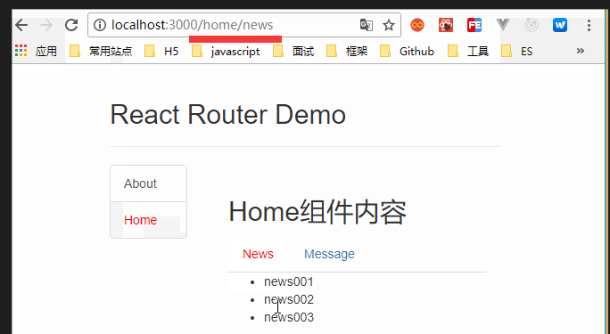
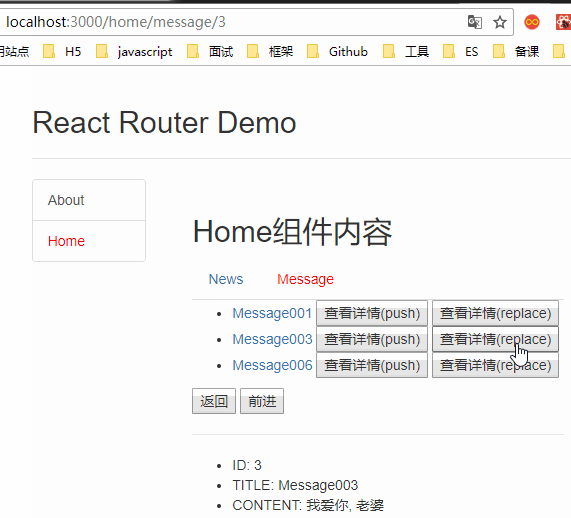
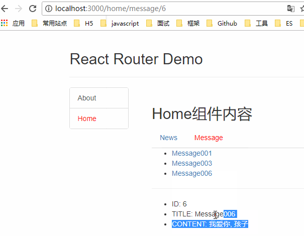

## 路由切换（单级）

### 功能结构


```java
描述
    点击导航连接，引起导航路径变化
    被前端路由器检测到具体的路径，进行匹配，进行内容展示
组件
    componnet
        about
        home
        my-native-link
    app.jsx
    index.js
```

### NavLink 封装

```java
// my-nav-link.jsx
import React from 'react'
import {NavLink} from 'react-router-dom'  // route 自带的

export default function MyNavLink(props) {
    
  // 利用传递参数   
  // <MyNavLink className="list-group-item" to='/home'>Home</MyNavLink>
  /*
  	
  	方式二
  		 <MyNavLink className="list-group-item" to={to}>{Title}</MyNavLink>
  		 使用
  		 	 <MyNavLink className="list-group-item" to='/home' title="Home">/MyNavLink>
  */    
  // 之后所有的 该标签，都有 className 属性
  // 直接这样使用  <MyNavLink to='/about' >About</MyNavLink>   即可
  return <NavLink {...this.props} activeClassName='activeClass'/>
}
```

### 组件 app.jsx

```jsx
import React from 'react'
import {Route, Switch, Redirect} from 'react-router-dom'
import MyNavLink from './components/my-nav-link'
import About from './views/about'
import Home from './views/home'

export default class App extends React.Component {
render () {
    return (
      <div>

              <h2>React Router Demo</h2>

              {/*导航路由链接*/}
              // 标签体也是特殊的标签属性，可以使用this.props.children 进行获取
              
              <MyNavLink className="list-group-item" to='/about' >About</MyNavLink>
              <MyNavLink className="list-group-item" to='/home'>Home</MyNavLink>

                {/*可切换的路由组件
                	提高匹配效率，值匹配需要指定的路由
                	路由的匹配是有顺序，从上到下执行的
                */}
                <Switch>
                  // 精准匹配，少用，除非出问题
                  <Route exact={true} path='/about' component={About} />
                  // 模糊匹配， 向后模糊匹配
                  <Route path='/home' component={Home} />
                  // 页面开启，默认进行匹配的路由，这个写到最下面
                  // 就是前面谁都匹配补上，就展示这个页面
                  <Redirect to='/about' />
                </Switch>

      </div>
    )
  }
}    
```

### index.js

```js
import React from 'react'
import ReactDOM from 'react-dom'
import {BrowserRouter, HashRouter} from 'react-router-dom'
import App from './components/app'

import './index.css'

ReactDOM.render(
  (
    <BrowserRouter>
      <App />
    </BrowserRouter>
    /*<HashRouter>
      <App />
    </HashRouter>*/
  ),

  document.getElementById('root')
)
```

### 组件 about.jsx

```java
import React from 'react'
export default function About() {
  return <div>About组件内容</div>
}
```

### 组件 home.jsx

```java
import React from 'react'
export default function About() {
  return <div>Home组件内容</div>
}
```


## 路由切换（多级）

### 结构描述



```js
注意
	也叫路由嵌套

一级路由组件
	home.jsx
二级路由组件
	news.jsx
	message.jsx
功能描述
	路由组件 home 中还要一个路由组件 new.jsx
	点击 home ,z展示出来 New , 然后点击 new 有展示出来一个组件
```

### 一级路由组件

#### home.jsx

```js
import React from 'react'
import {Switch, Route, Redirect} from 'react-router-dom'
import MyNavLink from './components/my-nav-link'
import News from './views/news'
import Message from './views/message'

export default function Home() {
  return (
    <div>
      <h2>Home组件内容</h2>
      <div>
        <ul className="nav nav-tabs">
          <li>
      		// 点击 news ，会触发 二级路由， 进行二级组件的展示
            <MyNavLink to='/home/news'>News</MyNavLink>
          </li>
          <li>
            <MyNavLink to="/home/message">Message</MyNavLink>
          </li>
        </ul>
        <Switch>
      	  // 性能优化，点击哪个就渲染哪个，不进行全部的渲染
      	  // 直接使用完整的路径
          <Route path='/home/news' component={News} />
          <Route path='/home/message' component={Message} />
          <Redirect to='/home/news'/>
        </Switch>
      </div>
    </div>
  )
}
```


### 二级路由组件

####  news.jsx

```js
import React from 'react'
export default class News extends React.Component {
  state = {
    newsArr: ['news001', 'news002', 'news003']
  }

  render () {
    return (
      <div>
        <ul>
          {
            this.state.newsArr.map((news, index) => <li key={index}>{news}</li>)
          }
        </ul>
      </div>
    )
  }
}
```

####  message.jsx

```js
import React from 'react'
import {Link, Route} from 'react-router-dom'

export default class Message extends React.Component {
 state = {
    messages: []
  }

  componentDidMount () {
    // 模拟发送ajax请求
    setTimeout(() => {
      const data = [
        {id: 1, title: 'Message001'},
        {id: 3, title: 'Message003'},
        {id: 6, title: 'Message006'},
      ]
      this.setState({
        messages: data
      })
    }, 1000)
  }


  render () {
    const path = this.props.match.path

    return (
      <div>
        <ul>
          {
            this.state.messages.map((m, index) => {
              return (
                <li key={index}>
                  <Link to='???'>{m.title}</Link>
                </li>
              )
            })
          }
        </ul>
      </div>
    )
  }
}  
```

## 路由切换模式

### 功能结构描述




```js
描述
    点击导航连接，引起导航路径变化
    被前端路由器检测到具体的路径，进行匹配，进行内容展示
组件
    componnet
        about
        home
        my-native-link
    app.jsx
    index.js

使用的是
	push
    repace
```

## 路由自动转换

### 编程式路由导航(自动)

#### 介绍

```java
介绍
    点击一个图片实现路由跳转 
    	link 包括图片，点击图片就是点击 link 标签
    一个 link 默认三秒自动跳转
    	// 不进行手动点击，就进行路由切换
    	编写一段代码，实现路由的自动跳转
 		其实就是写一个函数，在函数执行的时候， 进行路由跳转
    
编程时导航
    和普通的路由切换是一样的，没有什么区别
    
参数传递
    params: 一样
    query ： 一样
	history:
		// 携带参数需要修改， 其他都是一样的
		this.props.history.replace(`/home/message`,{id:id, title})
            
总结
借助this. prosp. history附象上的API对操作路由跳转、前进、后退
    -this . prosp. history. push()
    -this. prosp. history. replace()
    -this. prosp . history. goBack( )
    -this . prosp. history. goForward()
    -this. prosp. history. go()          
```

#### 二级路由 

##### message.jsx

```js
import React from 'react'
import {Link, Route} from 'react-router-dom'
import MessageDetail from "./views/message-detail"

export default class Message extends React.Component {
  state = {
    messages: []
  }

  componentDidMount () {
    // 模拟发送ajax请求
    setTimeout(() => {
      const data = [
        {id: 1, title: 'Message001'},
        {id: 3, title: 'Message003'},
        {id: 6, title: 'Message006'},
      ]
      this.setState({
        messages: data
      })
    }, 1000)
  }
  
  //
  ShowDetail = (id) => {
 	this.props.history.push(`/home/message/${id}`)
  }

  ShowDetail2 = (id) => {
    this.props.history.replace(`/home/message/${id}`)
  }

  back = () => {
    this.props.history.goBack()
  }

  forward = () => {
    this.props.history.goForward()
  }

  render () {
    const path = this.props.match.path

    return (
      <div>
        <ul>
          {
            this.state.messages.map((m, index) => {
              return (
                <li key={index}>
                  <Link to={`${path}/${m.id}`}>{m.title}</Link>
                  &nbsp;
                  <button onClick={() => this.ShowDetail(m.id)}>查看详情(push)</button>&nbsp;
                  <button onClick={() => this.ShowDetail2(m.id)}>查看详情(replace)</button>
                </li>
              )
            })
          }
        </ul>
        <p>
          <button onClick={this.back}>返回</button>&nbsp;
          <button onClick={this.forward}>前进</button>&nbsp;
        </p>
        <hr/>
        <Route path={`${path}/:id`} component={MessageDetail}></Route>
      </div>
    )
  }
}            
```

## 组件转换

### 普通组件转 路由组件

```java
介绍
    将一个普通组件，添加上路由组件的属性
语法 
    import React, {Cpmponent} from 'react'
    import {withRouter} from  'react-router-dom'
    // 普通组件
    class Header extends Componet {}

	// 给一般组件添加路由组件的特殊属性
	export default withRouter(Header)
```


## 路由传参

### 总结描述



```js
param
query
htmlhistory
```

### 请求参数 param -- params

#### 概述

```java
介绍
    传递的参数，最终都落到了 match.params 对象上

	{/* 

      传递组件 params
      to=/home/news/${id}
      路由连接（携带参数）
    */}
<Link to={`${path}/${m.id}`}>{m.title}</Link>
    
    
{/*
	:id  在注册的时候，才能正确拼接到跳转的路径上
	: 后面写的东西，可以从 props(history) 的 math 的 params 中找到
注册路由（声明接收）
*/}
<Route path={`${path}/:id`} component={MessageDetail}></Route>    
    
    
{/*
	接收参数
*/}    
  // 在跳转路径中 id 就可以在match 中找到    
  const id = props.match.params.id
```


#### 二级路由

```jsx
import React from 'react'
import {Link, Route} from 'react-router-dom'
import MessageDetail from "./views/message-detail"
export default class Message extends React.Component {
  state = {
    messages: []
  }

  componentDidMount () {
    // 模拟发送ajax请求
    setTimeout(() => {
      const data = [
        {id: 1, title: 'Message001'},
        {id: 3, title: 'Message003'},
        {id: 6, title: 'Message006'},
      ]
      this.setState({
        messages: data
      })
    }, 1000)
  }

  render () {
    const path = this.props.match.path

    return (
      <div>
        <ul>
          {
            this.state.messages.map((m, index) => {
              return (
                <li key={index}>
                  {/* 传递组件 params
                  	to=/home/news/${id}
                  	路由连接（携带参数）
                  */}
                  
                  <Link to={`${path}/${m.id}`}>{m.title}</Link>
                </li>
              )
            })
          }
        </ul>
        <hr/>
		{/*
			:id  在注册的时候，才能正确拼接到跳转的路径上
			: 后面写的东西，可以从 props(history) 的 math 的 params 中找到
			注册路由（声明接收）
		*/}
        <Route path={`${path}/:id`} component={MessageDetail}></Route>
      </div>
    )
  }
}    
```


#### 三级路由

##### message-detail.jsx

```java
import React from 'react'
const messageDetails = [
  {id: 1, title: 'Message001', content: '我爱你, 中国'},
  {id: 3, title: 'Message003', content: '我爱你, 老婆'},
  {id: 6, title: 'Message006', content: '我爱你, 孩子'},
]
export default function MessageDetail(props) {

  // 在跳转路径中 id 就可以在match 中找到    
  const id = props.match.params.id
  const md = messageDetails.find(md => md.id===id*1)

  return (
    <ul>
      <li>ID: {md.id}</li>
      <li>TITLE: {md.title}</li>
      <li>CONTENT: {md.content}</li>
    </ul>
  )
}
```

### 请求路径query -- search

#### 介绍

```jsx


介绍
    传递的参数，最终都落到了 match.params 对象上

	{/* 
      路由连接（携带参数）
    */}
<Link to={`/home/message/?id=${msgObj.id}&title=${msgObj.title}`}>{m.title}</Link>
					   ?id=01&title=xx1
    
    
{/*
	无需操作
*/}
<Route path="/home/message" component={MessageDetail}></Route>    
    
    
{/*
	接收参数
	在 props 中的location 中的 search 中，有 "？id=01&title=消息1" 的字符串
	search 需要自己进行处理，编程 {id:01, title:消息一}
	// 使用库 
		queryString 库（脚手架已经有了）
		urlEncode 格式编码 id=01&title=消息1 xx=xx&xx=xx
		
*/}    
	import qs from 'querystring'
	qs.stringify(xx)  // 转化为字符串
	// 接收参数
	const search = this.props.location
     const {id} = qs.parse(search.slice(1))  // 转化为对象
     
     // 使用 
     {id}
```


#### 二级路由

```jsx
import React from 'react'
import {Link, Route} from 'react-router-dom'
import MessageDetail from "./views/message-detail"
export default class Message extends React.Component {
  state = {
    messages: []
  }

  componentDidMount () {
    // 模拟发送ajax请求
    setTimeout(() => {
      const data = [
        {id: 1, title: 'Message001'},
        {id: 3, title: 'Message003'},
        {id: 6, title: 'Message006'},
      ]
      this.setState({
        messages: data
      })
    }, 1000)
  }

  render () {
    const path = this.props.match.path

    return (
      <div>
        <ul>
          {
            this.state.messages.map((m, index) => {
              return (
                <li key={index}>
                  {/* 传递组件 params
                  	to=/home/news/${id}
                  	路由连接（携带参数）
                  */}
                  
                  <Link to={`${path}/${m.id}`}>{m.title}</Link>
                </li>
              )
            })
          }
        </ul>
        <hr/>
		{/*
			:id  在注册的时候，才能正确拼接到跳转的路径上
			: 后面写的东西，可以从 props(history) 的 math 的 params 中找到
			注册路由（声明接收）
		*/}
        <Route path={`${path}/:id`} component={MessageDetail}></Route>
      </div>
    )
  }
}    
```

### history-- state参数

#### 概述

```java
介绍
    传递的参数，最终都落到了 match.params 对象上

	{/* 
     	 路由连接（携带参数）
    */}
<Link 
    to={
    	{pathname:'/home/message/detail',
         state:{
             id:msgObj.id, 
             title:msgObj.title}
        }
> {m.title}</Link>
    
    
{/*
	无需声明接收，正常注册即可
	注册路由（声明接收）
*/}
<Route path="/home/message" component={MessageDetail}></Route>    
    
{/*
	接收参数
	在 props 中的location 中的 state 中，有数据对象
		{id:01, title:消息一}  // 传递参数的时候，传递的就是一个对象
		
*/}    

	// 接收参数
    // 这种在清除浏览器缓存的时候，不指定就会报错，所以使用空对象
	const {id} = this.props.location.state || {}
     // 使用 
     {id}
    
    
注意
    这种请情况下，地址栏不会显示出来请求参数，只会显示原始地址
    	loaclhost:8080/home/message
	这个是利用 history 来记录参数，所以即使地址栏不显示，也会显示
	但是清除掉            
```


## // ====

## 待整理

```java
<Route path="/repos" component={Repos}>
  <Route path="/repos/:username/:repoName" component={Repo}/>
</Route>
```

