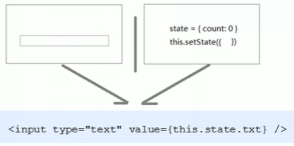

## 介绍

```java
HTML 表单元素与 React 中的其他 DOM 元素有所不同,因为表单元素生来就保留一些内部状态。

在 HTML 当中，像 <input>, <textarea>, 和 <select> 这类表单元素会维持自身状态，并根据用户输入进行更新。但在React中，可变的状态通常保存在组件的状态属性中，并且只能用 setState() 方法进行更新。
```

## 表单处理

### 介绍

```java
表单组件分类
    受控组件
    非受控组件(DOM 方式)
    
    
```

## 受控组件

### 介绍

```java
Html 中的表单元素是可输入的， 也就是有自己的可変状态    // html 自己管理
但是，react 中可変的状态通常保存在 state 中，并且只能通过 setState() 方法修改  // react 说必须由它管理
// 解决    
react 将 state 与表单元素值 value 绑定到一起， 由 state 的值来控制表单元素的值    
```



### 处理步骤

```java
步骤
1. 在state中添加一个状态，作为表单的 value 值(控制表单元素值的来源)     
2. 给表单元素绑定 change 事件， 将表单元素的值设置为 state 的值(控制表单元素值的变化)    
    
    
例子
    state = { name : '' }
	
	<input type="text" 
        value={this.state.name}
		/*
  		   状态的变化只能通过 setState 进行修改			
		   所以要想在表单发生变化时候，实现新的值更新到 state ，
		   就需要设置change 事件
		
		*/
		
		onChange={ e => this.setState({ name: e.target.value})}
	/>
```

### 例子

```java
  // 处理表单元素
  handleForm(e) {
    const {name, value}  = e.target
    this.setState({
      [name]:value
    })
  }

  render() { 
      return (
        <div className="app">
          <div>
            <input className="user" type="text" placeholder="请输入评论人" 
              value={this.state.userName}    // value 值
          	  name= {this.state.userName}   // name 标识
              onChange={this.handleForm} />
            <br />
            <textarea 
              className="content"
              cols="30"
              rows="10"
              placeholder="请输入评论内容"
              value={this.state.userContent}
              name={this.state.userContent}    // name 标识
              onChange={this.handleForm}
            />
            <br />
            <button>发表评论</button>
          </div>
	)
  }          
```


## 非受控组件

### 介绍使用

```java
使用
    借助 ref , 使用原生 dom 方式来获取表单元素值
    ref 可以获取 dom 或者组件 // 不推荐直接操作 dom, 通常还是使用受控组件


```

###  **Ref** 

#### 介绍

```java
介绍    
	可以用来绑定到 render() 输出的任何组件上。
    许你引用 render() 返回的相应的支撑实例（ backing instance ）。
    这样就可以确保在任何时间总是拿到正确的实例
    
注意
    这个 api 已经过时
```

#### 使用

```java
// 绑定一个 ref 属性到 render 的返回值上
<input ref="myInput" />

// 在其它代码中，通过 this.refs 获取支撑实例:
var input = this.refs.myInput;
var inputValue = input.value;
var inputRect = input.getBoundingClientRect();
```

#### 使用步骤

```java
使用步骤
1. 调用 React.createRef() 方法创建一个 ref 对象
    constructor(props) {
        super(props);
        this.myRef = React.createRef();  
    }
2.将创建好的 ref 对象添加到文本框中
    <input type="text" ref={this.myRef} />
    
3. 可以通过 ref 对象获取到文本框的值    
        // 使用原生的 DOM API 获取焦点
    console.log(   this.myRef.current.value )
```


#### 最新用法

```js
class MyComponent extends React.Component {
    constructor(props) {
        super(props);
        this.myRef = React.createRef();  
    }
  handleClick() {
    // 使用原生的 DOM API 获取焦点
    this.myRef.current.focus();
  }
  render() {
    //  当组件插入到 DOM 后，ref 属性添加一个组件的引用于到 this.refs
    return (
      <div>
        <input type="text" ref={this.myRef} />
        <input
          type="button"
          value="点我输入框获取焦点"
          onClick={this.handleClick.bind(this)}
        />
      </div>
    );
  }
}
```


## // ===================


## 实例

### 单向表单

```java

class HelloMessage extends React.Component {
  constructor(props) {
      super(props);
      this.state = {value: 'Hello Runoob!'};
      this.handleChange = this.handleChange.bind(this);
  }
 
  handleChange(event) {
    this.setState({value: event.target.value});
  }
  render() {
    var value = this.state.value;
    return <div>
        	// 渲染出一个值为 Hello Runoob! 的 input 元素，
            // 并通过 onChange 事件响应更新用户输入的值
            <input type="text" value={value} onChange={this.handleChange} /> 
            <h4>{value}</h4>
           </div>;
  }
}
ReactDOM.render(
  <HelloMessage />,
  document.getElementById('example')
);

```

### 子组件表单

```java
// 子组件
class Content extends React.Component {
  render() {
    return  <div>
    {/*
    	 onChange 方法将触发 state 的更新并将更新的值传递到子组件的输入框的 value 上来重新渲染界面。
    */}
            <input type="text" value={this.props.myDataProp} onChange={this.props.updateStateProp} /> 
            <h4>{this.props.myDataProp}</h4>
            </div>;
  }
}

// 父组件
class HelloMessage extends React.Component {
  constructor(props) {
      super(props);
      this.state = {value: 'Hello Runoob!'};
      this.handleChange = this.handleChange.bind(this);
  }
 
  handleChange(event) {
    this.setState({value: event.target.value});
  }
  render() {
    var value = this.state.value;
    return <div>
            <Content myDataProp = {value} 
              updateStateProp = {this.handleChange}></Content>
           </div>;
  }
}
ReactDOM.render(
  <HelloMessage />,
  document.getElementById('example')
);

```

### 多表单

```java
介绍
    当你有处理多个 input 元素时，你可以通过给每个元素添加一个 name 属性，
    来让处理函数根据 event.target.name 的值来选择做
例子
    
class Reservation extends React.Component {
  constructor(props) {
    super(props);
    this.state = {
      isGoing: true,
      numberOfGuests: 2
    };
 
    this.handleInputChange = this.handleInputChange.bind(this);
  }
 
  handleInputChange(event) {
    const target = event.target;
    const value = target.type === 'checkbox' ? target.checked : target.value;
    const name = target.name;
 
    this.setState({
      [name]: value
    });
  }
 
  render() {
    return (
      <form>
        <label>
          是否离开:
          <input
            name="isGoing"
            type="checkbox"
            checked={this.state.isGoing}
            onChange={this.handleInputChange} />
        </label>
        <br />
        <label>
          访客数:
          <input
            name="numberOfGuests"
            type="number"
            value={this.state.numberOfGuests}
            onChange={this.handleInputChange} />
        </label>
      </form>
    );
  }
}

```

### 父子表单

```java
介绍
    父组件和子组件都用表单:
例子
class HelloMessageChild extends React.Component {
  render(){
    return <div>
      <input type="text" value={this.props.myDataProp} onChange={this.props.updateStateProp} /> 
      <h4>子组件显示：{this.props.myDataProp}</h4>
      </div>;
  }
}
class HelloMessage extends React.Component {
  constructor(props) {
      super(props);
      this.state = {value: '父组件',value1:"子组件"};
      this.handleChange = this.handleChange.bind(this);
      this.handleChange1 = this.handleChange1.bind(this);
  }
 
  handleChange(event) {
    this.setState({value: event.target.value});
  }
  handleChange1(event) {
    this.setState({value1: event.target.value});
  }
  render() {
    var value = this.state.value;
    var value1 = this.state.value1;
    return <div>
            <table><tbody>
            <tr>
            <td>
              <input type="text" value={value} onChange={this.handleChange} /> 
              <h4>父组件显示：{value}</h4>
            </td>
            <td>
              <HelloMessageChild myDataProp = {value1} updateStateProp = {this.handleChange1} />
            </td>
            </tr>
            </tbody></table>
           </div>;
  }
}
ReactDOM.render(
  <HelloMessage />,
  document.getElementById('formexmple')
);
```


## // == 练手项目

## == 受控组件 ==

## 文本框

```js

class App extends React.Component {
    
  state = {
    name: ""
  }
  
  handleChange = e => {
    this.setState({
      name: e.target.value
    })
  }

  render() {
      return (
        <div>
          <input type="text" 
          	value={this.state.name} 
          	onChange={this.handleChange} />
        </div>
      )
  }
}
//
ReactDOM.render(
<App />,
  document.getElementById('root')
)

```


## 富文本框

```java

class App extends React.Component {
    
  state = {
    name: ""
  }
  
  handleChange = e => {
    this.setState({
      name: e.target.value
    })
  }

  render() {
      return (
        <div>
          <textarea value={this.state.name} 
          onChange={this.handleChange} />
        </div>
      )
  }
}
//
ReactDOM.render(
  <App />,
  document.getElementById('root')
)
```


## 下拉框

```java
介绍
    
    在 React 中，不使用 selected 属性，而在根 select 标签上用 value 属性来表示选中项。
    
例子
    
class FlavorForm extends React.Component {
  
  constructor(props) {
    super(props);
    this.state = {value: 'coconut'};
 
    this.handleChange = this.handleChange.bind(this);
    this.handleSubmit = this.handleSubmit.bind(this);
  }
 
  handleChange(event) {
    this.setState({value: event.target.value});
  }
 
  handleSubmit(event) {
    alert('Your favorite flavor is: ' + this.state.value);
    event.preventDefault();
  }
 
  render() {
    return (
      <form onSubmit={this.handleSubmit}>
        <label>
          选择您最喜欢的网站
          <select value={this.state.value} onChange={this.handleChange}>
            <option value="gg">Google</option>
            <option value="rn">Runoob</option>
            <option value="tb">Taobao</option>
            <option value="fb">Facebook</option>
          </select>
        </label>
        <input type="submit" value="提交" />
      </form>
    );
  }
}
 
ReactDOM.render(
  <FlavorForm />,
  document.getElementById('example')
);

```


## 多表单优化

```java
// 一个处理程序处理多个表单数据

1. 给表单元素添加 name 属性， 名称和 state 相同
    <input 
    	type="text" 
    	name="age"			    // name 标识，就是 [name]: value 的 [name]
    	value={this.state.age}   // value，就是 [name]: value 的 value
		onChange={this.handleChange} />
2. 根据表单类型获取对应的值
	// 根据表单元素类型获取值
	// 拿到当前的 dom 对象            
	const target = e.target     
	
	// 根据类型获取值            
	const value = target.type === 'checkbox'
           ? target.checked
           : target.value
	// 获取 name
	const name = target.name
               
3. 在 change 事件处理程序中， 通过 [name] 来修改对应的 state
	// 根据 name 设置对应 state, 进行更新
	this.setState({
        [name]: value
    })               
```

