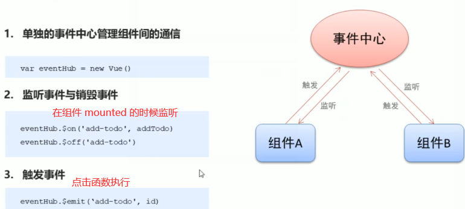

## 样式绑定

```java
介绍
    1. 对象绑定 、 数组绑定结合使用
    2. class 的值可以简化操作
   	3. 默认的 class 处理
1.         
```

## 循环条件

```java
v-if
    控制元素是否渲染到页面
v-show    
    控制元素是否显示（已经渲染到页面）
```


## 监听

```java
var vm = new Vue({
    el: "app",
    data: {
		name: 'jim',
    },
    watch: {
        // val 是 name 变化后数据
		name: function(val) {
		}
    }
})
```


## 模板字符串

```java

```

## 组件

### 父子组件

```java
命名
    驼峰式: 字符串模板中使用驼峰的方式使用组件（只能如此）
    短横线： 普通的标签模板中（驼峰要转为短横线）
        
局部组件： 只能在父组件中使用
全局组件： 任何地方使用，但可以注册为局部组件  
        
        
传值
	props 子组件中设置，用来接收父组件传递过来的值
	命名
       组件： 子组件 ：托峰值 。  父组件： 需要使用短横线取代
       模板： 模板字符串中可以使用驼峰， 但是 普通标签中必须使用短横线
        
	属性值类型
        有一定要求
     组件
        组件中的所有属性，都可以运用到 template 中
子组件向父组件传值
	子组件通过自定义事件向父组件传递信息
        <button v-on:click='$emit("事件，参数")'></button>
	父组件监听子组件的事件
        // event 可以获得子组件传递过来的参数
		<menu-item v-on:事件='$event'></menu-item>
     $event 只能接收一个参数  arguments 可以传递多个参数      
```

### 非父子组件



```java
介绍
    必须通过 事件中心进行数据传递
    
```

## 插槽

```java
作用域插槽
    父组件获取子组件的数据，然后数据进行操作
```


## vue 组件

### 介绍

*   组件化开发（参看组件、模块化开发）
*   vue 组件必须在 Vue 实例中使用
*   注意大小写的问题 ，在使用脚手架的时候，没有这个大小写的问题（原生的vue是有大小写问题的）

### 使用

```js
完整流程
	1. 创建组件构造器		Vue.extend()	// 返回组件对象
    2. 注册组件			  Vue.component()   .组件构造器的对象一般都写到这里面了
    3. 使用组件			  Vue 实例作用范围使用组件 <><>

语法糖
	Vue 简化了过程，省去使用 Vue.extend() 的步骤 ，直接使用一个对象替代
    直接写在注册组件当中了，即 Vue.conponent('',{}) 

属性
	template
		就是要复用的模板
	data
		存放数据，但是必须是函数
	methods
    props
    	properties（属性），子组件从父组件接收的数据 ，类型为数组、字符串
        在组件上注册的一些自定义 attribute。
        当一个值传递给一个 prop attribute 的时候，它就变成了那个组件实例的一个 property
        props 验证可以自定义类型
    
    
注意
	组件只能有一个根元素
    html 大小写不敏感，所以你使用驼峰命名，在标签中需要用 - 连接
	局部的 components 和全局 的 component
    所有的组件都继承于 vue 实例的原型
```

### 原理

*   data 函数

```js
data:function(){
    return {
        title:'abc'   // 这个就是组件用到的数据 ，在{{}} 中使用的
    }
}

原因：
	块级作用域
	组件每次调用 data 会创建一个新的对象，标签数据之间不相互影响，因为各自都有一个新的对象
    减少连续影响
```


### 名词

* 全局组件

    *   在多个 Vue 的实例中使用
    *   直接使用 Vue.compent 注册的组件

* 局部组件

    * 只能在特定实例中使用

    * 使用 new Vue({  components: {} })

        ```js
        之前使用 注册了组件，然后写入
        现在使用 var 声明组件 ，然后写入
        ```

* 父子组件

    ```js
    一个组件里面包含了另一个组件 ，就是父子组件 ， 
        父组件 {
        	子组件
    	}	
    
    原始的
    	// cpn2 本身就是一个组件，里面嵌套了另一个组件 component cpn1
    	const cnp2 = Vue.extend({
            template:`<div><cpn1></cpn1></div>`
            conponents: {    // 组件注册
                cpn1:cpn1
            }
        })
        
    注意
       1. 当子组件注册到父组件的 components 中， Vue 会编译好父组件的模块，该模块已经决定了为父组件将要渲染的HTML(相当于父组件中已经有子组件的内容了)
    	2. 子组件只能在父组件中被识别 ， 浏览器会自动忽略  ？？？？
        3. 所以 vue 实例中不要以子标签的形式使用
    	
    ```

### template 抽离

* 字符串 - 未抽离的

    ```js
    // 原生写法
    const cnp2 = Vue.extend({
        template:`<div><cpn1></cpn1></div>`
        conponents: {    // 组件注册
        	cpn1:cpn1
    	}
     })
    ```

    

* script 标签

    ```js
    // type 必须是  text/x-template
    <script type="text/x-template" id="id的值">
      <div> template code </div>
    </script>
    
    Vue.component('hello-world', {
      template: 'id的值'
    })
    ```

* template 标签

    ```js
    <template  id="id的值">
      <div> template code </div>
    </template>
    
    Vue.component('hello-world', {
      template: 'id的值'
    })
    ```

* .vue 文件

    ```js
    // TabBar.vue 文件
    <template>
    	<div id="tab-bar">
    		<div class="tab-bar-item">首页</div>
    	</div>
    </template>
    
    <script>
    	export default {
    		name:"TabBar"
    	}
    </script>
    
    <style>
        关于 tabbar tabbar-item 的css代码
    </style>
    
    // 调用
    <template>
        <tab-bar></tab-bar>
    </template>
    <script>
    	import TabBar from './components/tabbar/TabBar.vue'	
        export default {
          name: 'App',
          components: {
                TabBar
            }
        }
    </script>
    ```

### 组件数据访问

#### 注意

```js
根据数据流的特点，谁的数据谁去修改
```


#### 组件访问vue实例数据

```js
1. 组件可以直接访问 Vue 实例中的 data,但是不建议，这样会使 Vue 实例变得很臃肿
2. Vue 组件应该有自己保存数据的地方 ，其有 data 
```

#### 父传子 -props

```js
使用
	// 后端 --》 父组件 --》 子组件
	父组件从服务端获取到数据，然后给子组件进行展示
实例
	父组件
    // Vue 是根组件
    	const app = new Vue({
            el:'#app',
            data: {
                movie: ['','','']
            },
            components: {
                cpn
            }
        })
	子组件
    	const cpn = {
            
             // 这里就是子组件中对应 的接收父组件数据的变量
            template:'
            	<div> {{cmovie}} </div> 
            		',
            props:['cmovie']	// 引用的变量名。类型可以看 prop 验证，数组+对象
        }
    使用的时候传数据
    	<div id="app" >
            // 注意下面v-bind 的键值对都来自谁 ： (:子组件:父组件）
            // 这里相当于 子组件和父组件结合起来了
            // 这里双引号里面默认是一个变量，而不是字符串
        	<cpn :cmovie="movie"></cpn>
        </div>
```

#### 子传父 - 自定义事件

```js
使用
	// 用户输入 --》 子组件 --》 父组件
	用户浏览器输入产生事件  --  子组件产生事件 --》 通知父组件
实例
	父组件
    // Vue 是根组件
    	const app = new Vue({
            el:'#app',
            components: {
                cpn
            },
            methods: {
                // 用来处理子组件中的事件 ，并接收传过来的数据，dom 中省略参数情况见下面
                cpnClick(item) {
                    console.log('cpnClick')
                }
            }
        })
	子组件
    	const cpn = {
            // 子组件的模板
            template:'<div> 
            			<button @click="btnclick(item)"></button>
            		</div>',
            methods: {
            	btnclick(item){
                    // 告诉父组件发生的事件，并封装起了个名字,并把数据 item 传递过去
                    this.$emit('itemclick',item)                    
                }
        	},
            props:['cmovie']	// 引用的变量名。类型可以看 prop 验证，数组+对象
        }
        
    使用的时候传数据
    	<div id="app" >
        // 注意下面v-on的键值对都来自谁 ： @子组件事件名：父组件对应的处理方法
        // 这里相当于 子组件和父组件结合起来了
        // 注意自定义事件执行的时候，不写实参的默认陈晓娜书是自定义事件传过去的值，不是浏览器产生的事件！
        	<cpn @item-click="cpnClick"></cpn>
        </div>
```


#### 父子双向

```js
// 子组件改变数据，发送给父组件，然后父组件再改变 props 数据

const app = new Vue({
    el:'#app',
    data: {
        num1:1
    },
    methods:{
      // 注意这个 value 是字符串
      num1change(value)  {}
    },
    components:{
   		cpn: {
    		template:'#cpn',
    		props: {
    			number1:number
			}，
             // 根据 props 初始化 data 中的dnumber1
             // 不推荐直接更改 props 中的值，而是通过 data 计算属性来更改
             data() {
             	return  {
                   dnumber1:this.number1
                }   
             },
             methods: {
                 numInput(event){
                     return {
                         // v-model 语法糖岔开了，顺便触发input事件的时候向父组件发送个自定义事件
                         this.dnumber1 = $event.target.value
                         this.$emit('num1change',this.dnumber1)
                     }
                 }
             }                
            }
        }
    })

// 子组件模板
<template id="cpn">
    // 注意这里绑定到 props 中了
    // <input v-model="number1">
    // <input type="text" :value="dnumber1" @input="dnumber1=$event.target.value">
    <input type="text" :value="dnumber1" @input="numInput">
</cpn>
//父组件使用
<div id="app">
    <cpn :number1="num1" @num1change="num1change"></cpn>
</div>
```


## 路由

### 介绍

```js
Angular , react , Vue  都有自己路由的实现
介绍
	Vue.js 路由允许我们通过锚点定义不同的 URL， 达到访问不同的页面的目的，每个页面的内容通过延迟加载渲染出来。
	通过 Vue.js 可以实现多视图的单页Web应用（single page web application，SPA）

vue-router 是基于路由和组件的
	路由用于设定访问路径，将路径和组件映射起来
    在 vue-router 的单页面应用中，页面的路径的改变就是组件的切换
// 关于路由的知识 参看 web 网络编程中的路由

    
router-view   写在哪里就在那里渲染
路由切换其实就是切换 router-view 挂载的组件，其他内容不改变

meta 路由元数据
	描述数据的数据
```

### 使用

```js
// 导入进行使用 ，use 貌似不需要用了
	Vue.use(VueRouter)
// 创建实例
const router = new VueRouter({
    routers   // 路由
})

    //  定义路由，进行映射 注意 conponent 没有s 
    const routers = [
        {path:'/foo', component:foo} // 路由组件
    ]

    const Foo = { template: '<div>123<div>'}
    
// 路由注册
// 路由可以从其他文件导入
const app = new Vue({
    router
}).$mount('#app')


// 注意
const app = New Vue({
    router: {
        routes : [
            route,
            route,
            ...
        ]
    }
}).$mount('#app')
```

### API 解读

```js
router-link
router-view
router 构建选项
router 实例属性
router 实例方法
路由对象
路由注入 , 路由注册

<router-link>
<router-view>
    
const router实例 = new VueRouter({
    构建选项
})
const routes = [
    {路由对象}
]

const app = new Vue({
    router实例   // 路由注入
})
```

### 使用

#### 路由修改、跳转

```js
// 使用重定向 默认路由
routes = [
    {
        path :'',
        // 重定向 替换  component: 'Foo'
        redirect : 'Foo',
        // 改用 history 模式 ，#/ 是hash模式
        mode:'history',
       
    }
]

// 修改路由 ，不要绕过 vue-router 进行修改
// this.$router 就是一个 router 实例，
// 哪个路由处于活跃状态，这里就是指哪个路由
this.$router.push()
```

#### 路由懒加载

```js
原因
	路由中会定义很多不同的页面，这些页面最后被打包到一个 js 文件中，必然会造成这个 js 文件非常大，如果一次性从服务器请求下来这个页面，会花费一段时间，有可能在用户电脑上出现短暂的空白，避免出现这种情况，就要使用路由懒加载
作用
	将路由对应的组件打包成一个个的 js 代码块，只有这个路由被访问到的时候，才加载对应的组件
方法
	方法一
    	const Home = resolve => {
            require.ensure(['../components/Home.App'], ()=>{
                resolve(require('../components/Home.App'))
            })
        }
        
    方法二
    	const Home = resolve => (['../components/Home.App'] , resolve)
    方法三
    	const Home = () => inport('../copnents/Home.App')
  
 使用
 	const routes = [
        {path:'Home' , component:Home}
    ]
```


### 路由嵌套

```js
子组件的 router-link 的 to 属性，需要完整的路径  /Home/new.vue 
	就是把父组件 Home.vue   子组件 new.vue
```

### 路由参数传递

```js
// 就是修改 url ， 这个是 Vue 中的路由参数传递
传递参数
	params   
    query 动态网页
params 参数类型
	配置路由格式 /router/:id
    传递的方式  在 path 后面上跟上对象的值
    传递后形成路径  /router/abc

query 类型
	配置路由格式 /router 也就是普通配置
    传递的方式  对象中使用query的key 作为传递方式
    传递后形成路径  /router？id=abc

使用
	1. <router-link :to="{}"></router-link>    // {path:"" , query:{}}  
     2. 使用 this.$router.push()
```

### 导航守卫

```js
介绍
	// 页面拦截器
	路由（页面）跳转是一个很大的过程，这个过程被 Vue 分成好几个阶段，每一个阶段都有一个函数(钩子函数) ，你可以通过这些函数在响应的阶段，进行其他操作 ，这就是导航守卫
    即
    	vue  通过一些函数控制了路由跳转的过程，这些函数指导这个过程进行跳转实现，为跳转保驾护航 ， 这些函数就叫导航守卫(抖个机灵：这个过程或许可以叫守卫导航，2333)
	监听路由跳转
    
    
```


### 区分

```js
keep-alive
	Vue 内置的一个组件，可以使包含的组件保留状态，或者避免重新被渲染
    属性比较重要
router-view
	一个组件，如果被包在 kee-alive 中，所有临近匹配到的视图组件都会被缓存，不需要频繁创建频繁销毁
使用
	<keep-alive>
    	<router-view />
    </keep-alive>
```

