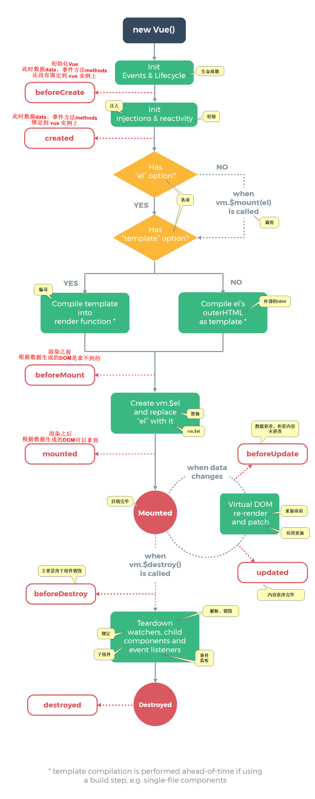

## 相关术语

### mvvm

```js
model m
	模型 ，数据对象data
view v
	视图。模板页面 ,就是 html 页面(标签)
viewmodel vm
	视图模型。vue 实例  。 const app = new Vue  中的 app
    
    
数据绑定 data bindings
	数据能自动从内存中提取数据，显示到页面中去。
```

### 渐进式

```js
渐进式框架
	意味着你可以将 Vue 作为你应用的一部分，嵌套入其中，带来丰富的交互体验
```

### 响应式

```js
数据改变，界面会自动发生响应，跟着数据改变
```


### 声明式编程

```css
当 vue 实例管理 html 的是标签是时，只用知道要显示什么东西即可
```

### 双向绑定

```js
单向 ： data ---> 界面数据
双向 ： data <---> 界面数据
```


## Vue

### 特点

*   解耦数据和视图
*   可复用的组件
*   前端路由技术
*   状态管理
*   虚拟 DOM

### vue  api

```js
全局
	配置
    API
    
参数 options 对象
	选项 / 数据 		 data  methods
	选项 / DOM   		   el 
	选项 / 生命周期钩子
	选项 / 资源
	选项 / 组合
	选项 / 其它

vue 实例
	实例 property(性质。特性)
    实例方法 / 数据
	实例方法 / 事件
	实例方法 / 声明周期

指令
特殊 attribute
内置组件
```

### 构建

```js
构造函数
	new Vue()
	参数 ： options对象  // 就是 new Vue(options{})
	返回 ： vue 实例对象

vue 实例
    let 实例对象 = new Vue({})
    let app = new Vue({
        el:'#app'
    })
```


## Vue参数 options 对象

```css
参数对象 options 属性
	选项 / 数据 		 data  methods computed
	选项 / DOM   		   el  template
	选项 / 生命周期钩子
	选项 / 资源			components 
	选项 / 组合
	选项 / 其它

```

## vue 实例

### 生命周期

```js
const app = new Vue({
    el:'#app',
    data:{}
})
```




## 指令

```js
v-for =
v-on =  @  监听 ：@ 像不像耳朵？？
v-bind = :  绑定 ： 更新数据


v-once
v-html	
v-text
v-pre
v-cloak  // 防闪烁
v-model  // 表单绑定 ，同一个 v-model 相当于同一个 name ，是互斥的
```

## 其他

### 数组、对象渲染

```js
 数组、对象渲染 
 	vue官网教程-查看列表渲染
    
数组响应式的方法
	// 并不不是所有的方法都是响应式的
    vue官网教程-数组更新检测
	pop 删除最后一个 
    shift 删除最后一个元素
    unshift 数组前面添加元素
```

### 监听绑定

```js

2. 事件监听-函数
    @  监听是有什么操作，比如 @：onclick  ，让那个属性值的函数执行
	@click='add()'  // 后面执行 add 这个函数。其中的 （） 尽量不要丢，最好写上
	注意
注意
1. methods 中定义的方法
	没有参数 ：可以省略方法后面的括号
	一个参数 ： 
    	html
        	// 事件定义的时候，写方法省略小括号，但是方法本身需要一个参数
        	// vue 默认将浏览器生成的event事件对象作为参数传入到方法中国
        	@click='add'
		vue
        	// 函数需要参数，但是没有传入，那么函数的形参为 undefined
        	function add(a)  {
                console.log('a')
            }
	需要event对象+其他参数
    	html
        	// 调用时需要 event 参数 ，还需要 其他参数
        	// 在调用时，需要手动获取到浏览器参数的 event 对象： $event
        	@click='add('a',$event)'
		vue
        	// 函数需要参数，但是没有传入，那么函数的形参为 undefined
        	function add(a,event)  {
                console.log('a')
                console.log(event)
            }
        	
    
    
    
    
    
    
3. 数据绑定-值
	用于属性的模板，属性哪里是不能使用 mustache ，所以要用 v-bind ，动态更新属性值
	： 用来更新数据用的：更新属性值、
    
    v-bind
	v-model
```

### key 属性

*   标签复用

    ```js
    标签
    	:key='item'
    使用
    	Vue 在进行 DOM 渲染时，出于性能考虑，会尽可能的复用已经存在的元素，而不是重新创建元素
    虚拟dom
    	进行对比修改渲染
    例子
    	v-for 绑定 和 非绑定 key
    不在重复利用
    	可以给 DOM标签 添加一个 key 
        一样的 key 是可以进行复用的，当 key 不一样就不进行复用
    为什么需要这个 key 
    	key 属性和 Vue 虚拟DOM的Diff算法有关
    	diff算法
         	1. 当一层有很多列节点，我们插入一个节点：是从插入的位置的数据依次往后移动一个单位
         key 作用
         	给每个节点做一个唯一的标识，dif算法就可以准确识别这个节点，以便在正确位置插入该节点
            就是为了高效的更新虚拟DOM
    ```


## 原理

### v-model 原理

```js
v-model 其实是一个语法糖，本质有两个操作
	v-bind 绑定一个 value 属性
    v-on   指令给当前元素绑定input事件
<body>
	<div id="app">
		<input type="text" v-model="message">
		<!-- input 有一个事件就是 input ，就是监听用户输入 -->
		<!-- <input type="text" :value="message" v-on:input="valueChange"> -->
   		<!-- <input type="text" :value="message" v-on:input="$event.target.value"> -->
	</div>
	<script type="text/javascript" src="../vue.js">
		
	</script>
	<script type="text/javascript">
		const app = new Vue({
			el:"#app",
			data: {
				message:'你好'
			},
			methods: {
				// 界面上产生一个事件，浏览器就会生成一个 event 这个event对象，包含我们想要的信息
				valueChange(event){
					this.message.target.value   // 就是最新的value值
				}
			}
		})
	</script>
	
</body>
</html>
```


## vue 组件

### 介绍

*   组件化开发（参看组件、模块化开发）
*   vue 组件必须在 Vue 实例中使用
*   注意大小写的问题 ，在使用脚手架的时候，没有这个大小写的问题（原生的vue是有大小写问题的）

### 使用

```js
完整流程
	1. 创建组件构造器		Vue.extend()	// 返回组件对象
    2. 注册组件			  Vue.component()   .组件构造器的对象一般都写到这里面了
    3. 使用组件			  Vue 实例作用范围使用组件 <><>

语法糖
	Vue 简化了过程，省去使用 Vue.extend() 的步骤 ，直接使用一个对象替代
    直接写在注册组件当中了，即 Vue.conponent('',{}) 

属性
	template
		就是要复用的模板
	data
		存放数据，但是必须是函数
	methods
    props
    	properties（属性），子组件从父组件接收的数据 ，类型为数组、字符串
        在组件上注册的一些自定义 attribute。
        当一个值传递给一个 prop attribute 的时候，它就变成了那个组件实例的一个 property
        props 验证可以自定义类型
    
    
注意
	组件只能有一个根元素
    html 大小写不敏感，所以你使用驼峰命名，在标签中需要用 - 连接
```

### 原理

*   data 函数

```js
data:function(){
    return {
        title:'abc'   // 这个就是组件用到的数据 ，在{{}} 中使用的
    }
}

原因：
	块级作用域
	组件每次调用 data 会创建一个新的对象，标签数据之间不相互影响，因为各自都有一个新的对象
    减少连续影响
```


### 名词

*   全局组件

    *   在多个 Vue 的实例中使用
    *   直接使用 Vue.compent 注册的组件

*   局部组件

    *   只能在特定实例中使用

    *   使用 new Vue({  components: {} })

        ```js
        之前使用 注册了组件，然后写入
        现在使用 var 声明组件 ，然后写入
        ```

*   父子组件

    ```js
    一个组件里面包含了另一个组件 ，就是父子组件 ， 
        父组件 {
        	子组件
    	}	
    
    原始的
    	// cpn2 本身就是一个组件，里面嵌套了另一个组件 component cpn1
    	const cnp2 = Vue.extend({
            template:`<div><cpn1></cpn1></div>`
            conponents: {    // 组件注册
                cpn1:cpn1
            }
        })
        
    注意
       1. 当子组件注册到父组件的 components 中， Vue 会编译好父组件的模块，该模块已经决定了为父组件将要渲染的HTML(相当于父组件中已经有子组件的内容了)
    	2. 子组件只能在父组件中被识别 ， 浏览器会自动忽略  ？？？？
        3. 所以 vue 实例中不要以子标签的形式使用
    	
    ```

### template 抽离

*   字符串 - 未抽离的

    ```js
    // 原生写法
    const cnp2 = Vue.extend({
        template:`<div><cpn1></cpn1></div>`
        conponents: {    // 组件注册
        	cpn1:cpn1
    	}
     })
    ```

    

*   script 标签

    ```js
    // type 必须是  text/x-template
    <script type="text/x-template" id="id的值">
      <div> template code </div>
    </script>
    
    Vue.component('hello-world', {
      template: 'id的值'
    })
    ```

*   template 标签

    ```js
    <template  id="id的值">
      <div> template code </div>
    </template>
    
    Vue.component('hello-world', {
      template: 'id的值'
    })
    ```
    
*   .vue 文件

    ```js
    
    ```

### 组件数据访问

#### 注意

```js
根据数据流的特点，谁的数据谁去修改
```


#### 组件访问vue实例数据

```js
1. 组件可以直接访问 Vue 实例中的 data,但是不建议，这样会使 Vue 实例变得很臃肿
2. Vue 组件应该有自己保存数据的地方 ，其有 data 
```

#### 父传子 -props

```js
使用
	// 后端 --》 父组件 --》 子组件
	父组件从服务端获取到数据，然后给子组件进行展示
实例
	父组件
    // Vue 是根组件
    	const app = new Vue({
            el:'#app',
            data: {
                movie: ['','','']
            },
            components: {
                cpn
            }
        })
	子组件
    	const cpn = {
            
             // 这里就是子组件中对应 的接收父组件数据的变量
            template:'
            	<div> {{cmovie}} </div> 
            		',
            props:['cmovie']	// 引用的变量名。类型可以看 prop 验证，数组+对象
        }
    使用的时候传数据
    	<div id="app" >
            // 注意下面v-bind 的键值对都来自谁 ： (:子组件:父组件）
            // 这里相当于 子组件和父组件结合起来了
            // 这里双引号里面默认是一个变量，而不是字符串
        	<cpn :cmovie="movie"></cpn>
        </div>
```

#### 子传父 - 自定义事件

```js
使用
	// 用户输入 --》 子组件 --》 父组件
	用户浏览器输入产生事件  --  子组件产生事件 --》 通知父组件
实例
	父组件
    // Vue 是根组件
    	const app = new Vue({
            el:'#app',
            components: {
                cpn
            },
            methods: {
                // 用来处理子组件中的事件 ，并接收传过来的数据，dom 中省略参数情况见下面
                cpnClick(item) {
                    console.log('cpnClick')
                }
            }
        })
	子组件
    	const cpn = {
            // 子组件的模板
            template:'<div> 
            			<button @click="btnclick(item)"></button>
            		</div>',
            methods: {
            	btnclick(item){
                    // 告诉父组件发生的事件，并封装起了个名字,并把数据 item 传递过去
                    this.$emit('itemclick',item)                    
                }
        	},
            props:['cmovie']	// 引用的变量名。类型可以看 prop 验证，数组+对象
        }
        
    使用的时候传数据
    	<div id="app" >
        // 注意下面v-on的键值对都来自谁 ： @子组件事件名：父组件对应的处理方法
        // 这里相当于 子组件和父组件结合起来了
        // 注意自定义事件执行的时候，不写实参的默认陈晓娜书是自定义事件传过去的值，不是浏览器产生的事件！
        	<cpn @item-click="cpnClick"></cpn>
        </div>
```


#### 父子双向

```js
// 子组件改变数据，发送给父组件，然后父组件再改变 props 数据

const app = new Vue({
    el:'#app',
    data: {
        num1:1
    },
    methods:{
      // 注意这个 value 是字符串
      num1change(value)  {}
    },
    components:{
   		cpn: {
    		template:'#cpn',
    		props: {
    			number1:number
			}，
             // 根据 props 初始化 data 中的dnumber1
             // 不推荐直接更改 props 中的值，而是通过 data 计算属性来更改
             data() {
             	return  {
                   dnumber1:this.number1
                }   
             },
             methods: {
                 numInput(event){
                     return {
                         // v-model 语法糖岔开了，顺便触发input事件的时候向父组件发送个自定义事件
                         this.dnumber1 = $event.target.value
                         this.$emit('num1change',this.dnumber1)
                     }
                 }
             }                
            }
        }
    })

// 子组件模板
<template id="cpn">
    // 注意这里绑定到 props 中了
    // <input v-model="number1">
    // <input type="text" :value="dnumber1" @input="dnumber1=$event.target.value">
    <input type="text" :value="dnumber1" @input="numInput">
</cpn>
//父组件使用
<div id="app">
    <cpn :number1="num1" @num1change="num1change"></cpn>
</div>
```


## 插槽

### 组件插槽

```js
1. 组件的插槽也是为了让我们封装的组件更加具有扩展性
2. 让使用者决定组件内部的一些内容到底展示什么
3. 有些组件之间有相同性，但是没有必要再封装层一个组件，所以就使用插槽
4. 插槽封装 ： 抽取共性，保留不同
	将共性抽取到组件中，不相同的暴露为插槽。因为预留的插槽，使用者可以自行决定者部分内容展示什么
    
 思考
 	就是在组件中用插槽预留一个位置 slot，在多次使用组件的时候，每次中的 slot 位置，可以是手动设置不同的东西
    <template id="app"> 
        <h2></h2>
        <slot></slot>
    <template>
        
    // 使
        用 ,重复使用组件，其中改变不同的部分
    <cpn><slot>111</slot></cpn>
    <cpn><slot>222</slot></cpn>
默认值
	插槽中可以设置一些标签，充当默认值
    
        
```


### 具名插槽

```js
// 有具体名称的插槽

<div id='app'>
    // 这个是替换的是没有 name 的slot
    <cpn>123</cpn>
	// 这个是替换的指定的插槽 slot
    <cpn><span slot="left">23</span></cpn>
</div>

<template>
	<div>
        <slot></slot>
        <slot name="left"><span>左</left></slot>
        <slot name="right"><span>左</left></slot>
     </div>
</template>
```

### 编译作用域

```js
<div id="app">
    // 此处 v-show 是vue实例的变量
    <cpn v-show="isshow"></cpn>
</div>
<template>
    // 模板的变量是从组件当中找的，作用域只在子组件
    <button v-show="ishow"></button>
</template>
```

### 作用域插槽

```js
// 父组件替换插槽的标签，但是内容由子组件来提供
// 作用插槽允许你将模板传递给插槽，而不是传递一个已呈现的元素。它被称为作用域的插槽，
// 因为尽管模板在父范围内呈现，但它可以访问某些子数据。


<div id="app">
    <cpn >
    // 获取子组件中的 languages （注意其作用域是子组件）, 拿到子组件中的 data
    // 通过 slot1 引用插槽对象，
    	<template slot-scope="slot1">
            // 注意 slot1 和 data 是怎么来的
            <span v-for="item in slot1.data">{{item}}</span>
	    </template>
    
    </cpn>
</div>

<template>
    <div>
    	// <ul><li v-for="item in languages"></li></ul>
    	// data 是随意起的 ，主要是拿到变量 lanbguages, 即 data 指向 languages
    	<slot ：data="languages">
    		<ul><li v-for="item in languages"></li></ul>
    	</slot>
    </div>
</template>


const app = new Vue({
    el: '#app',
    components: {
        cpn : {
        	data() {
           		 return {
                	 languages:[]
            	}
        	}   
        }
    }
})
```


