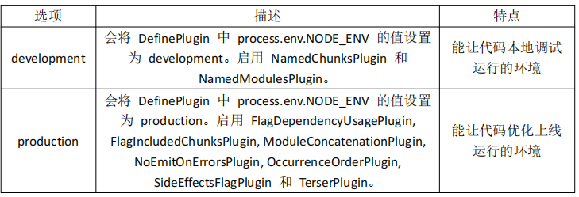

## 介绍

* Webpack是一个打包工具打包器
* 资源构建工具， 一个静态模块打包器(module bundler)。
    * 前端的所有资源文件(js/json/css/img/less/...)都会作为模块处理。
    * 它将根据模块的依赖关系进行静态分析，打包生成对应的静态资源(bundle)。
* Webpack可以帮助我们完成一些任务。
    * 自身能处理 js 文件: 压缩
    * 借助 loader 处理样式资源：css压缩、编译模板文件等

## 官方文档

```java
布局
    概念： webpack 涉及到的名词
    配置：
    	其中内容对应 webpack.config.js
    api：  
    指南: 
    loaders
    插件
```


## 核心概念

### entry -- 打包路径

```java
入口(Entry)指示 webpack 以哪个文件为入口起点开始打包，分析构建内部依赖图
// index.js    
```


### output -- 输出路径

```java
输出(Output)指示 webpack 打包后的资源 bundles 输出到哪里去，以及如何命名
// build文件夹    
```


### loader -- 翻译处理器

```java
Loader 让 webpack 能 够 去 处 理 那 些 非 JavaScript 文 件 (webpack 自 身 只 理 解 JavaScript)
    
loader 将 css less 等 转换为 js 资源    
```


### pligins -- 打包压缩

```java
插件(Plugins)可以用于执行范围更广的任务。
插件的范围包括，从打包优化和压缩， 一直到重新定义环境中的变量等
```

### model -- 运行环境

```java
模式(Mode)指示 webpack 使用相应模式的配置
```

