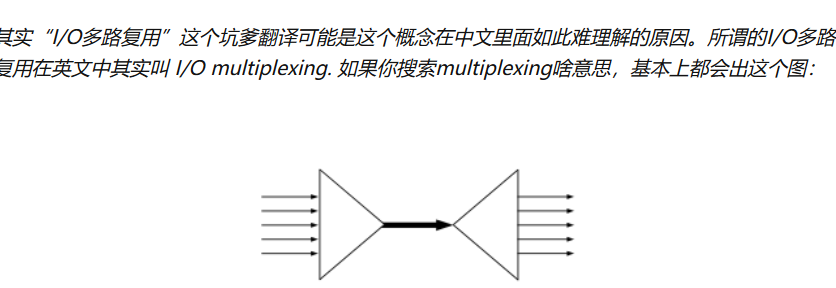

## 使用到的函数

## 服务端



```go
1 多路复用
    multiplex 多路传输;多路复用;多重发讯
    multiplexing n 倍增，标度放大，多路传输

    https://www.zhihu.com/question/32163005
    IO多路复用是一种同步IO模型，实现一个线程可以监视多个文件句柄；一旦某个文件句柄就绪，就能够通知应用程序进行相应的读写操作；没有文件句柄就绪时会阻塞应用程序，交出cpu。
    多路是指网络连接，复用指的是同一个线程

    你有N个不知道什么时候来水的水龙头需要接水，你根据某种信号一会儿拧这个龙头，一会儿拧那个龙头把水都接了就是多路复用（一个线程）。使用残像拳在每个水龙头前派一个你的分身蹲守就是Threaded IO。其实后者也没啥不好，因为未来的内核会消除上下文切换的软硬件性能损耗
```

## 客户端

```go

```
